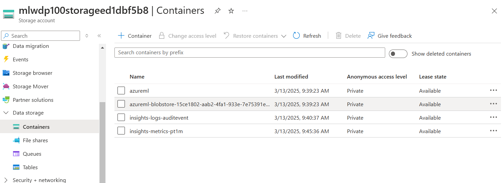
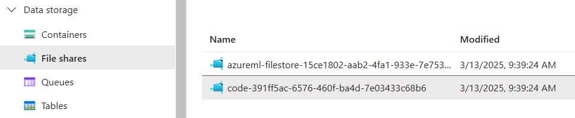

# Making data vailable

URIs - Uniform resourcses Identifiers: Basicamnete la location de la data. 

There is a protocol to connect URIS for Azure Machine Learning.


`http(s):` Use for data stores publicly or privately in an Azure Blob Storage or publicly available http(s) location.

`abfs(s):` Use for data stores in an Azure Data Lake Storage Gen 2.

`azureml:` Use for data stored in a datastore.

## Datastore

This is an abstraction for cloud data sources. They have the info to connect an external data source. This info is usually not in the script of the code.

There are different ways to get som authentication methods. it is something like 

storage -> crenditan base / identity based authentication -> SQL/dataGen2/API

## Type of datastores

 * Azure Blob Storage

 * Azure File Share 

 * Azure Data Lake (Gen 2)

## Datastore for Azure Blob Storage container

There are different ways to create datastores with a graphical UX, Azure command-line interface (CLI), and Python (SDK).

`blob_storage:` Almacenamiento de objetos en la nube para grandes cantidades de datos no estructurados. Se puede acceder mediante la API REST, SDKs de Azure, PowerShell y la CLI de Azure.

[Para saber mas de Blob Storage, click en este ejemplo](/aux%20examples/BlobStorage.md)

**Example of blob storage connection to connect Azure Blob Storga econainter**

```python
blob_datastore = AzureBlobDatastore(
    			name = "blob_example",
    			description = "Datastore pointing to a blob container",
    			account_name = "mytestblobstore",
    			container_name = "data-container",
    			credentials = AccountKeyConfiguration(
        			account_key="XXXxxxXXXxXXXXxxXXX"
    			),
)
ml_client.create_or_update(blob_datastore)
```

**Note** This is also possible with a SAS Token (SAS: Some security shit achronymous)

## Create a data asset

A data asset is basically a way in that a could acess info needed to compute, train model, etc. There are mainly 3 differentes ways to create a data asset. 

* URI file: Points to a specific file

* URI folder: Points to a specific folder

* MLTable: Points to a foler/file and includes a schema to read as tabular data

Assets are particularry usefull when executing machine learning tasks as Azure Machine Learning jobs. Simple think that i can create a data asset as an input/output for a python job in Azure ML.

### Create a URI file data asset

This points to an specific file. Azure ML only stores the path to the file. This are the possible ways to create a URI file path.


**Example to create URI file data asset**

```python
from azure.ai.ml.entities import Data
from azure.ai.ml.constants import AssetTypes

my_path = '<supported-path>'

my_data = Data(
    path=my_path,
    type=AssetTypes.URI_FILE,
    description="<description>",
    name="<name>",
    version="<version>"
)

ml_client.data.create_or_update(my_data)
```

To work with URI data, you first need to import the data. We can read a `input_data` file as it was a URI file data set that points to a csv file as it shows below:

```python
import argparse
import pandas as pd

parser = argparse.ArgumentParser()
parser.add_argument("--input_data", type=str)
args = parser.parse_args()

df = pd.read_csv(args.input_data)
print(df.head(10))
```

### Create a URI folder data asset

It points to a specific folder. Works similar to URI file and also allows the same path syntaxis

**This is how we create a URI folder**

```python
from azure.ai.ml.entities import Data
from azure.ai.ml.constants import AssetTypes

my_path = '<supported-path>'

my_data = Data(
    path=my_path,
    type=AssetTypes.URI_FOLDER, # here we specify it is a folder
    description="<description>",
    name="<name>",
    version='<version>'
)

ml_client.data.create_or_update(my_data)
```

**NOTE** To propperly give the URI folder to a Azure ML job we first import the data and use as show here:

```python
import argparse
import glob
import pandas as pd

parser = argparse.ArgumentParser()
parser.add_argument("--input_data", type=str)
args = parser.parse_args()

data_path = args.input_data
all_files = glob.glob(data_path + "/*.csv")
df = pd.concat((pd.read_csv(f) for f in all_files), sort=False)
```

Este script se usaria por medio de la consola de la siguiente manera:

```bash
python script.py --input_data "/ruta/a/la/carpeta"
```

### Craete a MLTable data asset

MLTable allows to point to tabular data. It is need to specify a schema to read the data. It is useful when you have a schema that's always changing its form and so on. Due this, changing every script is not wise. In that case MLTable is used so, we change directly the schema within the MLTable and not the way that the data is readed itself. 

To define a schema we include a MLTable file in the same folder as the data we read. This file includes the path the data pointing, how to read it and so on. 

```yml
type: mltable

paths:
  - pattern: ./*.txt
transformations:
  - read_delimited:
      delimiter: ','
      encoding: ascii
      header: all_files_same_headers
```

[Here's a guide to create yml files as MLtable](https://learn.microsoft.com/en-us/azure/machine-learning/reference-yaml-mltable?view=azureml-api-2)


It is possible to create also a MLtable with Python SDK as the following code shows:

```python
from azure.ai.ml.entities import Data
from azure.ai.ml.constants import AssetTypes

my_path = '<path-including-mltable-file>'

my_data = Data(
    path=my_path,
    type=AssetTypes.MLTABLE, # Here is the way to create a MLtable
    description="<description>",
    name="<name>",
    version='<version>'
)

ml_client.data.create_or_update(my_data)
```

And here is an example of implementing a MLTable as a JOB in Azure:

```python
import argparse
import mltable
import pandas

parser = argparse.ArgumentParser()
parser.add_argument("--input_data", type=str)
args = parser.parse_args()

tbl = mltable.load(args.input_data)
df = tbl.to_pandas_dataframe()

print(df.head(10))
```

**NOTE!** Againg, this is suppused to be a job and it will run by console. Something like the code below. A common approach is to convert the tabular data to a Pandas data frame. However, you can also convert the data to a Spark data frame if that suits your workload better.

```bash
python script_mltable.py --input_data "/ruta/a/la/carpeta"
```

# Lab 

Link to the lab: 
https://microsoftlearning.github.io/mslearn-azure-ml/Instructions/03-Make-data-available.html

**Assets are saved by default in azureml-blobstore-… container.**

<p align="center">
  
</p>

It is possible to create new containers within the data storage. Remember that what we want to do here is to create a Storage managment system that allows to store data and retrieved when needed. *To create a container just simply click on +Container button*

**Notebooks and codes are saved in the file share menu in code slider**


