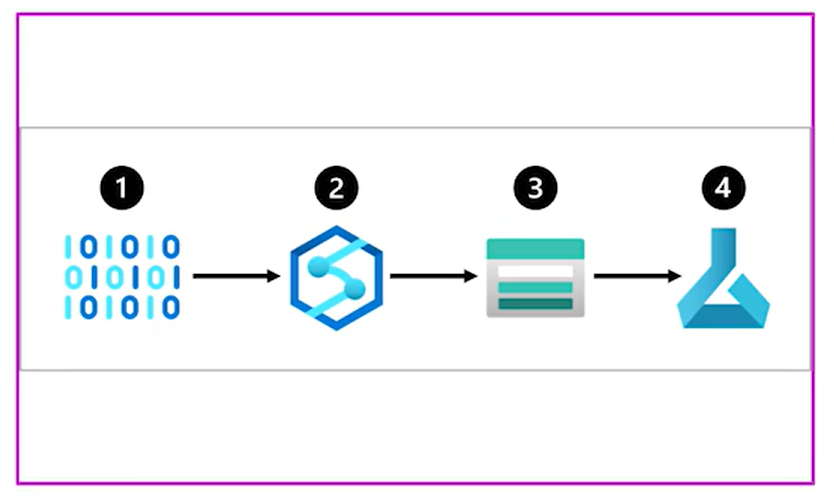

# Understanding the process

To actually create a ML solution in Azure, we need to understand how data is stored. Azure offers 3 types of data storages.

 * Azure Blob Storage: Great and cheapest for unstructured data, files, images, text and json.
 * Azure Data Lake storeage (Gen2): Same as before but with advanced features. Allows to give acess to specific file/folder to an specific role-based account
 * Azure SQL DataBase: Good wehn we have structured data
  
# Designing a data ingestion solution

Basically, a Pipeline. Now, usually the pipeline involves differente services used *outside¨of the ML services. This is because, we create the pipeline habing in mind the whole process of the data and that could potentially include a heavy transformation in the data. This is where we could use **Azure Synapse System** and **Azure Data bricks** and then put the output in one of the storage systems available to **finally consume it within Azure ML services**

  

``NOTE:`` It would be good to have a background with the other ETLS services. In this case DP-203 certification would be great.

*  **Data Drift** This is when the newer data is statistically different to the old data. This is important because we need to understand wether we train the model with the new data, we add new data or in the worst-case sceneario, we retrain the model. But, which case would we do? 

To avoid Data drift, we need to think about the process of ingesting data over the time. The main idea is to train models and this is all part of the process. 

## Other services to keep in mind

# Selecting compute options

Every time a model is trained it is needed to calculate the time that is taking to compute and the resources. Although the process need try-error checkig it is recommended to try from time to time the different confi of these optioms to verify that the used one is the best one regarding cost-bemefit ratio

**First configuration**
Depending on the needs of the projects, one cupute option would be better than another. In general *GPU* will be expensiver than *CPU* althou GPU will be faster. The selection in these two options will be critical at the very first stage. 

**Second configuration**

General purpose vs memory optimized. The general purpose computer has a optimal ratio of memory-cpu ratio and it's perfect to develop small analysis. 

On the other hand the memory optimized have a higher memory-to-CPU ratio and it's great to advanced analytics

**Third configuration**

Spark: ApAche Spark, you know the real "la vieja y confiable". Spark allows to distribute the processing into differents virtual machines.

# The deployment of a model

After the model is trained, we need to deploy the model into what is called an endpoint. THe idea is that the model would be deployed and application could send the model POST protocols and the model would send the REQUEST answer protocol.

In that order of idea, an **endpoint** is **simply a location where we'll send the API calls**; now here, what you need to understand is that, if the model is going to be deployed into a real-time endpoint or a batch endpoint.

* Real-Time Endpoint: This is used when the application calls the endpoint and it needs an inmediate response from the model. This means that you pay even if the model is not being used. 
* Batch Endpoint: This is used when the application calls the model and the response are stored in the model into batches to beused in time. Batch endpoints will consume processing power when creating the batch and then stop after they finished. Meaning this option is cheaper than real time endpoints. 
Batches also allows to process data in paralle and with this ypu could actually process larger amount of data mor efficently

As a general rule **if predictions could wait more than 5-10 minutes, batch-endpoints is a better option**

# Designing MLOps Solution

The idea here is to build a solution fast and scalable as fast as we can. What we could do about it? Well, could actually create 3 envirometns. DEvelovment, pre-production and production enviroments. This is could be having 3 ML workspaces and each one of them is useful for its specific task

