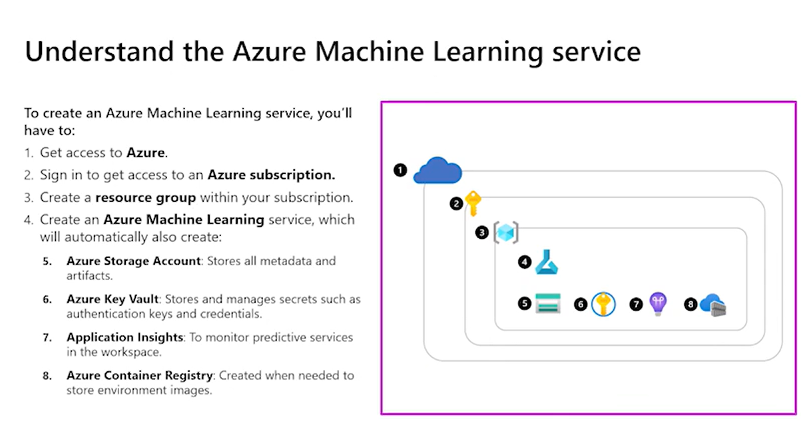
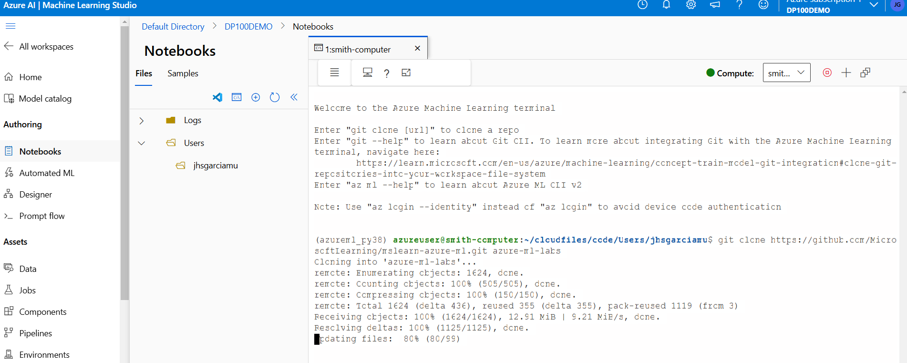
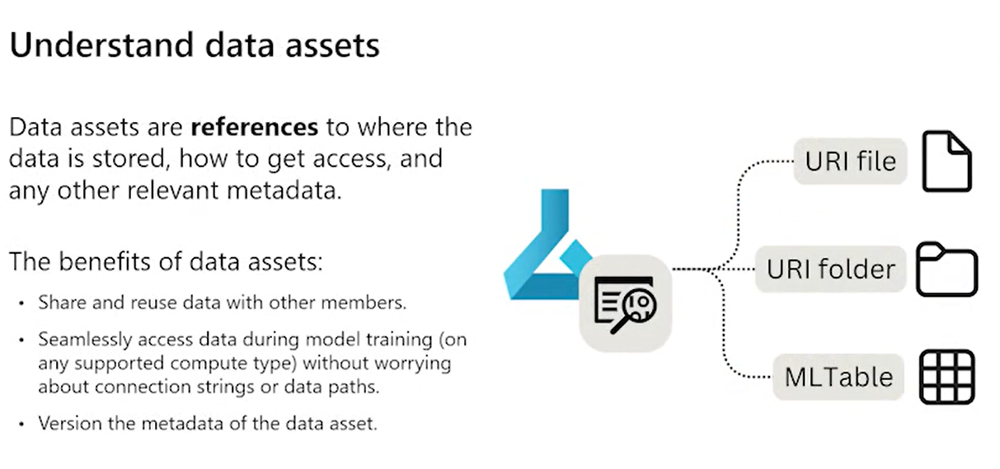
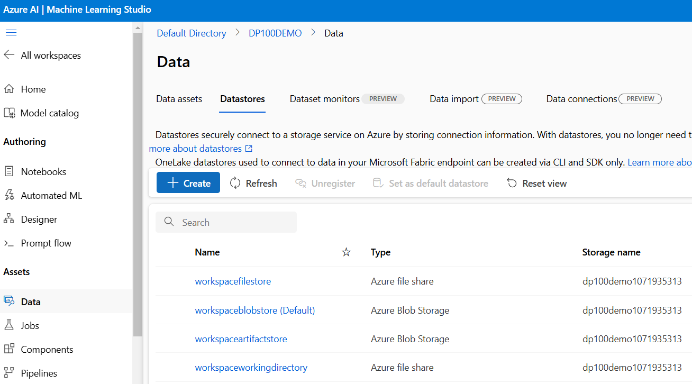
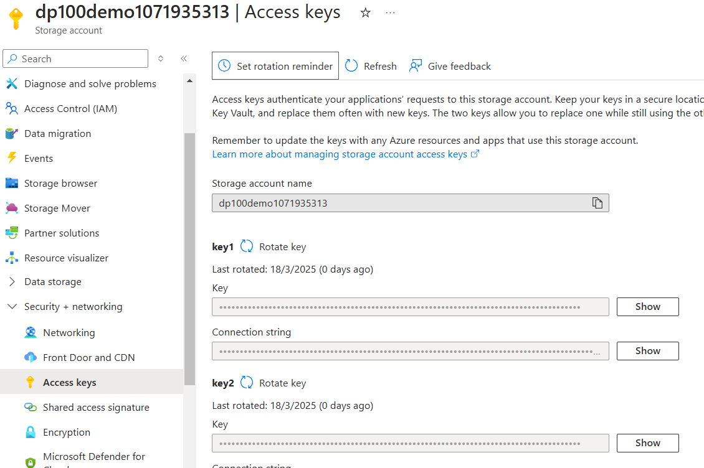
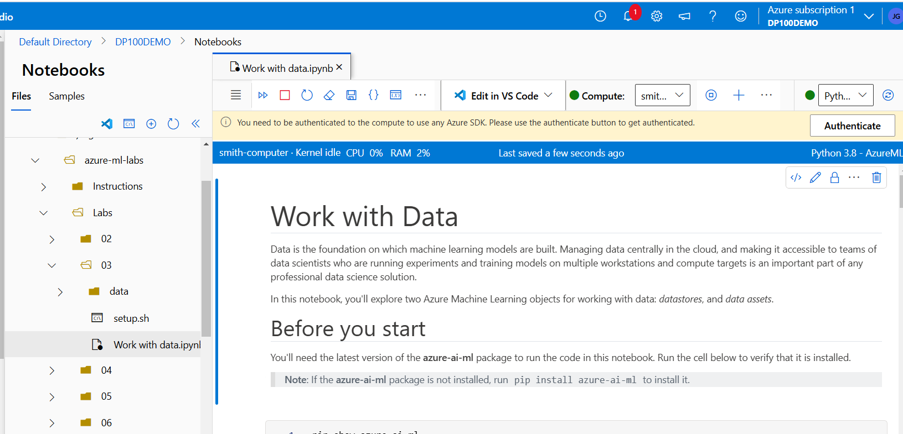
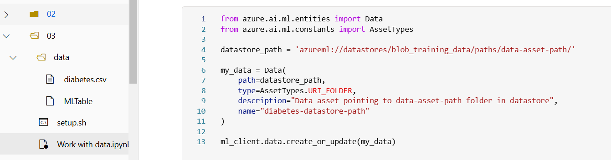

# Workspaces

When working in Azure ML, we understand that this is a platform specifically for data scientists. Whenever we create an Azure ML service, it comes with different services and assets.

With that in mind, every Azure Service requires a resource group because this is a service living inside the Azure data platform and is governed by its architecture. The image below shows the standard hierarchy of the process to access ML Service in the Azure portal.

<p align="center">
    
</p>

After we create a resource group, we are also creating:

1. **Azure storage account**: To store all metadata. We can also connect to other data sources or even other data accounts, databases, and so on.
2. **Azure key vaults**: To store usernames, passwords, connection strings for data sources.
3. **Application Insights**: To monitor the deployments of Azure.
4. **Azure Container registry**: Optional. To store container images that we use to provide environments.

**To create an ML Service**, just create a new resource in the Azure Portal. After that, it will create a new resource group with all the configurations to properly access ML Services.

One important thing is that we can add role assignments to the MS ML Service. Simply in the **Access control (IAM)** tab, we can add a control role. With this, we can restrict access to some data, info, etc.

# Azure Machine Learning Studio

Within the Azure portal, we can launch the Azure Machine Learning Studio, which is the place that contains the service itself. We can launch the `Machine Learning Studio` by clicking on "Launch Studio".

It is quite simple to create an Azure Workspace with the Azure CLI (The interface), but we can actually do this by coding:

```python
from azure.ai.ml.entities import Workspace

workspace_name = 'ml-example-workspace'
ws_basic = Workspace(
        name=workspace_name,
        location='eastus'
)

ml_client.workspaces.begin_create(ws_basic)
```

# Giving Access to Workspace

- **Owner**: Total access to the Workspace.
- **Contributor**: Full access to all resources but can't grant access to others.
- **Reader**: Can only view the resources but isn't allowed to make any changes.

With Azure ML workspace, there are *2 unique roles*:

- **Azure ML Data Scientist**: Can do anything but manage compute resources or edit workspace settings.
- **Azure ML Compute Operator**: Allows modifying resources of computing.

You can also create custom roles.

## Using Python SDK for Azure ML

1. **Installing**: `pip install azure-ai-ml`
2. **Connecting to a workspace**:
     ```python
     from azure.ai.ml import MLClient
     from azure.identity import DefaultAzureCredential

     ml_client = MLClient(
             DefaultAzureCredential(),
             subscription_id,
             resource_group,
             workspace
     )
     ```

## Using the CLI

A way to modify or create/access a workspace by console:

1. **Install on Windows**: `az extension add -n ml -y`
2. **Working with Azure CLI**:
     ```bash
     az ml compute create --file compute-yml --resource-group my-resource-group --workspace-name my-workspace
     ```

### Example Usage

Below is a list of commands in the order that should be inputted:

```bash
az extension add -n ml -y
az group create --name 'rg-dp100-labs-resource' --location 'eastus'

# This will give an output like this
{'id': 'group-id-code',
 'location': 'eastus',
 'managedBy': null,
 'properties': {
         'provisioningState': 'Succeeded'
 },
 'tags': null,
 'type': 'blablabla/resource-group'}

# Then we will need to generate the ML group in the group we created
az ml workspace create --name "dp100-demo" -g "rg-dp100-labs-resource"

# After we can create a compute instance for the ML service
# size: Values selectable by docs
# -w: workspace which will be created
# -g: resource group
# type: type of computational power supply

az ml compute create --name "DemoCompute" --size STANDARD_DS11_V2 --type ComputeInstance -w dp100-demo -g rg-dp100-labs-resource

# We could create another ML workspace with different specs as below
# type: AmlCompute - This is to create an ML compute instance
# --max: Parameter to control the max number of instances in the AML compute cluster
az ml compute create --name "aml-cluster" --size STANDARD_DS11_V2 --type AmlCompute --max-instances 2 -w dp100-demo -g rg-dp100-labs-resource
```

Now, when we created a compute instance, we can access it in the terminal by selecting the compute instance and in its application tab, we can just add the "terminal" button. Clicking here will launch the terminal associated with that compute instance.

Now in this compute, we will clone the repository with a simple git command. The repository to clone will be this one:

```bash
git clone https://github.com/MicrosoftLearning/mslearn-azure-ml.git azure-ml-labs
```



With that in mind, a folder with the corresponding repository will be created. Here we could find some files, notebooks, and scripts to work with.

# Creating Connections to Data Using URI

Basically, URIs are references to the location of your data. The good thing is that when we have this connection within the Azure service, we can avoid having connection credentials within our code. Although this is possible to do the connection, in most cases it is better to use a data store.

There are 4 data stores built-in when creating ML services. 2 of them connect to Azure Blob Storage containers and the other 2 to Azure File Share. All of them are created in the storage account within the Azure Resource Group.

By default, these 4 stores are created by Azure to store metadata or system information.

**Keep in mind that datastores *point* to data locations that we are working with but they DO NOT define any details regarding the data itself.**

## Data Assets

Data assets are basically the way that we reference **where and how** data is stored and **how** to get access to the data.



Now we could easily look into the 4 storage types within the Azure ML data tab as shown in the next ./pics/image:



### Demo of Data Connection

To do this demo, we could simply go to the storage account in the resource group and actually create a container. For learning purposes, we will call this brand-new container "training-data".

Now, inside the storage account, we will need the access key to the containers with the data itself. As shown in the next ./pics/image, the access key will be found in the security+networking tab, in the Access key section.



For this example, the storage account name is *dp100demo1071935313* and the actual access key is *zvwOTpPa8TAVWyw0PpXUOen83mK6svZTVBIPgtmECWFzFa2phUfi3VT7KjMe+mcVrC4uJgCmNaTj+ASt39n5jw==*

After we have this information, we can go back to the Azure ML Studio and try to create a notebook. As we already have a repository within the ML studio, we will use a notebook that has been created for learning purposes. Now, it is important to mention that:

- When we are working with a notebook, the environment inside the ML Studio needs to recognize properly computing resources and the Python environment.
    
- Always check the installation of the Azure SDK Python package inside the environment.
- Start the notebook by checking status and client configuration.

These 3 steps will be easily verified with the following code. And remember to install all the previous dependencies in the *compute terminal*.

```python
# to verify if the azure SDK is installed
pip show azure-ai-ml
```

```output
# Expected output
Name: azure-ai-ml
Version: 1.26.0
Summary: Microsoft Azure Machine Learning Client Library for Python
Home-page: https://github.com/Azure/azure-sdk-for-python
Author: Microsoft Corporation
Author-email: azuresdkengsysadmins@microsoft.com
License: MIT License
Location: /anaconda/envs/azureml_py38/lib/python3.10/site-packages
Requires: azure-common, azure-core, azure-mgmt-core, azure-monitor-opentelemetry, azure-storage-blob, azure-storage-file-datalake, azure-storage-file-share, colorama, isodate, jsonschema, marshmallow, msrest, pydash, pyjwt, pyyaml, strictyaml, tqdm, typing-extensions
Required-by: 
Note: you may need to restart the kernel to use updated packages.
```

```python
# to 
from azure.identity import DefaultAzureCredential, InteractiveBrowserCredential
from azure.ai.ml import MLClient

try:
        credential = DefaultAzureCredential()
        # Check if given credential can get token successfully.
        credential.get_token("https://management.azure.com/.default")
except Exception as ex:
        # Fall back to InteractiveBrowserCredential in case DefaultAzureCredential not work
        credential = InteractiveBrowserCredential()
```

```output
THE PREVIOUS CODE SHOULDNT SHOW ANY ERROR AND ONLY WORKS WITHIN THE AZURE ML STUDIO COMPUTE INSTANCES!!
```

```python
# Get a handle to workspace: This object it's just to interact with workspace
ml_client = MLClient.from_config(credential=credential)
```

Now with this, we have a proper connection inside the Azure ML Studio project. Let's do some tasks to practice a little bit more.

### List Datastores

```python
stores = ml_client.datastore.list() # get a list of datastores inside the storage account

for ds_name in stores:
    print(ds_name.name)
```

```output
workspacefilestore
workspaceblobstore
workspaceartifactstore
workspaceworkingdirectory
```

Note that the `workspaceblobstorage` contains the azureml-blobstorage and it's the container that we already explored. The `workspacefilestorage` connects to the **code** file share.

### Create a Datastore

The datastore creates a connection between your workspace and the storage but **it doesn't create the storage service itself**. To create the datastore, we will need to specify:

- The class to indicate with what type of storage service you want to connect. The example below connects to a Blob storage (`AzureBlobDatastore`).
- `name`: The display name of the datastore in the Azure Machine Learning workspace.
- `container_name`: The name of the container to store blobs in the Azure Storage Account.
- `credentials`: Provide the method of authentication and the credentials to authenticate. The example below uses an account key.

In previous steps we got the acess key and the storage account name. Now we could use the following code to actually create the datastorage


```python
from azure.ai.ml.entities import AzureBlobDatastore
from azure.ai.ml.entities import AccountKeyConfiguration

store = AzureBlobDatastore(
    name="blob_training_data",
    description="Blob Storage for training data. Learning how to do it in Python. Wiiiiiii",
    account_name="dp100demo1071935313",
    container_name="training-data", 
    credentials=AccountKeyConfiguration(
        account_key="zvwOTpPa8TAVWyw0PpXUOen83mK6svZTVBIPgtmECWFzFa2phUfi3VT7KjMe+mcVrC4uJgCmNaTj+ASt39n5jw=="
    ),
)

ml_client.create_or_update(store)
```
```output
AzureBlobDatastore({'type': <DatastoreType.AZURE_BLOB: 'AzureBlob'>, 'name': 'blob_training_data', 'description': 'Blob Storage for training data. Learning how to do it in Python. Wiiiiiii', 'tags': {}, 'properties': {}, 'print_as_yaml': False, 'id': '/subscriptions/77555a2f-fcc7-4967-a3f9-7f3061185b23/resourceGroups/rg-dp100/providers/Microsoft.MachineLearningServices/workspaces/dp100demo/datastores/blob_training_data', 'Resource__source_path': '', 'base_path': '/mnt/batch/tasks/shared/LS_root/mounts/clusters/smith-computer/code/Users/jhsgarciamu/azure-ml-labs/Labs/03', 'creation_context': None, 'serialize': <msrest.serialization.Serializer object at 0x7fd234ed1600>, 'credentials': {'type': 'account_key'}, 'container_name': 'training-data', 'account_name': 'dp100demo1071935313', 'endpoint': 'core.windows.net', 'protocol': 'https'})
```

**With this, the data storage is created and we can list it now**

```python
stores = ml_client.datastores.list()
for ds_name in stores:
    print(ds_name.name)
```
```output
blob_training_data
workspacefilestore
workspaceblobstore
workspaceartifactstore
workspaceworkingdirectory
```
### Create data assets

To point to a specific folder or file in a datastore, you can create data assets. There are three types of data assets:

- `URI_FILE` points to a specific file.
- `URI_FOLDER` points to a specific folder.
- `MLTABLE` points to a MLTable file which specifies how to read one or more files within a folder.


#### URI File creation

We need to sepcify the direct path that points to a specific file. The path can be local path or cloud path.

In the example below, you'll create a data asset by referencing a local path. To ensure the data is always available when working with the Azure Machine Learning workspace, local files will automatically be uploaded to the default datastore.In this case, the `diabetes.csv` file will be uploaded to **LocalUpload** folder in the **workspaceblobstore** datastore. 

In this case, the project's strucutre is as folows:


Remember that **we already creaded a datastore called blob_training_data** and we will give a complete path in the azure enviroment to the file where it should be upload

```python
from azure.ai.ml.entities import Data
from azure.ai.ml.constants import AssetTypes

datastore_path = 'azureml://datastores/blob_training_data/paths/data-asset-path/'

my_data = Data(
    path=datastore_path,
    type=AssetTypes.URI_FOLDER,
    description="Data asset pointing to data-asset-path folder in datastore",
    name="diabetes-datastore-path"
)

ml_client.data.create_or_update(my_data)

```
```output
from azure.ai.ml.entities import Data
from azure.ai.ml.constants import AssetTypes

datastore_path = 'azureml://datastores/blob_training_data/paths/data-asset-path/'

my_data = Data(
    path=datastore_path,
    type=AssetTypes.URI_FOLDER,
    description="Data asset pointing to data-asset-path folder in datastore",
    name="diabetes-datastore-path"
)

ml_client.data.create_or_update(my_data)
```

#### URI Folder

Uri folders points to specific folders. The path could be local or cloud. The path doesn't have to exist yet. The folder will be created when data is uploaded to the path.

```python
from azure.ai.ml.entities import Data
from azure.ai.ml.constants import AssetTypes

datastore_path = 'azureml://datastores/blob_training_data/paths/data-asset-path/'

my_data = Data(
    path=datastore_path,
    type=AssetTypes.URI_FOLDER,
    description="Data asset pointing to data-asset-path folder in datastore",
    name="diabetes-datastore-path"
)

ml_client.data.create_or_update(my_data)
```

```output
Data({'path': 'azureml://subscriptions/77555a2f-fcc7-4967-a3f9-7f3061185b23/resourcegroups/rg-dp100/workspaces/dp100demo/datastores/blob_training_data/paths/data-asset-path/', 'skip_validation': False, 'mltable_schema_url': None, 'referenced_uris': None, 'type': 'uri_folder', 'is_anonymous': False, 'auto_increment_version': False, 'auto_delete_setting': None, 'name': 'diabetes-datastore-path', 'description': 'Data asset pointing to data-asset-path folder in datastore', 'tags': {}, 'properties': {}, 'print_as_yaml': False, 'id': '/subscriptions/77555a2f-fcc7-4967-a3f9-7f3061185b23/resourceGroups/rg-dp100/providers/Microsoft.MachineLearningServices/workspaces/dp100demo/data/diabetes-datastore-path/versions/1', 'Resource__source_path': '', 'base_path': '/mnt/batch/tasks/shared/LS_root/mounts/clusters/smith-computer/code/Users/jhsgarciamu/azure-ml-labs/Labs/03', 'creation_context': <azure.ai.ml.entities._system_data.SystemData object at 0x7fd217da61d0>, 'serialize': <msrest.serialization.Serializer object at 0x7fd217da7eb0>, 'version': '1', 'latest_version': None, 'datastore': None})
```
#### ML Table

To create a `MLTable` data asset, you have to specify a path that points to a folder which contains a MLTable file. The path can be a local path or cloud path. 

> **Note**:
> Do **not** rename the `MLTable` file to `MLTable.yaml` or `MLTable.yml`. Azure machine learning expects an `MLTable` file.

In the example below, you'll create a data asset by referencing a *local* path which contains an MLTable and CSV file. Againg *note the project¿´s structure* in order to understand the relative paths

```python
from azure.ai.ml.entities import Data
from azure.ai.ml.constants import AssetTypes

local_path = 'data/'

my_data = Data(
    path=local_path,
    type=AssetTypes.MLTABLE,
    description="MLTable pointing to diabetes.csv in data folder",
    name="diabetes-table"
)

ml_client.data.create_or_update(my_data)
```

**And we can veiry the uploads with the next code**


```python
datasets = ml_client.data.list()
for ds_name in datasets:
    print(ds_name.name)
```
## Read data in notebook

Initially, you may want to work with data assets in notebooks, to explore the data and experiment with machine learning models. Any `URI_FILE` or `URI_FOLDER` type data assets are read as you would normally read data. For example, to read a CSV file a data asset points to, you can use the pandas function `read_csv()`. 

A `MLTable` type data asset is already *read* by the **MLTable** file, which specifies the schema and how to interpret the data. Since the data is already *read*, you can easily convert a MLTable data asset to a pandas dataframe. 

You'll need to install the `mltable` library (which you did in the terminal). Then, you can convert the data asset to a dataframe and visualize the data.  

```python
import mltable

registered_data_asset = ml_client.data.get(name='diabetes-table', version=1)
tbl = mltable.load(f"azureml:/{registered_data_asset.id}")
df = tbl.to_pandas_dataframe()
df.head(5)

```

# Compute cost and configuration

Compiute has a cost and one of the main worries within cloud enviroments is cloud-performance prices. To this, it is possible to assign s a compute instance to a user. 

``DISCLAIMER!`` A compute instance **can only be assigned to ONE user**

A compute instance can works only in notebooks due the fact it cant handle paralell process.

## when to use compute instance?

 * When we want to use and host notebooks
 * when we want to work with small process
 * When experimenting with data to small insigths and get familiar with dataset structure

## When to use compute cluster

 * When experimentation is done and need computational power to run hravy task
 * To run a pipeline job that we created in the *Designer*
 * Tu run AutoMachineLearing Jobs
 * To Run Script as a job
 * To train different models in parallel
 * 


## Compute selection

When creating a ML service within azure it is recommended to select the compute in function of the products needs. Here is an example of how to configure the computing and so on. Now in order to understand a little bit more about configuration of the computins see this [specific file]("./labs/2 Work with compute.ipynb") in which all the condiguration via SDK in Azure is done. **There is also a good example of how to create a job with compute instances and so on.

# Compute Example Demo

With that in mind, here’s a general idea of the implementation:

```python
from azure.ai.ml.entities import AmlCompute

# Name assigned to the compute cluster
cpu_compute_target = "aml-cluster"

try:
    # Let’s see if the compute target already exists
    cpu_cluster = ml_client.compute.get(cpu_compute_target)
    print(
        f"You already have a cluster named {cpu_compute_target}, we'll reuse it as is."
    )

except Exception:
    print("Creating a new cpu compute target...")

    # Let's create the Azure ML compute object with the intended parameters
    cpu_cluster = AmlCompute(
        name=cpu_compute_target,
        # Azure ML Compute is the on-demand VM service
        type="amlcompute",
        # VM Family
        size="STANDARD_DS11_V2",
        # Minimum running nodes when there is no job running
        min_instances=0,
        # Nodes in cluster
        max_instances=1,
        # How many seconds will the node running after the job termination
        idle_time_before_scale_down=120,
        # Dedicated or LowPriority. The latter is cheaper but there is a chance of job termination
        tier="Dedicated",
    )
```

```python
# Now, we pass the object to MLClient's create_or_update method
cpu_cluster = ml_client.compute.begin_create_or_update(cpu_cluster)
```

# Working with Enviroment Docker & CondaYML

At the very beggining when creating and working with Azure MK we have curated enviroments which are defaulst specs of an enviroment BUT if we would like to customize an enviroment we could use a custom enviroment with a Docker File or a COnda YAML file.

Now, the curated enviroments could be used by default and are quite useful regarding all possible scenearios where they will have to be used. With that in mind, let's see some basic comands to see the avialble envirometns or how to create some

NOTE: A specific enviroment python guide is in the this [notebook]("./labs/2a Work with environments.ipynb) that actually shows in a very precise way how to understand an enviroment configuration within azure platform

We already created a job in a previous scrip that is going to be executed.

```python
from azure.ai.ml import command

# configure job
job = command(
    code="./src",#point to the source directory
    command="python diabetes-training.py", # this script is going to be executed in the job
    environment="AzureML-sklearn-0.24-ubuntu18.04-py37-cpu@latest", #name of the enviroment used to the job, the env is a docker ./pics/image
    compute="aml-cluster",# computer power
    display_name="diabetes-train-curated-env",
    experiment_name="diabetes-training"
)

# submit job
returned_job = ml_client.create_or_update(job)
aml_url = returned_job.studio_url
print("Monitor your job at", aml_url)
```

**And this is how to see actually all the enviroments**

```python
envs = ml_client.environments.list()
for env in envs:
    print(env.name)
```

```output
AzureML-ACPT-pytorch-1.13-py38-cuda11.7-gpu
```

And this is how you could ask for a brief use or comment associated to the environment

```python
env = ml_client.environments.get("AzureML-sklearn-0.24-ubuntu18.04-py37-cpu", version=44)
print(env.description, env.tags)
```

```output
An environment for tasks such as regression, clustering, and classification with Scikit-learn. Contains the Azure ML SDK and additional python packages. {'Scikit-learn': '0.24.1', 'OS': 'Ubuntu18.04', 'Training': ''}
```

## Creating our own environment

We could create an enviroment based on a docker file. This is a generall idea of how to do it. We already created with based on a docker file

```python
from azure.ai.ml.entities import Environment

env_docker_image = Environment(
    image="mcr.microsoft.com/azureml/openmpi3.1.2-ubuntu18.04",
    name="docker-image-example",
    description="Environment created from a Docker image.",
)
ml_client.environments.create_or_update(env_docker_image)
```

```output
Environment({'arm_type': 'environment_version', 'latest_version': None, 'image': 'mcr.microsoft.com/azureml/openmpi3.1.2-ubuntu18.04', 'intellectual_property': None, 'is_anonymous': False, 'auto_increment_version': False, 'auto_delete_setting': None, 'name': 'docker-image-example', 'description': 'Environment created from a Docker image.', 'tags': {}, 'properties': {'azureml.labels': 'latest'}, 'print_as_yaml': False, 'id': '/subscriptions/77555a2f-fcc7-4967-a3f9-7f3061185b23/resourceGroups/rg-dp100/providers/Microsoft.MachineLearningServices/workspaces/dp100demo/environments/docker-image-example/versions/1', 'Resource__source_path': '', 'base_path': '/mnt/batch/tasks/shared/LS_root/mounts/clusters/smith-computer/code/Users/jhsgarciamu/azure-ml-labs/Labs/04', 'creation_context': <azure.ai.ml.entities._system_data.SystemData object at 0x7f2d20830d60>, 'serialize': <msrest.serialization.Serializer object at 0x7f2d208328f0>, 'version': '1', 'conda_file': None, 'build': None, 'inference_config': None, 'os_type': 'Linux', 'conda_file_path': None, 'path': None, 'datastore': None, 'upload_hash': None, 'translated_conda_file': None})
```