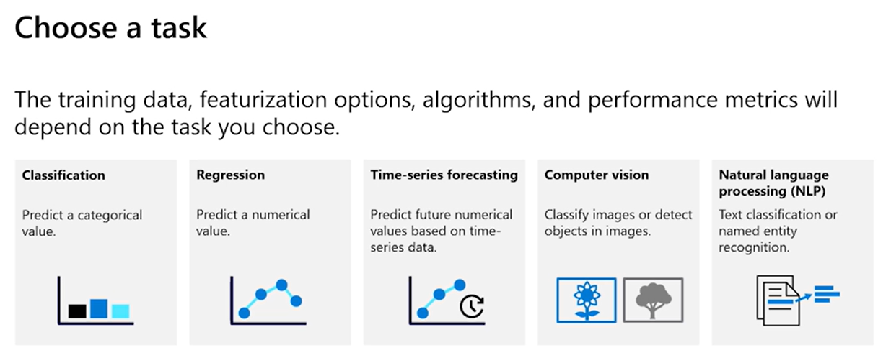
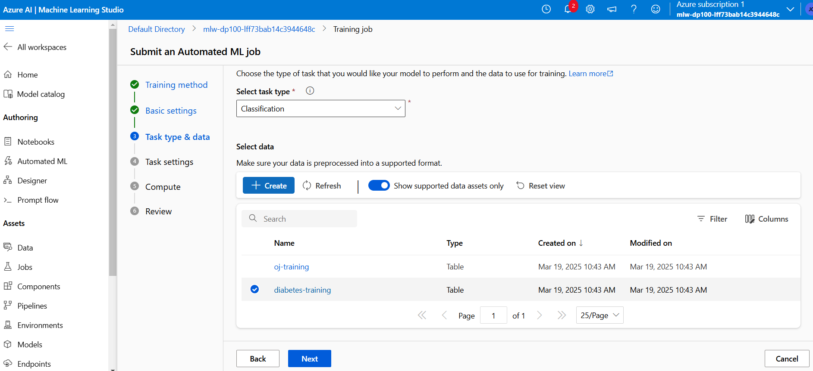

# Automated Machine learning

Essentially it create an experiments that runs differents algorithms within the Azure ML Service and execute hyperparameters tunning, at the ssame time to select the best fitting model to the situation.

AutoML gives data scientist a tool to run automatically a bunch of algorithm in seconds and evaluate performance to select the best one. What a data scientist usually does is to first, choose an algorithm, then execute and try to obtain the best hyper parameter and finally, repeat the process with a different algorithm. The whole idea is to keep doing that but in automatic with auto ML.

## Choose task

Depending on the problem Auto ML supports a specific numbers of algorithm to do some experimentation.



## Requirements

Remember that a MLTable store a schema to the tables

``Enviroments's requirements``

 * Need to create a data assets to the datastore
 * Requires tabular data
 * **requieres a MLTable**: Store the data in the same folder and the MLTable file as well
  
``Python requirements``

```python
from azure.ai.ml.consatns import AssesType
from azure.ai.ml import Input

my_training_data_input = input(

    type=AssesTypes.MLTABLE,
    path = 'azureml:input-data-automl:1'

)
```

### Scaling and normalization

AutoML applies scaling and normalization so we dont have any large scale feature dominaing the features. It also applies some of these transformation to the data:

 * Missing value imputation ot elimination null values
 * Categorical encoding to convert text into numbers
 * Dropping high cardinality features such as IDs records
 * Feature engineering: deriving individual date parts from DataFeatures
  
We could have control on which of these functionalities want and activate it or not BUT **they arent customizable at all**.  If you want to do an specific feature within the preprocessing, do it before this task is executed and the select which one could actually benefit the process, different that what we already have done.

## Find the best classification model  - DEMO

To create a AutoML job is quite simple. Jusst go to the "Auto ML" section on the left menu withi Azure ML Studio. There you will find the all AUtoML displayed and the option to "New Automated ML job". Click there. 

Now, it is important to select an aproppiate data type to the selected problem. When creating the auto ML job it could be selected the "Task type" and this is, whic ML problem are we facing? A regression problem? A clustering? To this exercise we will select a Classification problem. Bellow, thje usable data is showed and you can click it to double check the data.




### Task Settings tab

After that, we could select the target column (the one we want to predict). TO this example the diabetes Column will be the one selected.

 * in the `View additional configuration` button you will see some important configuration such as the Primary metric used to rank all possible models (AUCWeigthed, Accuracy, NormMacroRecall, AveragePrecissionScoreWeigthed, PreccisionScoreWeigthed)
 * Another interesting feature (which is disable by default) is to enable the ensemble stacking option which will use multiple models to stack predicitions (LOOK DEEPER INTO THIS!!)
 * Use suppurted models: Basically is an option to not use some models. On the list bellow will appear a list of models. If you select a model and activate this option, it will use all possible models BUT if you do not select this option, we can manually select which models we want to use. `To this demo we could will use LogisticRegression, SVM, KNN, DecisionTree` BUT we will use it all of them.
 * View featurearization settings: In this case you will basically select how the system should behave with the features one by one, what to do with it, how to fill blanks, how to treat high cardinality? By default you could leave it in "Auto" which automaticallly will select the best option to it
 * Limits option: We could limite compute power used for the AutoML job. 
 * Validating data: We could use cross validation of course and we could select which cross validation we want to use. We could also select the validation data with new data or the train-test split method. 
  
 * **Compute task**

     Here we will select the compute type that will be used. Remember that jobs requieres a compute cluster.  We can configure here the Priority of the task and how much resources it will take to train this model. By default is just fine 

Now, after all configuration are done, the job will be execute and keep in mind that MLAutomate job is gonna be a "Parent job" of very different children jobs and create different jobs to all model and figure out the best one based on all possible jobs runned. 

## Same demo with Python SDK

To watch the entire notebook with a deeper explanationg of how to use auto ml with azure in python go to [this file]("./labs/3 Classification with Automated Machine Learning.ipynb"). Here we will look at the most important commands to have in mind.

Remember to run the commands to verify acess to AzureML workspace and data. Those are:

```python
from azure.identity import DefaultAzureCredential, InteractiveBrowserCredential
from azure.ai.ml import MLClient

try:
    credential = DefaultAzureCredential()
    # Check if given credential can get token successfully.
    credential.get_token("https://management.azure.com/.default")
except Exception as ex:
    # Fall back to InteractiveBrowserCredential in case DefaultAzureCredential not work
    credential = InteractiveBrowserCredential()

# Get a handle to workspace
ml_client = MLClient.from_config(credential=credential)
```
After this validations are done, we can proceed. THe idea to create a autoML job via python is the same as the CLI in AzurePortal. 

from azure.ai.ml.constants import AssetTypes
from azure.ai.ml import Input

```python

# creates a dataset based on the files in the local data folder
my_training_data_input = Input(type=AssetTypes.MLTABLE, path="azureml:diabetes-training:1")
```

```output
# This uplooads the MLTable to the local enviroment
```

```python
from azure.ai.ml import automl

# configure the classification job
classification_job = automl.classification(
    compute="aml-cluster",
    experiment_name="auto-ml-class-dev",
    training_data=my_training_data_input,
    target_column_name="Diabetic",
    primary_metric="accuracy",
    n_cross_validations=5,
    enable_model_explainability=True
)

# set the limits (optional)
classification_job.set_limits(
    timeout_minutes=60, 
    trial_timeout_minutes=20, 
    max_trials=5,
    enable_early_termination=True,
)

# set the training properties (optional)
classification_job.set_training(
    blocked_training_algorithms=["LogisticRegression"], 
    enable_onnx_compatible_models=True
)
```


```python
# Submit the AutoML job
returned_job = ml_client.jobs.create_or_update(
    classification_job
)  

# submit the job to the backend
aml_url = returned_job.studio_url
print("Monitor your job at", aml_url)
```

```output
# And URL with the job itself
```

### Setting limits

One important thing is to create limits to the whole autoML process. With this we could control resource consuming

```python
classification_job.set_limits(
    timeout_minutes = 60, # Number of minutes after which the autoML process will be terminated
    trial_timeout_minutes = 20, # max minutes of a trial can take
    max_trials = 5, # amx number of tials or modes to be used
    enable_early_termination = True # in case the experiment's score isint improving in the short term 
)
```

## Reviewing results

After jobs are done we could actually look into the possibel results of the autoML  process. Just simply go to the "Jobs" tab and there you will be able to see all possible jobs. There will appear the child job and it will include a tag to see "the best job".

Inside job tab go to the "Models and child jobs" to look deeper into the trained models within each job. Then look into the best job and go to the exlpanaition of the model. Here you will find some info regarding the model itself and its performance


### Experiments 

We can group models used in differnet envirometns/jobs with a "tag" that we will call "experiments" so, when we see and experiment we will review all the models that have that "tag".

Now to tack models outside the Azure ML enviremtn we could use de **MLflow** package. That is an open source library that allows tracking and logged everything abouta model we're trainning into the Azure ML service with its paremets, metrics and artifacts.

To use MLFlow we need to install some libraries and do some preparations

 - install `mlflow` and `azureml-mlflow` packages
 - Get the value to the MLflow URI we are tracking from the Azure portal (Inside the task/job ion the overview page we could find the URI)
 - Use the following code inside the local machine to point to that. 

```python
mlflow.set_tracking_uri = "MLFLOW-TRACKING-URI"
```
**``NOTE: THIS TOPIC WILL BE STUDIED DEEPER IN NEXT DOCUMENTS``**
