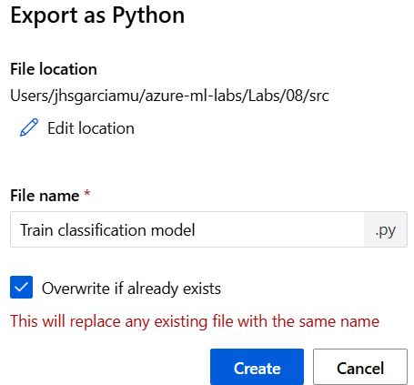
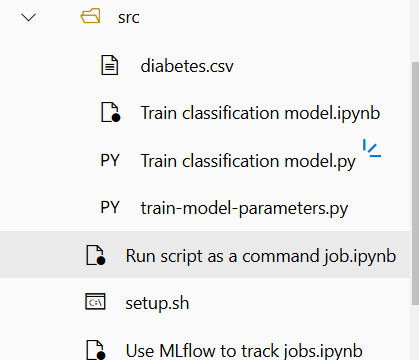
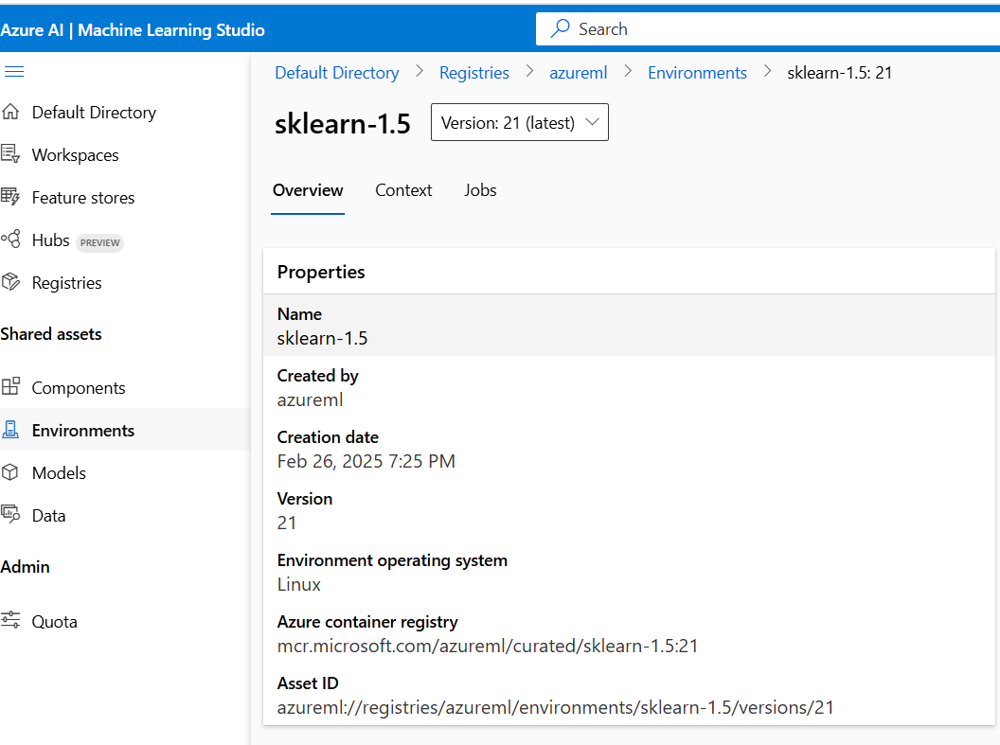
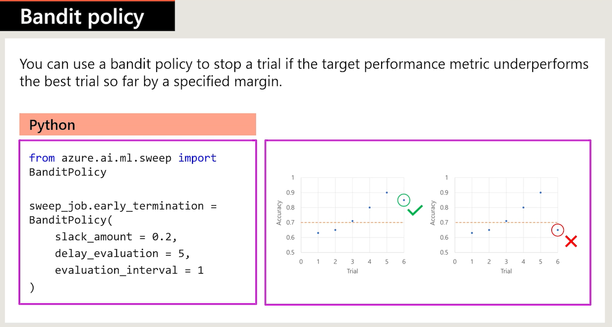
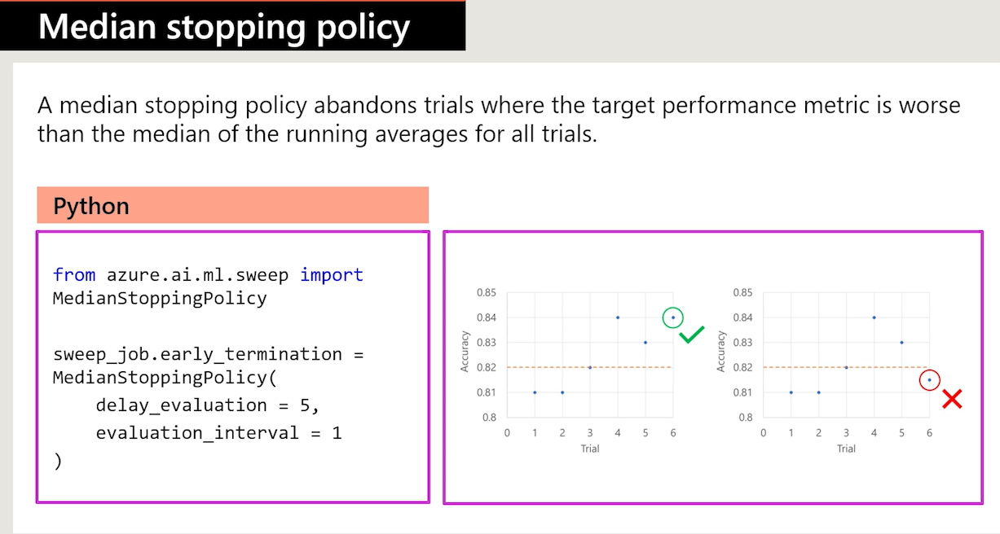
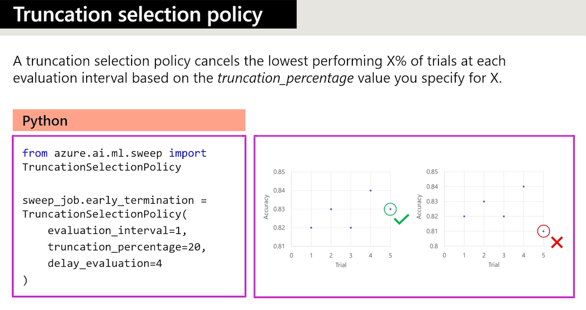
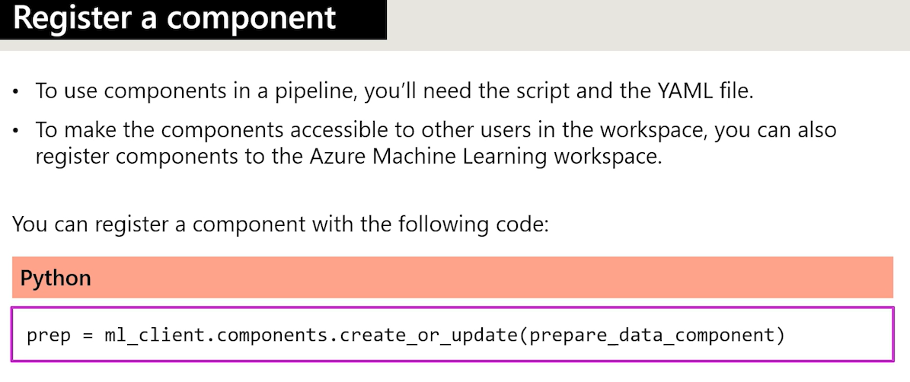
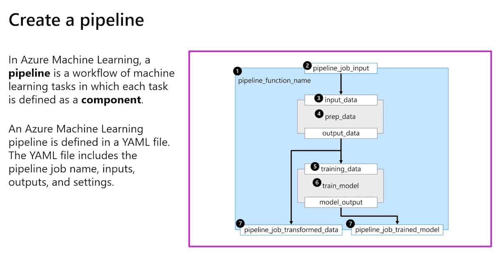
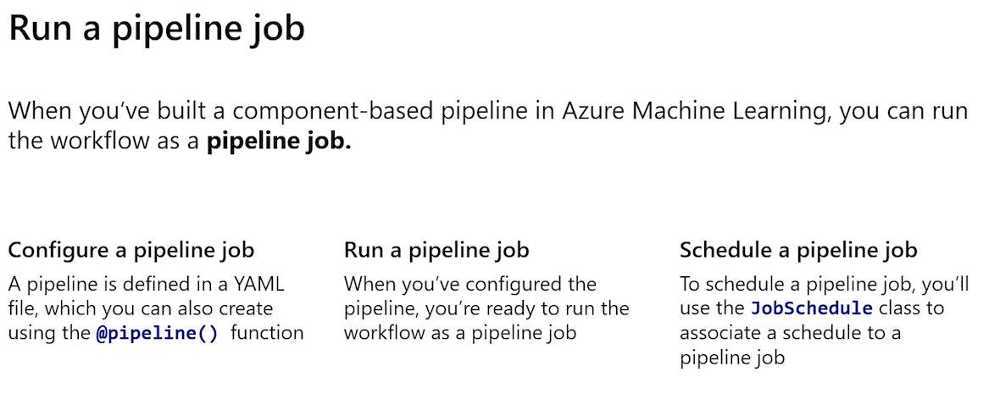

# Running a training scrips as a command job in Azure ML

After the experimentation is complete, we will need our code to deployment scenerarios. Notebooks are good to esperimentation, scripts are used to create pipelines and so on. 

Usually we create a notebook to experimantation and then convert it to a script. With that idea the script will need to be refactor as follows: 

 - Remove nonessencial code
 - Refactor code into functions
 - Test script (in terminal)

Hopefully after this we will have a production level script ready to go. After that we could run a script as a job.

## Jobs in Azure ML

 - **Command** Execute a single script
 - **Sweep** Perform hyper-optimization when executing a single script
 - **pipeline** Run a pipeline conssiting in multiple scripts or components

Now, when running a script as a job, you will need to use some parameters to be configure within the job to select things such as **the path to the script to be executed, the envitroment that can execute the scripts and the compute instance used.**

``Using parameters in a command job``

To run a script with different inputs, use **parameters**

 1. Import the argparse library, which allows to give arguments or parameters to a script via console. It is also needed to specify each of the parameters in the script including : the name, type and default value.
 2. Use the *ArgumentParser()* method in the script to include that name, type and default values. When doing this in the console we will use it as the parameters we give to the scriot via console
 3. Code example by console: ``python train.py --training_data diabetes.csv --reg_rate 0.01``

### Preparing a Python script

withi Azure notebooks we could simply save notebooks as .py file in the toolbar and exporting the file as a .py file. A pop-up windows appears and there you can modify toute and select if you want to overwrite the file if already exists.Now, a good example of how would ba a model prepared to be executed as a job would be [this on](./labs/4%20train-model-parameters.py)




As a general idea, a command script should be as follow:

 1. a main function: Who executes all the functions withis a script.
 2. functions to run task: All the functions who actually will run the job in the Azure ML server. 

```python
# Main function example: Execute all the functions
def main(args):
    # read data: A function to retrieve the data
    df = get_data(args.training_data)

    # split data
    X_train, X_test, y_train, y_test = split_data(df)

    # train model
    model = train_model(args.reg_rate, X_train, X_test, y_train, y_test)

    # evaluate model
    eval_model(model, X_test, y_test)
```
    * Now as the main function showed, there are functions that are called. Bellow is an example of one of such functions

```python
def get_data(path):
    print("Reading data...")
    df = pd.read_csv(path)
    return df
```

Now if you look carefully, the arguments of the main functions is **args** which ar actually the parameters passed via console. To do so, we create the next logic within the script:

 1. An argument parser function: That allows to parse via console the argumetns that we want to use
 2. And then we embbed the argument parser function *within* the main function. 

An example is showed below:

```python
def parse_args():
    # setup arg parser: The object to collect arguments
    parser = argparse.ArgumentParser()

    # add arguments: Adding training-data argument
    parser.add_argument(
        "--training_data",  # argument name
        dest='training_data', # argument destinatoin
                        type=str) # argument type

    parser.add_argument("--reg_rate", # argument name
        dest='reg_rate', # argumetn destiny
        type=float, # Argument type
        default=0.01) # default value

    # parse args: create object with arguments options
    args = parser.parse_args()

    # return args
    return args
```
And now we could execute the code assuring that arguments are required by console, executing the main. This is basically doing a calling of all ot the function created in the script AND also when we execute the script we will provide the arguments.

```python

# run script
if __name__ == "__main__":
    # add space in logs
    print("\n\n")
    print("*" * 60)

    # parse args
    args = parse_args()

    # run main function
    main(args)

    # add space in logs
    print("*" * 60)
    print("\n\n")

```
In this example, the data is stored in the same folder as the python script is so, the propper way to execute the script via terminal is as follows:

```bash
python train-model-parameters.py --training_data diabetes.csv
```
## Creating a job 

The propper way to create a job is explained in detail in this  [notebook](./labs/4%20Run%20script%20as%20a%20command%20job.ipynb). In this page we will give a brief description of how to create a job.



**Things to remember** 

- `code`: specifies the folder that includes the script to run.
- `command`: specifies what to run exactly.
- `environment`: specifies the necessary packages to be installed on the compute before running the command.
- `compute`: specifies the compute to use to run the command.
- `display_name`: the name of the individual job.
- `experiment_name`: the name of the experiment the job belongs to.

Note that the command used to test the script in the terminal is the same as the command in the configuration of the job below. 

`Note` Remember that Azure Curated Enviroments are created by default and their name could be consulted within Azure. We coul easily list the envirometns with this:

```python
envs = ml_client.environments.list()#remmeber ml_client is created first with the connections
for env in envs:
    # This list all possible enviroments
    print(f"Name: {env.name}, Version: {env.latest_version}")
```
```output
Name: AzureML-ACPT-pytorch-1.13-py38-cuda11.7-gpu, Version: 10
Name: AzureML-TensorFlow2.4-Cuda11-OpenMpi4.1.0-py36, Version: 1
Name: AzureML-Scikit-learn0.24-Cuda11-OpenMpi4.1.0-py36, Version: 1
Name: AzureML-Pytorch1.7-Cuda11-OpenMpi4.1.0-py36, Version: 1
```	

But to create an actual job command we need the assesID of the enviroment. It appears within the environment overvie tab. As we use a sklearn enviroment then we will use that asses ID. The propper enviroment list **would be within the CLI terminal an the command would be az ml enviroment list**

```bash
C:\Users\JhonatanSmithGarcía>az ml environment list --workspace-name mlw-dp100-lff73bab14c3944648c --resource-group rg-dp100-lff73bab14c3944648c
[
  {
    "latest version": "10",
    "name": "AzureML-ACPT-pytorch-1.13-py38-cuda11.7-gpu"
  },
  {
    "latest version": "1",
    "name": "AzureML-TensorFlow2.4-Cuda11-OpenMpi4.1.0-py36"
  },
  {
    "latest version": "1",
    "name": "AzureML-Scikit-learn0.24-Cuda11-OpenMpi4.1.0-py36"
  },
  {
    "latest version": "1",
    "name": "AzureML-Pytorch1.7-Cuda11-OpenMpi4.1.0-py36"
  }
]
```

BE AWARE THAT THE ENVIRONMENT PARAMETER INTO THE COMMAND SHOULD BE A PROPPER ENVIROMENT PATH WITHIN AZURE. So we know which enviroment to use and which version, now we only need the propper path within Azure service. It should be something like this: `azureml://registries/azureml/environments/AzureML-Scikit-learn0.24-Cuda11-OpenMpi4.1.0-py36/versions/1` and of course, it is easier to look for that assesID in the direct azure portal.




```python
from azure.ai.ml import command

# configure job

job = command(
    code="./src", # As said before, in this example the files are in the src root folder
    command="python train-model-parameters.py --training_data diabetes.csv", # 
    environment="azureml://registries/azureml/environments/AzureML-Scikit-learn0.24-Cuda11-OpenMpi4.1.0-py36/versions/1",
    #environment="AzureML-Scikit-learn0.24-Cuda11-OpenMpi4.1.0-py36@latest", # with @ wildcart we can simply select the numeric version as 1,2,3 etc or the latest version
    compute="aml-cluster",
    display_name="diabetes-train-script",
    experiment_name="diabetes-training"
    )

# submit job
returned_job = ml_client.create_or_update(job)
aml_url = returned_job.studio_url
print("Monitor your job at", aml_url)
```

# Track models with MLflow

MLflow is a open source package that helps to manage ML life cycle. It requires the **mlflow** and **azure-mlflow** packages to work. Just pip install them.

Ther are 2 options to track machine learning jobs with MLflow.

 - Autolloging ussing **mlflow.autolog()**
 - Use loggins functions to track custom metrics with **'mlflow.log_*'**

Now, if the Algorithm supports loggs in the ouput, it simply as just do the call of the autolog function from mlflow package and well be done.

```python
import mlflow
mlflow.autolog()
```
And with this, all possible logs will be saved.

## Log custom metrics with MLflow

Depending on the luibrary if it doesnt support logs or we want our own log, a method to store these as parameter are the next ones:

 - mlflow.log_param(): Log a single key-value parameter. 
 - mlflow.log_metric(): Can log a single key value metric, shows usually numbers
 - mlflow.log_artifact(): Log a file. Use this function for any plot you want to log, as image for example.

After we logged the metrics we can see them in the **Overview** and **Metrics** tabs. And we coul see even the plots in the **image** tab. Othe artifacts like model files coul be found in **Output+logs**

```python
# function that trains the model
def train_model(reg_rate, X_train, X_test, y_train, y_test):
  # with log_param: we could load a parameter to showed as a log
    mlflow.log_param("Regularization rate", reg_rate)
    print("Training model...")
    model = LogisticRegression(C=1/reg_rate, solver="liblinear").fit(X_train, y_train)

    return model
```
In this case the above code will show in the metrics the regularizartion rate as we selected it to be part of logs output. **Now we know that we could select any other parameter of our ML models**

## Retrive metrics with MLflow in a notebook

Use MLFlow noteboot python SDK to get more control anout MS Azure ML worksapce and in which job to run. 

```python
expermients = mlflow.search_experiments(max_results=2)
for exp in experiments:
  print(exp.name)

# retrieve runs
mlflow.search_runs(exp.experiment_id)
```

A complete guide to MLflow will be found in [this notebook](./labs/4a%20Use%20MLflow%20to%20track%20jobs.ipynb). Now in this notebook we have a complete data science job to classificate witha  Logistic Regression. Of course, we have outputs in this notebook such as plots, metrics and all kind of stuff that *are not allowed* as a terminal output. Take for example the next **Section** of the corresponding job.

```python

# function that evaluates the model
def eval_model(model, X_test, y_test):
    # calculate accuracy
    y_hat = model.predict(X_test)
    acc = np.average(y_hat == y_test)
    print('Accuracy:', acc)
    mlflow.log_metric("Accuracy", acc)

    # calculate AUC
    y_scores = model.predict_proba(X_test)
    auc = roc_auc_score(y_test,y_scores[:,1])
    print('AUC: ' + str(auc))
    mlflow.log_metric("AUC", auc)

    # plot ROC curve
    fpr, tpr, thresholds = roc_curve(y_test, y_scores[:,1])
    fig = plt.figure(figsize=(6, 4))
    # Plot the diagonal 50% line
    plt.plot([0, 1], [0, 1], 'k--')
    # Plot the FPR and TPR achieved by our model
    plt.plot(fpr, tpr)
    plt.xlabel('False Positive Rate')
    plt.ylabel('True Positive Rate')
    plt.title('ROC Curve')
    plt.savefig("ROC-Curve.png")
    # This next code will generate the ROC-curve artifact with the following code line
    mlflow.log_artifact("ROC-Curve.png")    
```

This is a function that actually calculates the auc cure to the model and makes a plot with those data. Now of course whenever we are creating a notebook we could asure this ouput within a cell *BUT** if we were to saved it as an output, we could store it with MLflow package as a metric to look for when the job is done in the MS Azure ML job's review section
In order to keep it as a metric/output it had to be especified within the code

# Perform hyperparameter tunning with Azure ML

Well, it is actually quite simple to understand that. We have parameter in a ML model so, we select different values to that and transform it in a Hyoerparameter. Which means that, we selec a **lambda** that could be a real number (take as an example regularization rate in a regression) and we fit different models with different regularization rates (aka HYper parameter) and to each one of them we got a model. The model with the best metric is the best model BUT we had to adjust too many models in order to select the best one. 

In azure ML we will use a **Sweep job** for hyperparamter tunning

## Sweep job

THe idea is to run a script as sweep job whenever we need to create a hyper parameter tunning job. It is as follows:

 - Create a trainning script for hyper parameter tunning
 - Configure and run a sweep job
 - Monitor and review sweep (chil) jobs

Nowin order to actually create and appropiated job we need to lear these concepts

 - `Discrete Hyperparameter` vs `Continues hyperparameters`: Basically the hyperparameter could be discrete or continues. Depending on what you want to tune, the idea has to be as follows.
 In the **discrete** case we select the value to the hyper parameter in a *finite* number of posibilites BUT in de **continous** case, the value of the hyperparameter itself could be a value along a scale, resulting in a *infinite* number of posibilites. 

 - `Search space` (Or commonly mentioned in math books as a "grid space"): This could be understood as all posibilities of the hyperparameter's values. 

### Sampling method

THe specific value used as a hyperparameter tunning run/sweep job depend on the sampling method used. There are essentially three different ways to sample.

 1. Grid sampling: Tries every posible combination (the idea to create a grid with all possible values to the parameter). **This applies only in discrete hyperparameters**
 2. Random sampling: Randomly select values from the search space and assign them as a hyperparameter value. 
 In this case we could add a **sobol** which is a random.state /random seed to the hyperparameter sampling method
 3. Bayesian sampling: Chooses new values based on previous results

Of course, we could add some restriction to the sampling methods as a general configuration. Such things as max number models, stop when the models are not improving, trigger a *early terminatio policy*. This last one could be particulary usefull when working witj continous models

`Early termination policy` Essentially there are 2 options.

 1. Evaluation_interval: Specify at which interval you want the policy to be evaluated. If it's set on 1 for example, it will evaluate this policy in every model (step)
 2. delay_evaluation: Specify an interval of when to start the policy. It says a number trials to wait before we do the evaluation.

Now with that in mind, the 3 policy types supported are **bandid policy, Median stopping policy and Truncation selection policy**.



 * slack_amount:0.2 -> Any trials that goes far from the 0.2 margiin will be terminated
 * delay_evaluation = 5 -> we will start do the calculation after the 5th trial
 * evaluation_interval =1 -> after the 5th evaluation the trials will be evaluated in each step



 * In this case we calculated the median of the trials and the ones who falls bellow that median will be terminated.



 * This one basically selects "a bottom" to terminate the process. In the example, the model is terminated if is in the "worst" 20% of the process

## Hyper parameter Tunning DEMO

A complete guide to create a Hyper parameter tunning is showed [here in html formar](./labs/5%20Hyperparameter%20tuning.html) or in [notebook for more pleasure](./labs/5%20Hyperparameter%20tuning.ipynb).

But to get a general idea of the most important part of the process, here you have it. First we would like to verify if out script works well with a single paramter value as a unique command job. After hat is assure, the idea is as follows:


```python
from azure.ai.ml import command, Input
from azure.ai.ml.constants import AssetTypes

# configure job

job = command(
  # where script is
    code="./src", 
    # how script is supposed to be excuted in terminal BUT now we have the  REG_RATE as an input!! This is the important part
    command="python train.py --training_data ${{inputs.diabetes_data}} --reg_rate ${{inputs.reg_rate}}",
    inputs={
        "diabetes_data": Input(
            type=AssetTypes.URI_FILE, 
            path="azureml:diabetes-data:1"
            ),
        "reg_rate": 0.01,
    },
    environment="AzureML-sklearn-0.24-ubuntu18.04-py37-cpu@latest",
    compute="aml-cluster",
    display_name="diabetes-train-mlflow",
    experiment_name="diabetes-training", 
    tags={"model_type": "LogisticRegression"}
    )

# submit job
returned_job = ml_client.create_or_update(job)
aml_url = returned_job.studio_url
print("Monitor your job at", aml_url)
```

This will be a sweep job WITH ONLY ONE HYPERPARAMETER just to verify that the job runs propperly.


**CREATING A SWEEP JOB**

After we have the job executed we need to define a *search space*. On the next step we will specify only 3 parameter. 

```python
from azure.ai.ml.sweep import Choice

command_job_for_sweep = job(
    reg_rate=Choice(values=[0.01, 0.1, 1]),
)
```

### Using a sweep job

You'll use the sweep function to do hyperparameter tuning on your training script. To configure a sweep job, you'll need to configure the following:

- `compute`: Name of the compute target to execute the job on.
- `sampling_algorithm`: The hyperparameter sampling algorithm to use over the search space. Allowed values are `random`, `grid` and `bayesian`.
- `primary_metric`: The name of the primary metric reported by each trial job. The metric must be logged in the user's training script using `mlflow.log_metric()` with the same corresponding metric name.
- `goal`: The optimization goal of the `primary_metric`. The allowed values are `maximize` and `minimize`.
- `limits`: Limits for the sweep job. For example, the maximum amount of trials or models you want to train.

Note that the command job is used as the base for the sweep job. The configuration for the command job will be reused by the sweep job.

```python
# apply the sweep parameter to obtain the sweep_job
sweep_job = command_job_for_sweep.sweep(
    compute="aml-cluster",
    sampling_algorithm="grid",
    primary_metric="training_accuracy_score",
    goal="Maximize",
)

# set the name of the sweep job experiment
sweep_job.experiment_name="sweep-diabetes"

# define the limits for this sweep
sweep_job.set_limits(max_total_trials=4, max_concurrent_trials=2, timeout=7200)

# ANd then we submit the Job like this
returned_sweep_job = ml_client.create_or_update(sweep_job)
aml_url = returned_sweep_job.studio_url
print("Monitor your job at", aml_url)
```
And finally in the **Trials** tab will show all models that have been trained and how ``Accuracy`` score differs. 

# Run pipelines 

Well, i fraking workflow... You know it, right? If not, search for the definition on google. Be a good boy and type "What is a pipeline in data sciente?" and go back after that.

Are you done? Good boy! Attaboy! Now, let us continue.

 * Components: reusable scripts that could be shared across users and workspaces. We use them to build pipelines and share ready-to-go code
 The magic with components it's that the could be prepared to do any stuff in the way you want in order to decompose a entire process in small pieces and use those pieces across the organization. For example, a train-test split process could be a component that could be reusable across workspaces. Or maybe something specific with the data within the organization process. *Sky is the limit my friend*

 

 

 

 

## Run a pipeline DEMO

Here's the complete demo in a [notebook](./labs/MyLabs/5%20Hyperparameter%20tuning.ipynb) and also in a [html format](./labs/MyLabs/5%20Hyperparameter%20tuning.html)