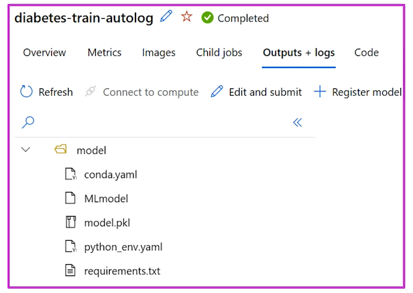

# Mlflow model in Azure

Over the time, we create some models and with those files we eventually want them in production. THe way to do is to regiester the model within de Azure ML service. 

**MLflow allows to log a model as an artifact or as a model**.

    - As an artifact: The model is treated as a file
    - AS a model: The model is able to be used directly in a pipeline

**Logging as a model will create a MLmodel file in the output directory. This MLmodel file contains model´s metadta to assure traceability**



## Understanding MLmodel file

This file could include:

1. **artifact_path** Location of where the model is logged to
2. **flavor** which is the library used to created the model
3. **model_uuid** Name of the model as unique identifier
4. **run_id** unique identifier of the job in which the model was created
5. **signature**Specifies the schema of the model´s input and output
   1. *inputs* Valid input to the model such as a valid subset to trainning a model
   2. *outputs* valid output to the model for example, model predictions for the input dataset

### DEMO how to do it

Think anout the next code as a script job to do some machine learning. Of course it is incomplete but as we see in the imports, **LogisticREgression** from **sklearn** is the main function to train the model. With that in mind, it could be simply to notice that the first artgument in the main function is the ``mlflow.autolog()`` statement. This basicallly uses the autolog function in the Azure ML services. We already studied that. 
```python
# import libraries
import mlflow
import argparse
import pandas as pd
import numpy as np
from sklearn.model_selection import train_test_split
from sklearn.linear_model import LogisticRegression
from sklearn.metrics import roc_auc_score
from sklearn.metrics import roc_curve
import matplotlib.pyplot as plt

def main(args):
    # enable autologging
    mlflow.autolog()

    # read data
    df = get_data(args.training_data)

    # split data
    X_train, X_test, y_train, y_test = split_data(df)

    # train model
    model = train_model(args.reg_rate, X_train, X_test, y_train, y_test)

    eval_model(model, X_test, y_test)

# function that reads the data
def get_data(path):
    print("Reading data...")
    df = pd.read_csv(path)
    
    return df

# function that splits the data
def split_data(df):
    print("Splitting data...")
    X, y = df[['Pregnancies','PlasmaGlucose','DiastolicBloodPressure','TricepsThickness',
    'SerumInsulin','BMI','DiabetesPedigree','Age']].values, df['Diabetic'].values

    X_train, X_test, y_train, y_test = train_test_split(X, y, test_size=0.30, random_state=0)

    return X_train, X_test, y_train, y_test
```


**Specify flavor** To do so, it's quite simple. Code will stay the same BUT now the mlflow function will recieve another parameter. 

```python
def main(args):
    # enable autologging
    mlflow.sklearn.autolog() # THIS IS HOW WE ADD FLAVOURS

    # read data
    df = get_data(args.training_data)

    # split data
    X_train, X_test, y_train, y_test = split_data(df)

    # train model
    model = train_model(args.reg_rate, X_train, X_test, y_train, y_test)

    eval_model(model, X_test, y_test)
```

**Model inferred signature**

We could specify schema to the model itself as it follows. You can manually log the model using `mlflow.sklearn.log_model` instead of autologging. You'll create a signature by inferring it from the training dataset and predicted results. And finally, you'll log the scikit-learn model. *look at the script as it follows*

```python
# import libraries
import mlflow
import argparse
import pandas as pd
import numpy as np
from sklearn.model_selection import train_test_split
from sklearn.linear_model import LogisticRegression
from sklearn.metrics import roc_auc_score
from sklearn.metrics import roc_curve
import matplotlib.pyplot as plt
import mlflow.sklearn
# to give a signature to the model
from mlflow.models.signature import infer_signature

def main(args):
    # read data
    df = get_data(args.training_data)

    # split data
    X_train, X_test, y_train, y_test = split_data(df)

    # train model
    model = train_model(args.reg_rate, X_train, X_test, y_train, y_test)

    # evaluate model
    y_hat = eval_model(model, X_test, y_test)

    # create the signature by inferring it from the datasets. In this case  inferring the idea that the model use a X_train as an input and will give an y_hay as an output
    signature = infer_signature(X_train, y_hat)

    # manually log the model: And with the flavour, we give the moedl a signature
    mlflow.sklearn.log_model(model, "model", signature=signature)

...
...
...

# run script
if __name__ == "__main__":
    # add space in logs
    print("\n\n")
    print("*" * 60)

    # parse args
    args = parse_args()

    # run main function
    main(args)

    # add space in logs
    print("*" * 60)
    print("\n\n")
```

**Model defined signature** You can manually log the model using `mlflow.sklearn.log_model`. You'll also create a signature manually. And finally, you'll log the scikit-learn model. The idea is as follows:

```python

# import libraries
...
...
...

def main(args):
    # read data
    df = get_data(args.training_data)

    # split data
    X_train, X_test, y_train, y_test = split_data(df)

    # train model
    model = train_model(args.reg_rate, X_train, X_test, y_train, y_test)

    # evaluate model
    y_hat = eval_model(model, X_test, y_test)

    # create the signature manually: We take some time to actually specify table's schema 
    input_schema = Schema([
    ColSpec("integer", "Pregnancies"),
    ColSpec("integer", "PlasmaGlucose"),
    ColSpec("integer", "DiastolicBloodPressure"),
    ColSpec("integer", "TricepsThickness"),
    ColSpec("integer", "DiastolicBloodPressure"),
    ColSpec("integer", "SerumInsulin"),
    ColSpec("double", "BMI"),
    ColSpec("double", "DiabetesPedigree"),
    ColSpec("integer", "Age"),
    ])
    # and give that schema to the output
    output_schema = Schema([ColSpec("boolean")])

    # Create the signature object
    signature = ModelSignature(inputs=input_schema, outputs=output_schema)

    # manually log the model
    mlflow.sklearn.log_model(model, "model", signature=signature)

```

### Register a model

Now the whole point of this is to regiser a model in the Azure platform. To do so, we could get a model from a job. First, let's create an hypotetical job.

```python
from azure.ai.ml import command

# configure job

job = command(
    code="./src",
    command="python train-model-signature.py --training_data diabetes.csv",
    environment="AzureML-sklearn-0.24-ubuntu18.04-py37-cpu@latest",
    compute="aml-cluster",
    display_name="diabetes-train-signature",
    experiment_name="diabetes-training"
    )

# submit job
returned_job = ml_client.create_or_update(job)
aml_url = returned_job.studio_url
print("Monitor your job at", aml_url) # this would retrieive the job's url
```

Now, after we properly get a job with a model, we coul just **simply try to register a model** as a MLflow model to easily deploy it later.

```python
from azure.ai.ml.entities import Model
from azure.ai.ml.constants import AssetTypes

job_name = returned_job.name

run_model = Model(
    path=f"azureml://jobs/{job_name}/outputs/artifacts/paths/model/",
    name="mlflow-diabetes",
    description="Model created from run.",
    type=AssetTypes.MLFLOW_MODEL,
)
# Uncomment after adding required details above
ml_client.models.create_or_update(run_model)
```

In the Studio, navigate to the **Models** page. In the model list, find the `mlflow-diabetes` model and select it to explore it further.

- In the **Details** tab of the `mlflow-diabetes` model, you can review that it's a `MLFLOW` type model and the job that trained the model.
- In the **Artifacts** tab you can find the directory with the `MLmodel` file.

If you want to explore the model's behavior further, you can **optionally** choose to deploy the model to a real-time endpoint.

# Responsible AI Dashboard for a model 

Model explaniation, features importance, Error and correlation. All that with a model in Azure ML. Usually we need metrics and verify that all models are align withoud bias and responisible topics (eitcs,security and reliability)

To create a proper dashboard we need to first create a pipeline with a model with integrated components. **We requiere**

 * A ML model already registered in Azure ML
 * Train and test datasets as MLTables
 * Access to a Azure ML workspace and a compute cluster

## Getting integrated components

```python
# import libraries
from azure.ai.ml import Input, dsl
from azure.ai.ml.constants import AssetTypes

# We can build a dashborad like this
rai_constructor_component = ml_client.components.get(
    name = "microsoft_azureml_rai_tabular_insight_constructor",
    label = "latest
)

rai_explanation_component = ml_client.components.get(
    name = "microsoft_azureml_rai_tabular_explanaition",
    label = "latest"
)

rai_gather_component = ml_client.components.get(
    name = "microsoft_azureml_rai_tabular_insight_gather",
    label = "latest"
)
```

## Building a pipeline

```python
@dsl.pipeline(
    compute = "aml-cluster", #my cluster 
    experiment_name = "Create a RAI Dashboard"
)

def rai_decision_pipeline(target_column_name, train_data, test_data):

    # 1. Crear el dashboard base
    create_rai_job = rai_constructor_component(
        title="RAI dashboard diabetes",
        task_type="classification",  # puede ser regression también
        model_info=expected_model_id,  # info del modelo registrado
        model_input=Input(type=AssetTypes.MLFLOW_MODEL, path=azureml_model_id),
        train_dataset=train_data,
        test_dataset=test_data,
        target_column_name=target_column_name,
    )
    create_rai_job.set_limits(timeout=30)

    # 2. Agregar explicaciones (u otros análisis)
    explanation_job = rai_explanation_component(
        rai_insights_dashboard=create_rai_job.outputs.rai_insights_dashboard,
        comment="add explanation",
    )
    explanation_job.set_limits(timeout=10)

    # 3. Reunir todo en el dashboard final
    rai_gather_job = rai_gather_component(
        constructor=create_rai_job.outputs.rai_insights_dashboard,
        insight=explanation_job.outputs.explanation,
    )
    rai_gather_job.set_limits(timeout=10)
    rai_gather_job.outputs.dashboard.mode = "upload"

    return {
        "dashboard": rai_gather_job.outputs.dashboard,
    }

```

## Executing the pipeline

```python
# Entradas necesarias
pipeline_job = rai_decision_pipeline(
    target_column_name="label",
    train_data=Input(type="mltable", path="path_to_train_data"),
    test_data=Input(type="mltable", path="path_to_test_data"),
)

# Enviar a Azure ML
ml_client.jobs.create_or_update(pipeline_job)
```
## Reviewing the dashboard

Now in the Azure ML service we could see in **models -> dashboard** all the results of the pipeline and the dashboard with the propper analyisis such as feature imporatance and so on.