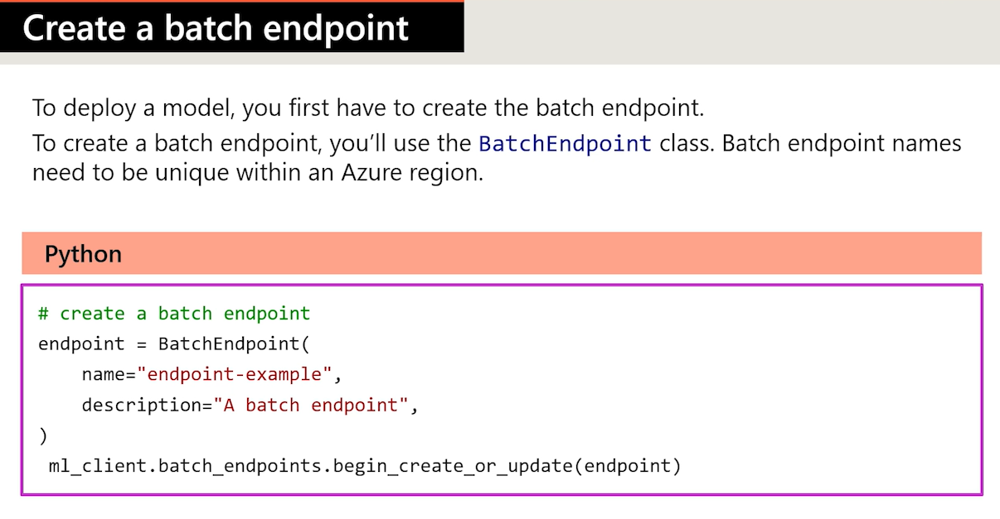
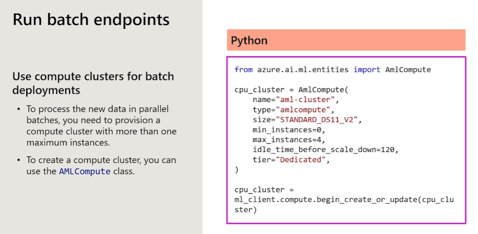
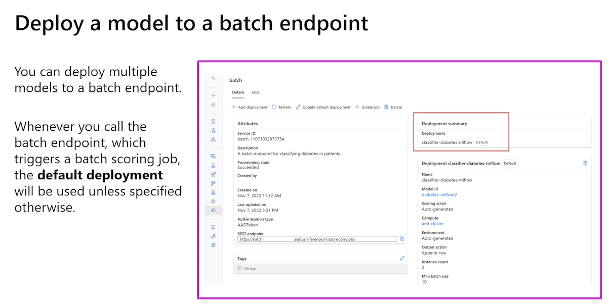
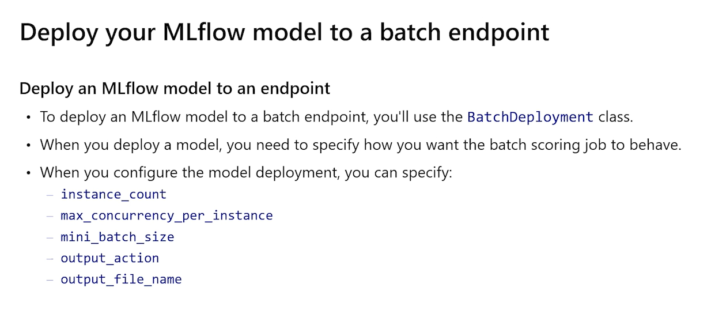
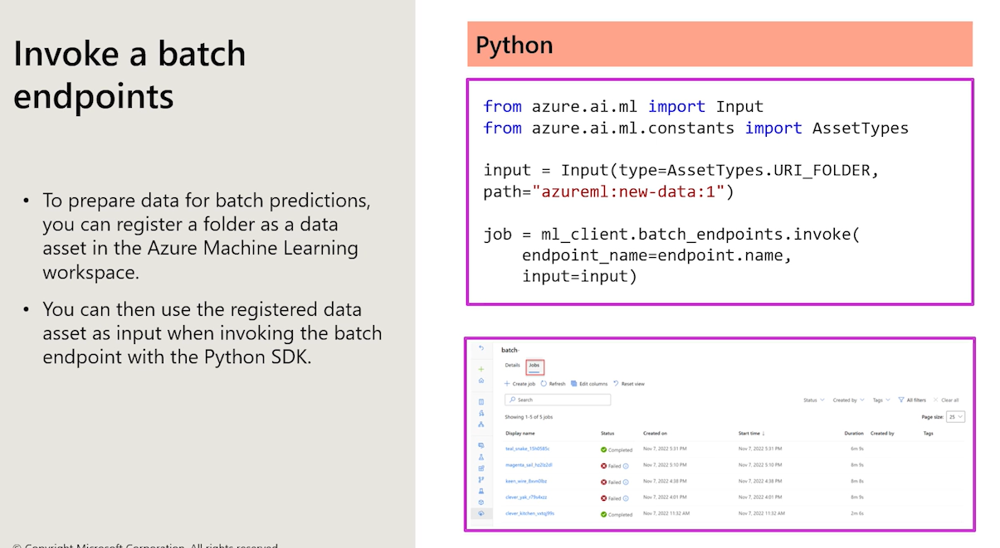

# A brief introduction

Before reading this documentation, please be sure that you understand *what a conda file is* and how it works. In case you are not sure how to use it and what they are, please read this small documentation to give a brief idea. 

[Click here to read conda examples](./aux%20examples/yml-conda%20files.md)

# Endpoints and hosting

And endpoint is used to expose an API for the model and can be reach over the HTTPS protocol. The idea is that wit HTTP request we could send the input data to the model and recieve a response with the output prediction data of the model.

Online endpoints are used on real-time scenerios. But essentially we have these two scenearios.

 1. Deploy a MLflot model: Simply regist a MLModel file, create the deployment and do it in its respective endpoint
 2. Deploy a custom model: This have some other stepts to have in mind. 
    1. Register a model with the neceesary model files
    2. Creating a scoring script wich tell how the request and response will be communicate and done
    3. Define the execution enviroment
    4. Create the deployment
    5. Deploy to the endpoint

In Azure ML we could see in a very simple way all endpoints available, endpoint's details, test an endpoint. In Azure ML interface there is also a test tab in which we could have a little test passing the info as an input and showing the results.

``Blue/Green implementation:`` This is a strategy to test new version of a model whi has been deployed. **Blue** is the current version of the model which recieves the majoy traffic service. Approx a 90% of that trafic. **Green** will be the new model to be deployed. It will recieve the rest 10% of the traffic.
Now, a complete guide to deploy [online endpoints is here](./labs/6a%20Deploy%20to%20online%20endpoint.ipynb) and of course, to deploy a [Batch endpoint](./labs/6b%20Deploy%20to%20batch%20endpoint.ipynb) as well. 


### Scoring Script

We could also deploy a model with a customizable Endpoint. To do so we will need a scoring script that could be used as a guide to show waht is needed to create an endpoint and deploy the model propperly.

A `score.py` script as example is showed below. But as a general idea, the inference script /scoring script will always need these 2 functions:

 1. `init():` To load model in memoty
 2. `run(data):` Call the model to return predictions in each response


```python
import json
import joblib
import numpy as np
import os

def init():
    global model
    model_path = os.path.join(os.getenv('AZUREML_MODEL_DIR'), 'model.pkl')
    model = joblib.load(model_path)

def run(raw_data):
    data = np.array(json.loads(raw_data)['data'])
    predictions = model.predict(data)
    return predictions.tolist()

```

And after this, the execution enviroment is needed to be created. Of course, to create an enviroment to run this model (the scoring script) we could do a Docker file image or a `conda.yml` o directly with the Azure SDF V2. Both examples are showed below.


```yaml
# Conda file to create the enviroment
name: env-deployment
channels:
  - conda-forge
dependencies:
  - python=3.7
  - scikit-learn
  - pandas
  - numpy

```

```python
# Python Azure SDK file to create the enviroment
from azure.ai.ml.entities import Environment

env = Environment(
    image="mcr.microsoft.com/azureml/openmpi3.1.2-ubuntu18.04",
    conda_file="./conda.yml",
    name="deployment-environment",
    description="Entorno con imagen Docker base y dependencias Conda.",
)
ml_client.environments.create_or_update(env)
```

**And finally, the deplyoment**

```python
from azure.ai.ml.entities import ManagedOnlineDeployment, CodeConfiguration, Model

model = Model(path="./model")

deployment = ManagedOnlineDeployment(
    name="deployment-name",
    endpoint_name="endpoint-name",
    model=model,
    environment=env,
    code_configuration=CodeConfiguration(
        code="./src", scoring_script="score.py"
    ),
    instance_type="Standard_DS2_v2",
    instance_count=1,
)

ml_client.online_deployments.begin_create_or_update(deployment).result()

# And traffic assigment:
endpoint.traffic = {"deployment-name": 100}
ml_client.begin_create_or_update(endpoint).result()

# AND THIS IS A ENDPOINT IS DELETED
ml_client.online_endpoints.begin_delete(name="endpoint-name")

```


## Deploy to an online endpoint

```python
# The usal stuff, connecting to workspace and get a handle to that workspace
from azure.identity import DefaultAzureCredential, InteractiveBrowserCredential
from azure.ai.ml import MLClient

try:
    credential = DefaultAzureCredential()
    # Check if given credential can get token successfully.
    credential.get_token("https://management.azure.com/.default")
except Exception as ex:
    # Fall back to InteractiveBrowserCredential in case DefaultAzureCredential not work
    credential = InteractiveBrowserCredential()

# Get a handle to workspace
ml_client = MLClient.from_config(credential=credential)
```

**Define an endpoint**

The application will consume the endpoint with and URI and authenticating with a key or token.  *The name of the endpoint has to be unique*

```python
from azure.ai.ml.entities import ManagedOnlineEndpoint
import datetime

# Generates a unique endpoint name - a string
online_endpoint_name = "endpoint-" + datetime.datetime.now().strftime("%m%d%H%M%f")

# create an online endpoint - This is the class from entities module
endpoint = ManagedOnlineEndpoint(
    name=online_endpoint_name,
    description="Online endpoint for MLflow diabetes model. This is an example",
    auth_mode="key",
)

# Creating the endpoint job
ml_client.begin_create_or_update(endpoint).result()

```

<p style="color:red;font-size:120%;background-color:yellow;font-weight:bold"> IMPORTANT! Wait until the endpoint is created successfully before continuing! A green notification should appear in the studio. </p>
### Config the deployment

We can deploy different model to the same endpoint. This is useful when we need to update a model without shutdown production model. 

```python
from azure.ai.ml.entities import Model, ManagedOnlineDeployment
from azure.ai.ml.constants import AssetTypes

# create a blue deployment
model = Model(
    path="./model",
    type=AssetTypes.MLFLOW_MODEL, # of course, it is needed to be state as a MLflow model
    description="my sample mlflow model. Just for fun",
)

blue_deployment = ManagedOnlineDeployment(
    name="blue", # just to give it a name
    endpoint_name=online_endpoint_name, # the unique name of the endpoint
    model=model,
    instance_type="Standard_D2as_v4", # tipo de instance cpu deploy, una VM de la tabla de compute disponibles
    instance_count=1, # cuantas copias de la VM se quiere levantar. Mas instancias, mayor disponibilidad, balance de carga a peticiones simultaneas
    # En resumen:
    # instance_type="Standard_D2as_v4"   - ¿Qué máquina uso?
    # instance_count=1                  - ¿Cuántas máquinas levanto?
)

# Finally let's create the deployment

ml_client.online_deployments.begin_create_or_update(blue_deployment).result()
```

**Usually a deployment takes around 10-15 minutes** and of course, it is needes to be **FIRST, DEPLOYED** do to any testing. After that is done, we could proceed with some testing.

```python
# blue deployment takes 100 traffic: Basicamente dice que todo el trafico del endpoint  debe ser atendido por el deployment llamado blue. En un escenario hipotetitico donde se tengan varios deployment se podria asignar porcentaje diferentes a cada uno de ellos para que lidien con el trafico. 
# endpoint.traffic = {"blue": 80, "green": 20} - Esto seria una relacion 80-20 de trafico compartido
endpoint.traffic = {"blue": 100}
ml_client.begin_create_or_update(endpoint).result()
```

And of course, we could run some test with the deployed model in the endpoint with some mock data.

**Sample data in the json file**

```json
{
  "input_data": {
    "columns": [
      "Pregnancies",
      "PlasmaGlucose",
      "DiastolicBloodPressure",
      "TricepsThickness",
      "SerumInsulin",
      "BMI",
      "DiabetesPedigree",
      "Age"
    ],
    "index": [1],
    "data": [
      [
      0,148,58,11,179,39.19207553,0.160829008,45
    ]
    ]
  }
}
```

```python
# test the blue deployment with some sample data
response = ml_client.online_endpoints.invoke(
    endpoint_name=online_endpoint_name,
    deployment_name="blue",
    request_file="sample-data.json",
)

if response[1]=='1':
    print("Diabetic")
else:
    print ("Not diabetic")
```

And of course, we could list all endpoints and get some details of the endpoints. look at this!

```python
# Get endpoint list
endpoints = ml_client.online_endpoints.list()
for endp in endpoints:
    print(endp.name)

# Get the details for online endpoint
endpoint = ml_client.online_endpoints.get(name=online_endpoint_name)

# existing traffic details
print(endpoint.traffic)

# Get the scoring URI
print(endpoint.scoring_uri)

# And this is how we delete an endpoint
ml_client.online_endpoints.begin_delete(name=online_endpoint_na``me)
```

## Deploy a batch endpoint

Well, in general the idea witha batch endpoint is the same but it has some triccky issues. First, the nature of a batch endpoint is quite different. Also, the way in which batch endpoint is created is different as well. The next slides gives a general idea of how they are created but keep in mind that [rhis Batch endpoint lab](./labs/6b%20Deploy%20to%20batch%20endpoint.ipynb) will do a better job explainig everything. 











### Batch deplyment demo

