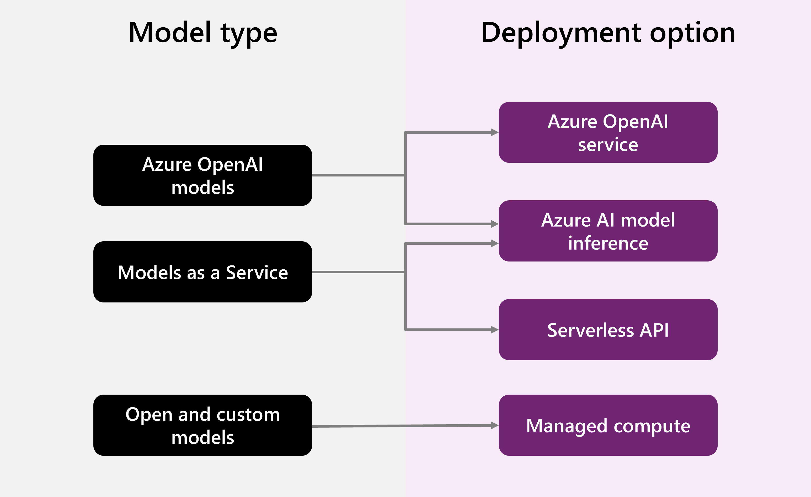
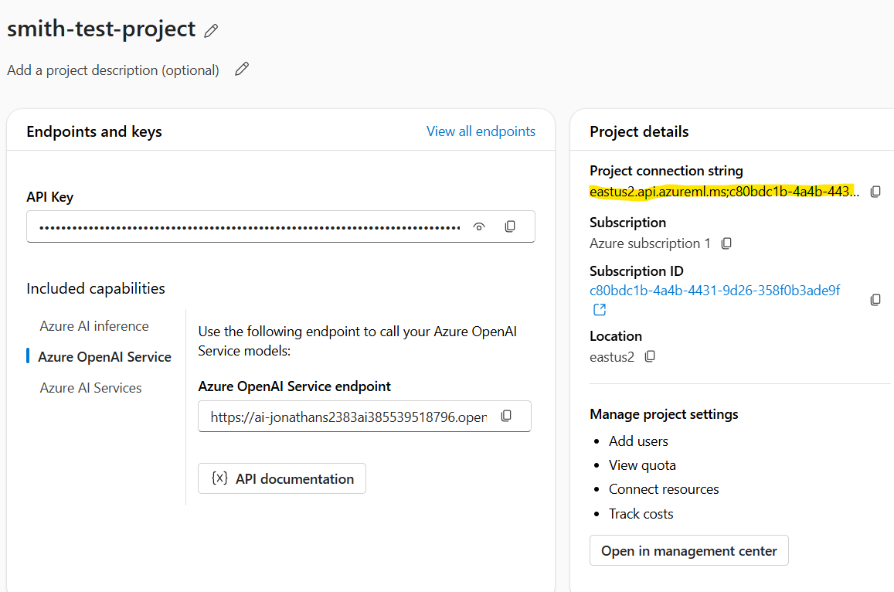
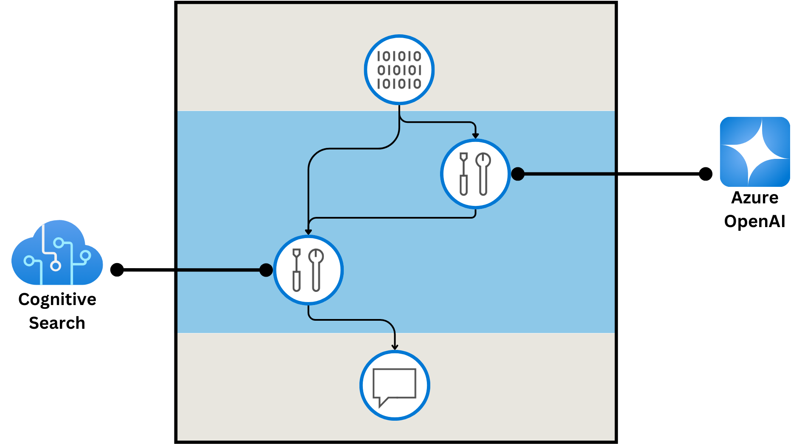
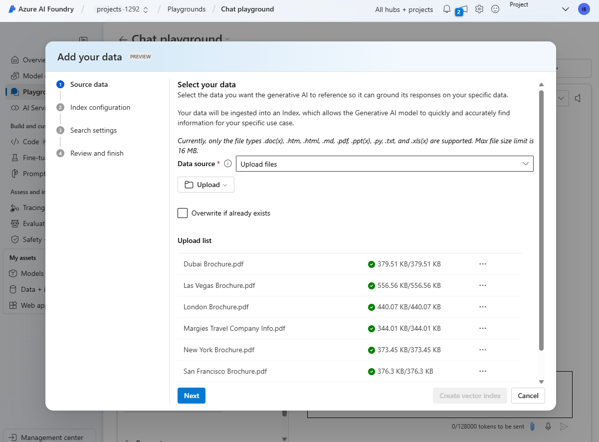

# Azure AI services

Microsoft offers different services related to AI. To use these services, you need to specify resources for these tasks.

 * Azure OpenAI: GPT family, DALL-E, and so on
 * Azure AI Vision: Offers models and APIs to implement computer vision
 * Azure AI Speech: Well, the name "speaks" for itself (Ba-Dum-Tss)
 * Azure AI Language: NLP and Text mining
 * AI Content Safety: Advanced algorithms to process image, text, and content potentially offensive or risky
 * Azure AI Translator: Model to translate different languages
 * Azure AI Face: Detecting and recognizing human faces
 * Azure AI Custom Vision: Train and deploy computer vision classification models
 * Azure AI Document Intelligence: Facilitates the extraction of information from complex documents, such as invoices, receipts, and forms, using prebuilt or custom models.
 * Azure AI Content Understanding: Analysis of media content, text, docs, videos, etc.
 * Azure AI Search: AI skills to extract info by indexing a search.

## Azure AI Foundry 

It's the platform where all AI solutions in MS are managed. There are two main tools to work with this platform.

 * **Azure AI Foundry portal**: Visual interface to work on AI projects
 * **Azure AI Foundry SDK**: A tool to develop tools via code

## Hubs and projects

Resources, assets, code, and other elements are managed by Hubs and projects.

 * **Hubs**: Like a general container to manage shared resources, data, connections, and security config as well. *A hub allows multiple devs in different projects to develop specific solutions* and you need *at least one hub* to use all the solution development features.
 * **Projects**: A hub can support different projects. Used to manage resources to develop a specific AI tool. Different users can collaborate in a project sharing data, data containers, and storage to the project using shared resources defined in the HUB.

There are different roles within the Hub configuration workspace. 

 * Owner: Full access to the hub including managing and creating new hubs. 
 * Contributor: Same as before but isn't able to manage hub permissions on the existing resources.
 * Azure AI Developer: Same as before but isn't able to create new hubs and manage hub permissions.
 * Azure AI Inference Deployment Operator: All permissions required to create a resource deployment within a resource group.
 * Reader: Read only (Dah!)

Project level roles are:

 * Owner, Contributor, Azure AI Developer, Azure AI Inference Deployment Operator, Reader: Same idea as above but at a Project level.

 * Regional availability and Costs: Depending on the region some services will be limited. Cost and so on should be pre-calculated with the respective *cost calculator* tool.

## Responsible AI

Some shit-hippie speach about responsible AI. Here are thecore principles of responsible AI:
 
 * Fairness: AI models should not discriminate against any group of people.
 * Reliability and Safety: AI models should not cause harm to people or the environment. Tesla car for example.
 * Privacy and Security: AI models should not collect or use personal data without the user's consent. Keep your data safe.
 * Inclusiveness: AI systems should empower everyone and engage people. AI should bring benefits to all parts of society, regardless of physical ability, gender, sexual orientation, ethnicity, or other factors.
 * Transparency: AI models should be transparent and explainable. Should be understandable by humans. AI systems should be understandable. Users should be made fully aware of the purpose of the system, how it works, and what limitations may be expected.
* Accountability: AI models should be accountable for their actions. Developers who trained and validated models are the ones to be held responsible for the consequences of their actions.

### First lab about gen AI

In this exercise, you use Azure AI Foundry portal to create a hub and project, ready for a team of developers to build an AI solution.
[Link to the lab](https://microsoftlearning.github.io/mslearn-ai-studio/Instructions/01-Explore-ai-studio.html)

# Model catalog in azure AI Foundry

There are many models, you can select them from Hugging Face, Open AI, Azure Open AI, etc. Now, azure AI Foundry has a catalog of models that you can use. There are some criteiria to select a model to use:
 * large vs Small models: Large models are more powerful but also more expensive. GPT-4, Mistral Large, Llama3 405Bare **LLM** 
 Small models are cheaper but less powerful. Phi3, Mistral OSS, Llama 38B are small models examples.
 * Task or tool: Some models are better for text generation, some for image generation, some for translation, etc. Depending on the model we will require to select an specific one. For example advanced reasioning, math, science, text generation, we could use **DeepSeek-R1** or **o1**.
 Some models are multi modal, meaning the can be used for image generation, text generation, etc.Models like GPT-4o family and Phi3-vision ara capables of both analyzing aand generating images and text.
 Dall-E 3 is a good example to generate images. 
* model by region: Some models are better to an specifici region like Core42 JAIS; which is an Arabic LLM making best choice to transalte to Arabic. Mistral LArge has a strong focus on European models. 

### Model selection criteria

To select the best language model for you use case, you need to decide on what criteria you're using to filter the models

 * ``task type``: Text only? Images? Translation?
 * ``Precision``: What is the precision of the model? Is it good enough to achgive the task? does it need fine tunning wth training with an specific dataset? In generative AI, precision refers to the accuracy of the model in generating correct and relevant outputs. It measures the proportion of true positive results (correct outputs) among all generated outputs. High precision means fewer irrelevant or incorrect results, making the model more reliable.
 * ``Openness``: Want to fine tune it by youtself?
 * ``Deployment``: Do you need to deploy it to an endpoint? Locally?
 * ``Performance``: When you're exploring models through the Azure AI Foundry model catalog, you can use model benchmarks to compare publicly available metrics like coherence and accuracy across models and datasets. These benchmarks can help you in the initial exploration phase, but give little information on how the model would perform in your specific use case.

| **Benchmark**       | **Description**                                                                                                                                                         |
|---------------------|-------------------------------------------------------------------------------------------------------------------------------------------------------------------------|
| **Accuracy**        | Compares model-generated text with correct answer according to the dataset. Result is one if generated text matches the answer exactly, and zero otherwise.             |
| **Coherence**       | Measures whether the model output flows smoothly, reads naturally, and resembles human-like language.                                                                  |
| **Fluency**         | Assesses how well the generated text adheres to grammatical rules, syntactic structures, and appropriate usage of vocabulary, resulting in linguistically correct and natural-sounding responses. |
| **Groundedness**    | Measures alignment between the model's generated answers and the input data.                                                                                           |
| **GPT Similarity**  | Quantifies the semantic similarity between a ground truth sentence (or document) and the prediction sentence generated by an AI model.                                 |
| **Quality index**   | A comparative aggregate score between 0 and 1, with better-performing models scoring a higher value.                                                                   |
| **Cost**            | The cost of using the model based on a price-per-token. Cost is a useful metric with which to compare quality, enabling you to determine an appropriate tradeoff for your needs. |


## How to deploy an AI model

AI solutions could vary depending on the needs of the application that is being developed. Of course, some models are better for translation, others for text mining or summarization, and so on. There is a vast amount of models in the Azure AI Foundry catalog. Essentially the procedure is as follows:

 1. Choose the proper model: Depending on the project's need.
 2. Deploy model: Each model has its unique button to deploy. Configure deployment parameters.
 3. Get endpoint details: Once the model is deployed, get the URI endpoint and authentication keys.
 4. Consume model from an app: Use URI and keys to provide requests to the model. Requests should include input data and how the model should process it.

The idea is quiet simple, you use a model deployed in a endpoint to consume it from an app. Make request to the endpoint and get the response. 


When a user asks a question:

1. An API request is sent to the endpoint.
2. The endpoint specifies the model that processes the request.
3. The result is sent back to the app through an API response.

When you deploy a language model from the model catalog with the Azure AI Foundry, you get an endpoint, which consists of a target URI (Uniform Resource Identifier) and a unique key. For example, a target URI for a deployed GPT-3.5 model can be:

```bash
https://ai-aihubdevdemo.openai.azure.com/openai/deployments/gpt-35-turbo/chat/completions?api-version=2023-03-15-preview
```

The URI includes:

1. Your AI hub name, for example ai-aihubdevdemo.
2. Your deployed model name, for example gpt-35-turbo.
3. The task for the model, for example chat/completion.

``deployment cost`` When you deploy a language model with Azure AI Foundry, you have several types available, which depend on the model you want to deploy.



## Optimize model performance

After you deploy your model to an endpoint, you can start interacting with it to see how it works. Some useful techquiniques are:

 * ```Promt engineering```: Clear instructions, structured format of headers, and keywords to guide a response.
 * ``Ask model to act as a specific persona``: For example, you can ask the model to act as a customer service representative.
 * ``Ask for better question suggestions``
 * ``Specify the desired format for responses``: When you want the model to generate output in a specific format, you can provide a template or structure in your prompt.
 * ``Ask for an explanation of reasoning``
 * ``Add context to the model``: When you want the model to focus on specific topics, you can specify the context to consider. You can also tell the model to ignore irrelevant information.

## Second lab - Explore and deploy a chat model

The Azure AI Foundry model catalog serves as a central repository where you can explore and use a variety of models, facilitating the creation of your generative AI scenario.

[link to the lab](https://microsoftlearning.github.io/mslearn-ai-studio/Instructions/02-Explore-model-catalog.html)

**There are other other model optimizations such as Retrieval Augmented genration (RAG) or Fine-Tunning** that could be used to improve the model performance.

But **before deploying a model** you should ensure how to optimize it. Here is a list of tasks to improve model performance *before deployment*:

 1. Prompt Engineering: Clear instructions, structured format of headers, and keywords to guide a response.
 2. System messages update: With specific use case examples, chained thoughts, and add context to the model.
 3. Model tuning: With fine-tuning tasks and RAG (Retrieval Augmented Generation) tasks. Text generation with information retrieval to give **a specific source of info training to the model**.

# Developing an AI app with Azure AI Foundry SDK

The Azure AI Foundry SDK is a set of packages and services designed to work together to enable developers to write code that uses resources in an Azure AI Foundry project. With the Azure AI Foundry SDK, developers can create applications that connect to a project, access the resource connections and models in that project, and use them to perform AI operations, such as sending prompts to a generative AI model and processing the responses

## Installing Python SDK - Azure AI Foundry

1. Installing all dependencies

```python
pip install azure-ai-projects
pip install azure-identity
```

2. Making a connection with Azure AI Foundry: This next code establishes a connection with the Azure AI Project.

```python
from azure.ai.projects import AIProjectClient
from azure.identity import DefaultAzureCredential

project_connection_string = "<string_connection_project>"

project_client = AIProjectClient.from_connection_string(
    credential=DefaultAzureCredential(),
    connection_string=project_connection_string
)
```

The "AIProjectClient" is the main object to interact with AI projects. It allows you to manage connections, models, and other resources within the project.

``Note`` The string to connect to the project is found in the Azure AI Foundry portal, in the **project**, go to the review page and there is the **project_connection_string**.



## Project connections

With Azure AI Foundry SDK we create a **AIProjectClient** in Python with some **connections** property, which allows to acess te resources in the project. Methods of connections object include:

 * ``connections.list()``: List all connections in the project. Could alse filter by connection_type parameter with a valid numeration, such as ``ConnectionType.AZURE_AI_SERVICE``.
 * ``connections.get(connection_name, include_credentials=True)``:Returns a connection object for the connection with the name specified. If the include_credentials parameter is True (the default value), the credentials required to connect to the connection are returned - for example, in the form of an API key for an Azure AI services resource.
 * ``connections.get_default(connection_type, include_credentials)``: Returns the default connection of the specified type - for example, the default Azure AI services connection defined in the project.
 
### Quick example


```python
from azure.ai.projects import AIProjectClient
from azure.ai.projects.models import ConnectionType
from azure.identity import DefaultAzureCredential
from azure.core.credentials import AzureKeyCredential
from azure.ai.textanalytics import TextAnalyticsClient

try:
    # Get project client
    project_connection_string = "<region>.api.azureml.ms;<project_id>;<hub_name>;<project_name>"
    project_client = AIProjectClient.from_connection_string(
      credential=DefaultAzureCredential(),
      conn_str=project_connection_string,
    )

    # Get the properties of the default Azure AI Services connection with credentials
    connection = project_client.connections.get_default(
      connection_type=ConnectionType.AZURE_AI_SERVICES,
      include_credentials=True, 
    )

    # Use the connection information to create a text analytics client
    ai_svc_credential = AzureKeyCredential(connection.key)
    text_analytics_client = TextAnalyticsClient(endpoint=connection.endpoint_url, credential=ai_svc_credential)

    # Use the Language service to analyze some text (to infer sentiment) 
    text = "I hated the movie. It was so slow!"
    sentimentAnalysis = text_analytics_client.analyze_sentiment(documents=[text])[0]
    print("Text: {}\nSentiment: {}".format(text,sentimentAnalysis.sentiment))

except Exception as ex:
    print(ex)
```

<details>
<summary><strong> 🧠  Code Explanation (click to expand)</strong></summary>

In the provided code snippet, the `text_analytics_client` is an instance of the `TextAnalyticsClient` class, which is used to interact with Azure's text analytics services. The connections mentioned refer to the linked resources that allow the project to communicate with external services, such as Azure AI services. These connections are established through the `AIProjectClient`, which retrieves connection details necessary for accessing the text analytics functionality.

The connections enable the application to utilize Azure's capabilities for tasks like sentiment analysis, which is demonstrated in the code where the sentiment of a given text is analyzed.

The connections in the Azure AI Foundry SDK are essential for linking your project to various external services. In the context of the `text_analytics_client`, these connections provide the necessary credentials and endpoints to access Azure AI services.

The `TextAnalyticsClient` uses these connections to perform operations such as sentiment analysis on the provided text. The code snippet illustrates how to retrieve the default connection for Azure AI services, which includes the credentials required to authenticate and make requests to the text analytics service.

While the code does not explicitly mention a model, it utilizes Azure's pre-trained models for sentiment analysis under the hood.

**Overall**, the `text_analytics_client` leverages Azure's capabilities, which are built on advanced machine learning techniques to provide accurate sentiment analysis results. The connections are crucial for ensuring that the application can securely access and utilize these powerful AI services.

</details>


# Create a Chat client

The ``ChatClient`` allows interacting easily with language models like GPT from the Azure AI Foundry. This is ideal for chatbot and Q&A tasks. 

## Requirements

Basic pip install methods are defined and it is needed ***the openai** python module. 

**To actually build an AI Chat client, we will depend on the models that you have deployed in Azure AI foundry project.** Then the app will consume those models. Now the actualy deployment could be done with different model hosting solutions:

### 1. 🌐 Azure AI Model Inference
- **Description**: A unified endpoint for multiple model types.
- **Supports**: OpenAI models and others from the Azure AI Foundry model catalog.
- **Connection**: Models are accessed via an **Azure AI services resource** in your project.

### 2. 🤖 Azure OpenAI Service
- **Description**: A dedicated endpoint for OpenAI models hosted in Azure.
- **Supports**: Only OpenAI models.
- **Connection**: Models are accessed via an **Azure OpenAI service resource** in your project.

### 3. 🚀 Serverless API
- **Description**: A model-as-a-service setup where **each deployed model has its own unique endpoint**.
- **Hosting**: Fully managed and hosted in your **Azure AI Foundry project**.

### 4. 🧠 Managed Compute
- **Description**: Similar to Serverless API, but the models are deployed to **custom compute environments**.
- **Hosting**: Each model has its own endpoint and runs on user-managed infrastructure.


## Chat example 1: Client app for Azure AI inference deployment

This will be the general idea of how to buil chatbot apps. 

 1. ``Import and create chat client:`` Remember that to create the AIPRojectClient the **connection string** is needed. 
   ```python
from azure.ai.projects import AIProjectClient
from azure.identity import DefaultAzureCredential
from azure.ai.inference.models import SystemMessage, UserMessage
# Initialize the project client
project_connection_string = "<region>.api.azureml.ms;<project_id>;<hub_name>;<project_name>"
project_client = AIProjectClient.from_connection_string(
    credential=DefaultAzureCredential(),
    conn_str=project_connection_string,
)

## Get a chat client
chat = project_client.inference.get_chat_completions_client()
```

 2. ``Send a message:`` This will be the prompt to the model.
   ```python
    # Get a chat completion based on a user-provided prompt
    user_prompt = input("Enter a question:")
```
 3. ``Model response``: By only changing on parammeter (model name as we got it deployed) we can change the response from each model. 
   ```python
    response = chat.complete(
        model="phi-4-model",
        messages=[
                   SystemMessage("You are a helpful AI assistant that answers questions."),
                   UserMessage(user_prompt)
        ],
    )
    print(response.choices[0].message.content)
   ```
   
## Chat example 2: Client app for Azure OpenAI deployment

in Azure AI foundry SDk for python, the **AIProjectClient** class provides a **get_azure_openai_client()** method to create an Azure OpenAI client object. You can then use the classes and methods defined in the Azure OpenAI SDK to consume a model deployed to the Azure OpenAI service.

```python
from azure.ai.projects import AIProjectClient
from azure.identity import DefaultAzureCredential
import openai # of course this module is needed

try:
    # Initialize the project client
    project_connection_string = "<region>.api.azureml.ms;<project_id>;<hub_name>;<project_name>"
    project_client = AIProjectClient.from_connection_string(
        credential=DefaultAzureCredential(),
        conn_str=project_connection_string,
    )

    ## Get an Azure OpenAI chat client
    openai_client = project_client.inference.get_azure_openai_client(api_version="2024-06-01")

    # Get a chat completion based on a user-provided prompt
    user_prompt = input("Enter a question:")
    response = openai_client.chat.completions.create(
        model="gpt-4-model",
        messages=[
            {"role": "system", "content": "You are a helpful AI assistant that answers questions."},
            {"role": "user", "content": user_prompt},
        ]
    )
    print(response.choices[0].message.content)

except Exception as ex:
    print(ex)
```

## Lab # 3: Creating a chatbot 

There is a lab to create a chat here [in this link](https://microsoftlearning.github.io/mslearn-ai-studio/Instructions/02a-AI-foundry-sdk.html) and the corresponding repository is in this [link](https://github.com/microsoftlearning/mslearn-ai-studio). To fully see how to create a chatbot see this tutorial.

# Prompt flow development to develop language model app

**Prompt flow** is one of Azure AI Studio functionalities that allows testing, developing, and deploying apps based on GenAI (assistants, chatflows, etc.) using models like GPT. 

## LLM dev lifecycle

1. **The beginning**
    1. Set an objective. Clear and concise.
    2. *Gather data* with representative info with initial tests.
    3. *Build a basic prompt* to interact with the model.
    4. *Design the flow* to set a sequence of steps to be used.
2. **Experimentation**
    1. *Execute prompt flow* in test data to double-check environment status.
    2. *Test performance* of each prompt in order to assess model efficiency.
    3. *Modify prompt flow according to needs* to improve results.
3. **Evaluation and fine-tuning**
    1. *Test flow with a wider dataset* to verify the generalization of the model.
    2. *Identify areas to improve* and see possible limitations and bias.
    3. *ReTuning ultra deluxe:* improve even more the prompt flow.
4. **Production**
    1. *Optimize efficiency and effectiveness* to assure optimal working in real conditions. 
    2. *Deploy to an endpoint* and make accessible to the final user.
    3. *Monitor performance* in order to gather and use insights.

## The core components and flow types

1. **Inputs**: What the model will receive as data. Strings, integers, or even booleans.
2. **Nodes**: Tools that do specific operations such as data processing, task execution, and so on. Nodes could include tools as *LLM* -to allow NLP interaction- or *python tools* to run scripts; even *prompt tools* to work with complex strings.
3. **Outputs**: Results generated by the model. 

`There are three different types of Prompt flows`
 1. **Standard Flow**: Good for general development of AI apps using LLM.
 2. **Chat flow**: Used to develop chatting apps, supporting chatbots, and all related to chat interactions.
 3. **Evaluation flow**: Focused on testing performance and allowing analysis and model improvements.
   
`In Azure AI Studio` the prompt flow is essential to understand two key components: **connections** and **runtimes**.

### Connections

To establish connections securely with Prompt Flow and external services allowing integration with APIs such as Azure OpenAI or Cognitive Search (to give an example). Doing this configuration, all credentials and info required to do the proper connections are stored in **Azure Key Vault**. Some examples of integrated tools are *Azure OpenAI* to LLM/Python and *Cognitive Search* to do vectorial search/python.



### Runtimes

Runtimes combine compute instances to give a specific environment including modules and libraries to execute the flow. **Azure prompt flow** offers by default an environment to execute quick tests but it is possible to get additional packages. 

## Prompt flow Variants

**Variants** refer to specific versions of a node from a tool with different configurations. Currently, **variants are only compatible with the functionality LLM (large language model)**. 

When using variants allows for **better quality in the generation of the model** by creating variations of an LLM node it is possible to identify prompts and optimal config to improve quality content.

It also helps to save **time and resources** due to the fact that you can quickly compare different versions of the prompts and at the same time boosts productivity.

## Flow deployment to an endpoint

*Endpoints* are URLs that could be invoked from any application giving almost immediate response doing an *API call*. When deploying the flow to an endpoint online, *Prompt Flow* generates a URL and a key to integrate securely into applications or enterprise processes. 

``Tracking evaluation metrics`` 

Tracking metrics is an essential process to understand how applications based on LLM are performing. Some important metrics are:

 1. Groundedness: To measure how aligned the app is with the data source.
 2. Relevance: How pertinent are the model outputs.
 3. Coherence: Test logic of the workflow and linguistic on the app.
 4. Fluency: Grammatical precision and linguistic output to the app.
 5. Similarity: Quantifies the contextual and semantic correspondence between the application output and the ground truth.
   
## Lab #4: Prompt flow to manage conversation in a chat app

https://microsoftlearning.github.io/mslearn-ai-studio/Instructions/03-Use-prompt-flow-chat.html

# Creating RAG-based agent

Grounded vs ungrounded responses: A model answer better when we provided him information. This is where RAG system enters the chat. To asure that answer are actually founded in something, we create a RAG system (Retrieval Augmented Generation).
 1. Retrieve data: Based in the user's query, info is extracted from an specific data source
 2. Aumented query: Retrieved information is appended to the query and gives additional context
 3. Generating a response: The model gives a wider anser baes in concrete data.

**Example of how to upload data**



In Azure AI Foundry is possible to do a RAG following these steps: 

 1. **Connecting to adta sources** uplloading data into gen" or Azure blob storage, Azure datalake or microsoft OneLake. 
 2. **Setting the retrieve data** designing a process to recieve user's promts and retrieveing data form data sources
 3. **Model integration** using retrieved info. 

## makinng data searchable

Data not only needs to be available but easily searchable as well.This is where **Azure AI Searc** plays a key role. This is a retriever of data. It allows to:

 1. ingest custom data indexing it from different sources such as documents, data bases, web sited. All to make it avaibale to the AI App
 2. Index data giving it structure in a sorted way to make easier the process of searching
 3. Index consulting: Extracing main info to enrich the generated model responses. 

### Vector indexing

For example, imagine you have two documents with the following contents:

"The children played joyfully in the park."
"Kids happily ran around the playground."

These two documents contain texts that are semantically related, even though different words are used. By creating vector embeddings for the text in the documents, the relation between the words in the text can be mathematically calculated.

The distance between vectors can be calculated by measuring the cosine of the angle between two vectors, also known as the cosine similarity. In other words, the cosine similarity computes the semantic similarity between documents and a query.
By representing words and their meanings with vectors, you can extract relevant context from your data source even when your data is stored in different formats (text or image) and languages.


``Search index creation``
To propperly implement something like this it is needed to create a **search index** in the Azure AI search. 


``Searching method``

- **Keyword Search**: Identifies relevant documents or passages based on specific terms provided in the query.​

- **Semantic Search**: Retrieves documents or passages by understanding the meaning of the query and matching it with semantically related content, rather than relying solely on exact keyword matches.​

- **Vector Search**: Uses mathematical representations of text (embeddings) to find relevant information based on semantic similarities, even when different words or phrases are used.

## Building an Agent with Promt Flow

The general procedure to do this is as follows:


## Preparing Your Data

- **Connect Data Sources**: Bring your data into the project from services such as Azure Blob Storage, Azure Data Lake Storage Gen2, or Microsoft OneLake.​

- **Index the Data**: Use integration with Azure AI Search to create an index that facilitates efficient search and retrieval of relevant information.​

## Configure the Flow in Prompt Flow
To create an Agent with Azure AI foundry and also a RAG you could use a **Promt Flow** system as follows:

- **Modify the Query with History**: Combine the conversation history with the new user query to generate a contextualized question.​

- **Retrieve Relevant Information**: Use the Index Lookup tool to query the created index and retrieve relevant data to enrich the model's response.​

- **Generate Prompt Context**: Use a Python node to process the retrieved documents and consolidate them into a text string that serves as additional context for the language model.​

- **Define Prompt Variants**: Create different versions of the prompt, varying the system messages or conversation structure to evaluate which produces the most accurate and well-grounded responses.​

- **Interact with the Language Model**: Send the enriched prompt to the language model to generate an informed and contextualized response.

### DEMO - Creating a chatbot witha  RAG

https://microsoftlearning.github.io/mslearn-ai-studio/Instructions/04-Use-own-data.html

# Fine tunning a LLM in Azure AI Foundry

the way to do fine tunning to a LLM could be with a JSON Lines (JsonL) file. With this we could specify structure with promt and output expected from the model to the user. Something like this:

```json
{"messages": [{
  "role": "system", 
"content": "You are an Xbox customer support agent whose primary goal is to help users with issues they are experiencing with their Xbox devices. You are friendly and concise. You only provide factual answers to queries, and do not provide answers that are not related to Xbox."}, 

{"role": "user", 
"content": "Is Xbox better than PlayStation?"}, 

{"role": "assistant",
 "content": "I apologize, but I cannot provide personal opinions. My primary job is to assist you with any issues related to your Xbox device. Do you have any Xbox-related issues that need addressing?"}]}

```

If you want to fine-tune only on specific assistant messages, you can optionally use the weight key-value pair. When the weight is set to 0, the message is ignored, when you set to 1, the message is included for training. The enxt json is a good example

```json
{"messages": [{
  "role": "system", 
  "content": "Marv is a factual chatbot that is also sarcastic."}, 
  {"role": "user", 
  "content": "What's the capital of France?"}, 
  
  {"role": "assistant", 
  "content": "Paris", 
  "weight": 0}, 
  
  {"role": "user", 
  "content": "Can you be more sarcastic?"}, 
  
  {"role": "assistant",
   "content": "Paris, as if everyone doesn't know that already.", 
   "weight": 1}]}
```

## Select the Base Model

- **Access the model catalog in Azure AI Studio.**​

- **Filter models by the "chat completion" task** to identify those that support fine-tuning.​

- **Consider factors** such as model capabilities, pretraining data, potential biases, and language support when selecting the appropriate model.

## Prepare Your Training and Validation Data

- **Ensure data is in JSONL format**, representing full chat interactions.​

- **Include system messages, user inputs, and assistant responses** in each entry.​

- **Verify data quality and diversity**, and remove any sensitive information.​

## Configure the Fine-Tuning Job

- **Upload your training and validation datasets to Azure AI Studio.**​

- **Specify advanced parameters** such as batch size, learning rate multiplier, number of epochs (`n_epochs`), and seed to control reproducibility.

## Start and Monitor the Fine-Tuning Process

- **Submit the fine-tuning job** and monitor its progress through the Azure AI Studio interface.​

- **Once completed**, review performance metrics to assess the effectiveness of the fine-tuned model.​

## Deploy the Fine-Tuned Model

- **Deploy the fine-tuned model to an endpoint** to integrate it into your applications.​

- **Run additional tests** to ensure the model meets the established requirements and expectations.

