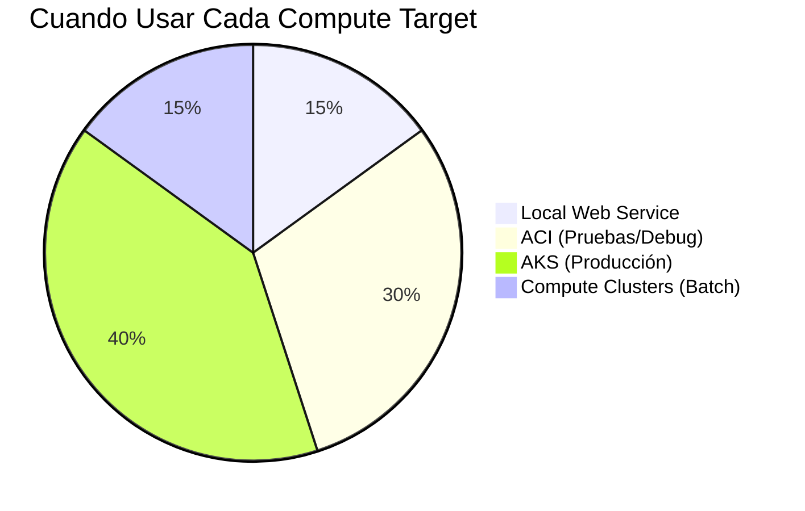

## Caso de estudio: Monitoreo de trabajos en Azure Machine Learning

---

## Pregunta 1

**Tipo:** Selección única  
**Pregunta:**  
You need to monitor your jobs for training.  
**Solution:** From the *Monitor* tab in the Azure portal, you select *Diagnostic settings*, then select *+Add diagnostic setting* and, under *Category details*, you select `AmlRunStatusChangedEvent`, before configuring it to send to an Azure ML service workspace.  
**Does this solution meet the goal?**

- [x] Yes
- [ ] No

**Respuesta Correcta:** ✅ Yes

**Explicación:**  
Esta solución es válida. La manera correcta de habilitar el monitoreo de trabajos en Azure ML es a través del portal de Azure, usando el panel de *Monitor*. Allí se configuran las *diagnostic settings* con la categoría `AmlRunStatusChangedEvent` para enviar los eventos a un *Log Analytics Workspace*. Esto permite visualizar el estado de los trabajos, alertas y errores del entrenamiento.

📚 **Referencia oficial:**  
[Monitor and analyze jobs in Azure ML](https://learn.microsoft.com/en-us/azure/machine-learning/how-to-monitor-view-training-log)

---

## Pregunta 2

**Tipo:** Selección única  
**Pregunta:**  
You need to monitor your jobs for training.  
**Solution:** In the Azure portal, you create a *New alert rule* and receive the job status by email notification, by selecting the *Monitor* tab.  
**Does this solution meet the goal?**

- [ ] Yes
- [x] No

**Respuesta Correcta:** ❌ No

**Explicación:**  
Aunque crear una alerta por correo electrónico puede notificar cambios en estado, **no es suficiente para monitorear trabajos de entrenamiento** en Azure ML de forma integral. Esta solución no permite el análisis detallado de métricas, logs ni visualización completa de eventos. El enfoque correcto es usar *diagnostic settings* con `AmlRunStatusChangedEvent`.

---

## Pregunta 3

**Tipo:** Selección única  
**Pregunta:**  
You need to create a compute instance that would support running ML pipeline training using the Azure Machine Learning designer v2.  
**Solution:** You create a **Machine Learning compute cluster**.  
**Does this solution meet the goal?**

- [x] Yes
- [ ] No

**Respuesta Correcta:** ✅ Yes

**Explicación:**  
Los *Machine Learning compute clusters* son la infraestructura ideal para ejecutar pipelines dentro del Designer v2 en Azure Machine Learning. Son escalables y están diseñados para trabajos de entrenamiento en lote o en flujo.

📚 **Referencia oficial:**  
[Azure ML Compute Targets](https://learn.microsoft.com/en-us/azure/machine-learning/concept-compute-target)

---

## Pregunta 4

**Tipo:** Selección única  
**Pregunta:**  
You need to create a compute instance that would support running ML pipeline training using the Azure Machine Learning designer v2.  
**Solution:** You create an **Azure Databricks environment**.  
**Does this solution meet the goal?**

- [ ] Yes
- [x] No

**Respuesta Correcta:** ❌ No

**Explicación:**  
Azure Databricks puede integrarse con Azure ML pipelines, pero **no se puede usar directamente en Designer v2 como target de entrenamiento**. Databricks es más adecuado para procesamiento distribuido con Spark.

📚 **Referencia oficial:**  
[What is Designer (v2) in Azure ML?](https://learn.microsoft.com/en-us/azure/machine-learning/concept-designer-overview)

---

## Pregunta 5

**Tipo:** Selección única  
**Pregunta:**  
You need to create a compute instance that would support running ML pipeline training using the Azure Machine Learning designer v2.  
**Solution:** You create an **Azure HDInsight environment**.  
**Does this solution meet the goal?**

- [ ] Yes
- [x] No

**Respuesta Correcta:** ❌ No

**Explicación:**  
HDInsight, al igual que Databricks, se basa en Apache Spark y puede ejecutar trabajos ML, pero **no es compatible como destino directo dentro de Azure ML Designer**. Designer requiere clusters de entrenamiento dedicados como *AML compute clusters*.

📚 **Referencia oficial:**  
[Configure and submit training jobs](https://learn.microsoft.com/en-us/azure/machine-learning/how-to-train-cli)

---

## Caso de estudio: Seguimiento de métricas y ejecución de trabajos en Azure Machine Learning

---

## Pregunta 6

**Tipo:** Selección única  
**Pregunta:**  
You need to monitor your jobs for training.  
**Solution:** You enable autologging by adding `mlflow.autolog()` in your code and subsequently view the metrics using the code shown below:

```python
import mlflow
run = mlflow.get_run("<RUN_ID>")
metrics = run.data.metrics
params = run.data.params
tags = run.data.tags
print(metrics, params, tags)
```

**Does this solution meet the goal?**

- [x] Yes  
- [ ] No

**Respuesta Correcta:** ✅ Yes

**Explicación:**  
La función `mlflow.autolog()` permite capturar automáticamente métricas, parámetros y artefactos de los entrenamientos sin necesidad de definirlos manualmente. Es ideal cuando trabajas con frameworks compatibles (como scikit-learn, TensorFlow, etc.). La información se puede consultar vía código o en el portal de Azure ML.

📚 [Referencia oficial - Track experiments and models with MLflow](https://learn.microsoft.com/en-us/azure/machine-learning/how-to-log-view-metrics)

---

## Pregunta 7

**Tipo:** Selección única  
**Pregunta:**  
You need to log metrics data from your job runs using MLflow.  
**Solution:** You use the `mlflow.log_metric()` MLflow API method.  
**Does this solution meet the goal?**

- [ ] No  
- [x] Yes

**Respuesta Correcta:** ✅ Yes

**Explicación:**  
La función `mlflow.log_metric()` es la forma correcta de registrar métricas como accuracy, pérdida, etc. Este método toma como argumentos el nombre de la métrica y su valor, y puede usarse varias veces para capturar la evolución de una métrica a lo largo del entrenamiento.

📚 [Referencia oficial - Log metrics with MLflow](https://mlflow.org/docs/latest/python_api/mlflow.html#mlflow.log_metric)

---

## Pregunta 8

**Tipo:** Selección única  
**Pregunta:**  
You need to log data from your job runs using MLflow.  
**Solution:** Use the `Run.log()` Azure ML SDK method.  
**Does this solution meet the goal?**

- [x] No  
- [ ] Yes

**Respuesta Correcta:** ❌ No

**Explicación:**  
`Run.log()` pertenece al SDK de Azure ML, no a MLflow. Aunque permite registrar información como artefactos, no es la herramienta adecuada cuando se usa MLflow como motor de tracking de métricas. Por tanto, **no cumple el objetivo** de esta pregunta.

📚 [Referencia oficial - Azure ML SDK Run Class](https://learn.microsoft.com/en-us/python/api/azureml-core/azureml.core.run)

---

## Pregunta 9

**Tipo:** Selección única  
**Pregunta:**  
You need to log data from your job runs using MLflow.  
**Solution:** Use the `mlflow.log_param()` MLflow API method.  
**Does this solution meet the goal?**

- [x] No  
- [ ] Yes

**Respuesta Correcta:** ❌ No

**Explicación:**  
El método `mlflow.log_param()` sirve para registrar parámetros (como hiperparámetros), no métricas. Dado que la pregunta exige loguear métricas, esta opción **no es válida**.

📚 [Referencia oficial - Track experiments and models with MLflow](https://mlflow.org/docs/latest/tracking.html#logging-data-to-runs)

---

---

## Pregunta 10

**Tipo:** Selección única  
**Pregunta:**  
You want to perform real-time scoring of the ML model and to deploy and debug locally by using local endpoints.  
You need to create a deployment named `mydep` under the local endpoint.  
**Solution:** You use Azure CLI version >= 2.38.0 to set up the local endpoints using the following commands:

```bash
az ml online-endpoint create --local -n $ENDPOINT_NAME -f endpoints/online/managed/sample/endpoint.yml

az ml online-deployment create --local -n mydep --endpoint $ENDPOINT_NAME -f endpoints/online/managed/sample/blue-deployment.yml
```

**Does this solution meet the goal?**  
- [x] Yes  
- [ ] No  

**Respuesta Correcta:** ✅ Yes  
**Explicación:**  
La solución cumple el objetivo. Azure CLI >=2.38.0 permite crear endpoints locales y realizar despliegues con el flag `--local`, que usa el entorno Docker para pruebas locales. Se usan archivos YAML para definir los endpoints y despliegues.  

📚 Referencia: [Install and set up the CLI (v2)](https://learn.microsoft.com/en-us/azure/machine-learning/how-to-deploy-local-endpoints-cli?view=azureml-api-2)

---

## Pregunta 11

**Tipo:** Selección única  
**Pregunta:**  
You want to perform real-time scoring of the ML model and to deploy and debug locally by using local endpoints.  
You need to create a deployment named `mydep` under the local endpoint.  
**Solution:** You use Azure ML Python SDK v2 with the following:

```python
ml_client.online_endpoints.begin_create_or_update(endpoint, local=True)

ml_client.online_deployments.begin_create_or_update(
    deployment=mydep,
    local=True
)
```

**Does this solution meet the goal?**  
- [x] Yes  
- [ ] No  

**Respuesta Correcta:** ✅ Yes  
**Explicación:**  
El SDK v2 de Azure ML permite la creación y prueba de endpoints locales con el parámetro `local=True`, ejecutando en un entorno Docker. `ml_client` gestiona recursos como endpoints, trabajos y despliegues.  

📚 Referencia: [MLClient Class](https://learn.microsoft.com/en-us/python/api/azure-ai-ml/azure.ai.ml.mlclient)

---

## Pregunta 13

**Tipo:** Selección única  
**Pregunta:**  
You want to perform real-time scoring of the ML model and to deploy and debug locally by using local endpoints.  
You need to create a deployment named `mydep` under the local endpoint.  
**Solution:** You use Azure ML Studio to set up and deploy `mydep` to the local endpoint.

**Does this solution meet the goal?**  
- [ ] Yes  
- [x] No  

**Respuesta Correcta:** ❌ No  
**Explicación:**  
Azure ML Studio no permite configurar ni desplegar endpoints locales. Para hacerlo, se debe usar Azure CLI v2 o Azure ML Python SDK v2.  

📚 Referencia: [Deploy and score a machine learning model by using an online endpoint](https://learn.microsoft.com/en-us/azure/machine-learning/how-to-deploy-local-endpoints-cli)

---
## Pregunta 12

Tipo:** Selección única  
**Pregunta:**  
You want to implement a scalable and maintainable solution to automate the retraining of an image classification model using MLOps.  
**Solution:** You use Azure Data Factory.

**Does this solution meet the goal?**  
- [x] Yes  
- [ ] No  

**Respuesta Correcta:** ✅ Yes  
**Explicación:**  
Azure Data Factory permite crear pipelines que integran, transforman y disparan el reentrenamiento automáticamente ante cambios en la base de datos. Es ideal para escenarios MLOps con grandes volúmenes de datos.  

📚 Referencia: [Retraining and Updating Azure ML models with Azure Data Factory](https://learn.microsoft.com/en-us/azure/machine-learning/tutorial-adf-ml-pipelines)

---


---

## ❓ Pregunta 1

**Contexto**: Tu organización usa Azure Machine Learning (ML). Necesitas registrar un modelo personalizado que combina varios elementos de diferentes frameworks.

**Pregunta**: ¿Qué deberías usar para registrar el modelo?

**Opciones**:
- `mlflow.pyfunc`
- `mlflow.autolog()`
- `mlflow.log_params()`
- `mlflow.<flavor>.load_model()`

**✅ Respuesta correcta**: `mlflow.pyfunc`

**Explicación**:
El módulo `mlflow.pyfunc` permite definir utilidades para registrar modelos personalizados que combinan frameworks distintos. No deberías usar `mlflow.autolog()` ni `mlflow.log_params()` ya que no manejan correctamente modelos personalizados, y `load_model()` se usa solo para cargar, no registrar.

---

## ❓ Pregunta 2

**Contexto**: Accedes a datos en formato Parquet dentro de una carpeta, no registrados como un dataset. Usas Azure ML SDK v2.

**Pregunta**: ¿Qué deberías hacer para leer/escribir esta carpeta directamente desde un script de ML?

**Opciones**:
- Crear un trabajo v2 con `Dataset.File.from_files()` y `ml_client.jobs.create_or_update()`
- Crear un trabajo v2 con `AssetTypes.URI_FOLDER` y `ml_client.jobs.from_config()`
- Crear un trabajo v2 con `AssetTypes.URI_FILE` y `ml_client.jobs.create_or_update()`

**✅ Respuesta correcta**: Crear un trabajo v2 con `AssetTypes.URI_FOLDER` y `ml_client.jobs.create_or_update()`

**Explicación**:
Cuando el archivo Parquet está en una carpeta, debes usar `AssetTypes.URI_FOLDER` y crear el trabajo con `ml_client.jobs.create_or_update()` para enviar toda la carpeta al entorno de ejecución.

---

## ❓ Pregunta 3

**Contexto**: Vas a crear recursos de cómputo en Azure ML usando Azure CLI y necesitas asegurarte de que no haya costos cuando no haya trabajos corriendo.

**Pregunta**: ¿Qué acciones debes tomar?

**Opciones**:
- ✅ Especificar "idle seconds before scale down" a 0.
- ✅ Crear un destino de cómputo tipo instancia.
- ❌ Crear un destino de cómputo tipo cluster.
- ❌ Crear un destino de cómputo en Azure Data Factory.

**✅ Respuestas correctas**: 
- Especificar `idle_seconds_before_scaledown=0`
- Crear una instancia de cómputo

**Explicación**:
Las instancias se pueden pausar automáticamente cuando no hay trabajos. El parámetro de inactividad a 0 ayuda a escalar automáticamente. No debes usar clústeres ni ADF.

---

## Caso de estudio: Registro y uso de modelos personalizados con múltiples frameworks

---

## Pregunta 13po:** Selección única  
**Pregunta:**  
You have built a custom model that uses multiple elements from different frameworks. You need to log the model. What should you use?

**Opciones:**
- mlflow.pyfunc ✅
- mlflow.autolog()
- mlflow.log_params()
- mlflow.<flavor>.load_model()

**Respuesta Correcta:** ✅ mlflow.pyfunc

**Explicación:**  
Debes usar el módulo `mlflow.pyfunc` para registrar modelos personalizados que usan múltiples frameworks o lógica de inferencia no incluida de forma nativa en MLflow. Este módulo permite definir un formato de sistema de archivos genérico para modelos de Python y ofrece utilidades para guardarlos y cargarlos desde este formato.

---

## Pregunta 14

tipo: Selección única  
**Pregunta:**  
You have access to column-oriented data in Parquet format within a folder. The data is not registered in a dataset. You want to read/write the folder in a job using the Azure ML SDK v2. What should you do?

**Opciones:**
- Create a v2 job using Dataset.File.from_files() and submit with `ml_client.jobs.create_or_update()`
- Create a v2 job using `AssetTypes.URI_FOLDER` and submit with `ml_client.jobs.from_config()`
- Create a v2 job using `AssetTypes.URI_FILE` and submit with `ml_client.jobs.create_or_update()`
- Create a v2 job using `AssetTypes.URI_FOLDER` and submit with `ml_client.jobs.create_or_update()` ✅

**Respuesta Correcta:** ✅ Create a v2 job using `AssetTypes.URI_FOLDER` and submit with `ml_client.jobs.create_or_update()`

**Explicación:**  
`AssetTypes.URI_FOLDER` se usa para hacer referencia a carpetas (no archivos individuales) como en este caso con datos Parquet. Esta configuración permite leer y escribir directamente los datos desde el script.

---

## Pregunta 15

**Tipo:** Selección múltiple  
**Pregunta:**  
You want to ensure batch jobs do not incur cost when not running. What two actions should you perform?

**Opciones:**
- Specify an idle seconds before scale down. Set the number to 0 ❌
- Create an Azure Machine Learning compute instance target ❌
- Create an Azure Machine Learning compute target ✅
- Specify the minimum number of cluster nodes. Set the number to 0 ✅

**Respuesta Correcta:** ✅ Create compute target + Set minimum nodes to 0

**Explicación:**  
Al establecer el número mínimo de nodos del clúster en 0, Azure liberará recursos cuando no haya trabajos ejecutándose. No se recomienda establecer `idle_seconds_before_scaledown` en 0 porque puede causar reprovisionamientos innecesarios.

---

## Pregunta 16

*Tipo:** Selección múltiple  
**Pregunta:**  
You need to write a batch inference script using `ParallelRunStep`. Which two functions must be included?

**Opciones:**
- load()
- init() ✅
- run(mini_batch) ✅
- evaluate(mini_batch)
- execute(mini_batch)

**Respuesta Correcta:** ✅ init(), ✅ run(mini_batch)

**Explicación:**  
`init()` se usa para preparar recursos (como cargar el modelo) y `run(mini_batch)` ejecuta la inferencia sobre los datos del lote. Las demás funciones no son válidas como entrada para un `ParallelRunStep`.

---

## Pregunta 17

**Tipo:** Selección en menú desplegable  
**Pregunta:**  
You are registering multiple trained models. Which compute target should be used for each usage scenario?

| Model usage scenario   | Deployment target                           |
|------------------------|---------------------------------------------|
| Batch inference        | Azure Machine Learning compute cluster ✅    |
| Real-time inference    | Azure Kubernetes Service (AKS) ✅            |
| Testing and debugging  | Azure ML compute instance web service ✅     |

**Respuesta Correcta:** Todas las asignaciones son correctas.

**Explicación:**  
- **Batch:** usa clústeres por su escalabilidad para tareas intermitentes.  
- **Realtime:** AKS permite escalado horizontal y disponibilidad.  
- **Debugging:** compute instance es ideal para pruebas de bajo costo y AutoML.

## Pregunta 24: Programación de trabajos recurrentes con SDK v2

**Tipo:** Pregunta tipo tabla (selección múltiple por fila)  
**Tema:** Azure Machine Learning - Programación de trabajos con SDK v2

**Pregunta:**  
You have been tasked with scheduling ML pipeline jobs using the Azure ML Python SDK v2. You have the following code:

```python
schedule_name = "sched_recurrence_with_python_sdkv2"
recurrence_trigger = RecurrenceTrigger(
    frequency="day",
    interval=1,
    schedule=RecurrencePattern(hours=7, minutes=[0, 1]),
)
job_schedule = JobSchedule(
    name=schedule_name,
    trigger=recurrence_trigger,
    create_job=pipeline_job
)
```

You are asked to validate the following statements:

| Statement | Yes | No |
|-----------|-----|----|
| The schedule fires every day with the recurrence set in the UTC time zone. | ✅ | ❌ |
| The first job will run instantly and the future job triggers are based on the schedule. | ✅ | ❌ |
| The frequency for this schedule can be updated to hour, day, week, month and year. | ❌ | ✅ |

---

**Respuesta Correcta:**

✅  
✅  
❌  

---

**Explicación técnica:**

La programación de trabajos en Azure ML con el SDK v2 se realiza usando objetos como `RecurrenceTrigger`, que permiten definir una recurrencia de ejecución basada en frecuencia e intervalos. En este caso:

1. **Frecuencia diaria (frequency="day") con intervalo 1** significa que el trabajo se ejecutará todos los días. Como **no se especifica el parámetro `time_zone`**, el SDK usa por defecto **UTC**, por lo tanto la afirmación es **verdadera**.  
   📖 [Documentación oficial sobre RecurrenceTrigger](https://learn.microsoft.com/en-us/azure/machine-learning/reference-yaml-job-schedule#recurrencetrigger-object)

2. Si no se define el parámetro `start_time`, el primer trabajo se lanza de forma **instantánea**, y luego los siguientes trabajos se disparan según la programación definida. Esta afirmación también es **correcta**.  
   👉 Esto está documentado [aquí](https://learn.microsoft.com/en-us/azure/machine-learning/how-to-schedule-pipelines-v2#recurrencetrigger-object)

3. La clave `frequency` **no puede** tomar el valor `"year"` (según la documentación solo puede ser `"minute"`, `"hour"`, `"day"`, `"week"`, `"month"`), por lo tanto la afirmación es **falsa**.

---

**Resumen de por qué descartar las otras:**

- ❌ `"year"` no es un valor aceptado para `frequency`.
- ❌ No se define `start_time`, por lo tanto el primer job se ejecuta inmediatamente.
- ✅ La zona horaria por defecto es UTC si no se especifica.

---

**Referencias adicionales:**

- 📘 [Schedule jobs with SDK v2 (Azure ML)](https://learn.microsoft.com/en-us/azure/machine-learning/how-to-schedule-pipelines-v2)
- 📘 [CLI (v2) schedule YAML schema](https://learn.microsoft.com/en-us/azure/machine-learning/reference-yaml-job-schedule)


## Pregunta 25:  sobre lectura de archivos Parquet desde Azure Blob con Apache Spark (SDK v2)

**Tipo:** Selección única  
**Pregunta:**  
Tu empresa usa Azure Machine Learning. Planeas leer un conjunto de datos desde Azure Blob Storage para tu proyecto de aprendizaje automático. El conjunto de datos está almacenado en un archivo de formato columnar (Parquet) en la siguiente ubicación:  
`wasbs://mycontainer.blob.core.windows.net`

Estás utilizando un Apache Spark pool respaldado por Azure Synapse.  
Necesitas usar una función de wrangling de datos de Apache Spark para leer este archivo.

**¿Qué función deberías usar?**

**Opciones:**  
- [ ] `spark.read.text("wasbs://mycontainer.blob.core.windows.net")`  
- [x] `spark.read.format("parquet").load("wasbs://mycontainer.blob.core.windows.net")`  
- [ ] `spark.read.format("avro").load("wasbs://mycontainer.blob.core.windows.net")`  
- [ ] `spark.read.format("csv").load("wasbs://mycontainer.blob.core.windows.net")`

**Respuesta correcta:** ✅ `spark.read.format("parquet").load("wasbs://mycontainer.blob.core.windows.net")`

---

### 🧠 Explicación:

En este caso, el archivo que se va a leer está en formato Parquet, que es un formato columnar comúnmente utilizado en big data y ML por su eficiencia en compresión y lectura.

- La función `spark.read.format("parquet")` le indica a Spark que el archivo a cargar está en formato Parquet.
- `.load("wasbs://...")` especifica la ubicación del archivo en Azure Blob Storage usando el protocolo `wasbs://`, que es compatible con Spark.

💡 Los DataFrames de Spark permiten trabajar eficientemente con datos estructurados, facilitando tareas de wrangling como filtrar, agrupar, transformar, y alimentar modelos de ML.

---

### ❌ Por qué se descartan las otras opciones:

- `spark.read.text(...)` está diseñado para leer archivos de texto plano línea por línea, no Parquet.
- `spark.read.format("avro")...` solo aplica si el archivo está en formato Avro, lo cual no es el caso.
- `spark.read.format("csv")...` genera un error si el archivo realmente está en formato Parquet.

---

📚 **Referencia oficial:**

- [Spark read formats - Parquet](https://spark.apache.org/docs/latest/sql-data-sources-parquet.html)  
- [Access Azure Blob Storage with Spark](https://learn.microsoft.com/en-us/azure/synapse-analytics/spark/apache-spark-azure-blob-storage)

## Pregunta 26: Programar trabajos de pipeline con Azure ML SDK v2

**Tipo:** Selección múltiple (tabla de veracidad)

**Pregunta:**

You have been tasked with scheduling ML pipeline jobs using the Azure ML Python SDK v2. You have the following code:

```python
schedule_name = "sched_recurrence_with_python_sdkv2"
recurrence_trigger = RecurrenceTrigger(
    frequency="day",
    interval=1,
    schedule=RecurrencePattern(hours=7, minutes=[0, 1]),
)
job_schedule = JobSchedule(
    name=schedule_name,
    trigger=recurrence_trigger,
    create_job=pipeline_job
)
```

**Afirmaciones a evaluar:**

| Statement                                                                 | Yes | No  |
|---------------------------------------------------------------------------|-----|-----|
| The schedule fires every day with the recurrence set in the UTC time zone. | ✅  |     |
| The first job will run instantly and the future job triggers are based on the schedule. | ✅  |     |
| The frequency for this schedule can be updated to hour, day, week, month and year. |     | ✅  |

**Respuesta Correcta:**

- ✅ Primera afirmación
- ✅ Segunda afirmación
- ❌ Tercera afirmación

---

### Explicación:

1. **Frecuencia y zona horaria:** El `RecurrenceTrigger` con `frequency="day"` e `interval=1` indica que la ejecución ocurre diariamente. Si no se especifica explícitamente la zona horaria, se usa por defecto UTC (`time_zone=TimeZone.UTC`).

2. **Primera ejecución:** Como no se proporciona el parámetro `start_time`, la primera ejecución ocurre inmediatamente, y las siguientes se programan de acuerdo al intervalo y patrón definido.

3. **Limitaciones en la frecuencia:** El parámetro `frequency` solo acepta: `minute`, `hour`, `day`, `week`, `month`. No se admite `year` como frecuencia válida.

> ❌ La afirmación que dice que se puede actualizar a `year` es falsa, y por eso debe marcarse como incorrecta.

---

📚 **Referencias:**

- [📄 Schedule pipeline jobs - Microsoft Learn](https://learn.microsoft.com/en-us/azure/machine-learning/how-to-schedule-pipelines)
- [📄 RecurrenceTrigger YAML schema](https://learn.microsoft.com/en-us/azure/machine-learning/reference-yaml-job-schedule-v2)

## Pregunta 27: Comportamiento de componentes en un pipeline de predicción de automóviles

**Tipo:** Veracidad (selección múltiple tipo tabla)

**Contexto:**  
Tu equipo ha creado un pipeline de predicción de precios de automóviles. Necesitas enviar la ejecución y entender cómo funcionan los componentes.

**Pregunta:**  
Para cada una de las siguientes afirmaciones, selecciona "Yes" si es verdadera. En caso contrario, selecciona "No".

| Afirmación | Yes | No |
|-----------|-----|----|
| The Split Data component splits the columns in your dataset, based on how you configure the component. | ❌ | ✅ |
| The model classifies automobiles into various price categories. | ❌ | ✅ |
| The Score Model component generates scores for prices predicted versus prices provided for the test data features. | ✅ | ❌ |

---

**Respuesta Correcta:**  
- ❌ Primera afirmación  
- ❌ Segunda afirmación  
- ✅ Tercera afirmación

---

**Explicación técnica:**

1. **Split Data component**: Este componente no divide columnas, sino que divide **filas** del conjunto de datos en dos particiones: típicamente, un set de entrenamiento y otro de prueba. El comportamiento de división se basa en proporciones o reglas definidas por el usuario, pero **no** por columnas.  
   📚 [Referencia oficial - Transform data (Split Data)](https://learn.microsoft.com/en-us/azure/machine-learning/component-reference/split-data)

2. **Clasificación vs regresión**: El modelo en el escenario utiliza **regresión lineal**, no un algoritmo de clasificación. Por tanto, **no clasifica** automóviles en categorías de precio. En su lugar, predice un **valor numérico continuo**.  
   📚 [Referencia oficial - Linear Regression component](https://learn.microsoft.com/en-us/azure/machine-learning/component-reference/linear-regression)

3. **Score Model component**: Este componente toma como entrada un modelo ya entrenado y el conjunto de prueba. Luego **compara las predicciones del modelo con los valores reales** de la variable objetivo. Es perfectamente adecuado para tareas de regresión como esta.  
   📚 [Referencia oficial - Score Model](https://learn.microsoft.com/en-us/azure/machine-learning/component-reference/score-model)

---

**Resumen:**  
Solo la tercera afirmación es correcta, porque es la única que describe con precisión cómo trabaja el componente dentro del pipeline de regresión.

## Pregunta 27: Comportamiento de componentes en Azure ML Designer

**Tipo:** Selección múltiple (tabla de veracidad)

**Pregunta:**
Tu equipo está creando un pipeline de predicción de automóviles. Debes enviar la ejecución y comprender el modelo. Para cada afirmación, indica si es verdadera o falsa:

| Statement                                                                                       | Yes | No  |
|--------------------------------------------------------------------------------------------------|-----|-----|
| The Split Data component splits the columns in your dataset, based on how you configure the component. |     | ✅  |
| The model classifies automobiles into various price categories.                                |     | ✅  |
| The Score Model component generates scores for prices predicted versus prices provided for the test data features. | ✅  |     |

**Respuesta Correcta:**
- ❌ Afirmación 1: Incorrecta
- ❌ Afirmación 2: Incorrecta
- ✅ Afirmación 3: Correcta

**Explicación Técnica:**

1. **Split Data** no divide columnas, sino que divide **filas** del dataset en subconjuntos como entrenamiento y prueba. Por tanto, la afirmación 1 es **incorrecta**.
2. El modelo descrito utiliza **regresión lineal**, no un algoritmo de clasificación. Clasificar automóviles en categorías de precio sería una tarea de **clasificación**, lo cual **no aplica aquí**.
3. El componente **Score Model** toma el modelo entrenado y los datos de prueba, ejecuta las predicciones y **compara los valores predichos** contra los verdaderos. Esto valida el rendimiento del modelo.

📚 [Linear Regression component](https://learn.microsoft.com/en-us/azure/machine-learning/component-reference/linear-regression)
📚 [Score Model](https://learn.microsoft.com/en-us/azure/machine-learning/component-reference/score-model)
📚 [Transform data - Azure ML Designer](https://learn.microsoft.com/en-us/azure/machine-learning/component-reference/split-data)

---

## Pregunta 28: Monitoreo de logs en Azure ML con OpenCensus y Application Insights

**Tipo:** Emparejamiento de requerimiento con campo (drop-down)

**Pregunta:**
Deseas monitorear y depurar pipelines redirigiendo logs de Azure Machine Learning a Application Insights mediante la librería **OpenCensus para Python**. ¿Qué campos debes incluir para cada requerimiento?

| Query Requirement                              | Field           |
|------------------------------------------------|-----------------|
| Differentiate between training and scoring runs | `run_type`      |
| Focus on a specific issue                      | `step_id`       |
| View logs for all steps over time              | `parent_run_id` |

**Respuesta Correcta:**
- ✅ `run_type` permite diferenciar entre ejecuciones de entrenamiento y evaluación.
- ✅ `step_id` filtra por problemas específicos en pasos individuales.
- ✅ `parent_run_id` agrupa todos los pasos de una ejecución de pipeline para su análisis conjunto.

**Explicación Técnica:**

- `run_type`: identifica si una ejecución es de entrenamiento o scoring. Es esencial para análisis comparativo entre fases de desarrollo y despliegue.
- `step_id`: cada paso del pipeline tiene un identificador único. Este campo ayuda a **aislar errores o analizar tiempos de ejecución**.
- `parent_run_id`: vincula los logs de pasos individuales a la ejecución principal del pipeline. Es útil para tener una vista integral y cronológica.

📚 [Troubleshooting machine learning pipelines](https://learn.microsoft.com/en-us/azure/machine-learning/how-to-troubleshoot-pipeline)
📚 [Application Insights overview](https://learn.microsoft.com/en-us/azure/azure-monitor/app/app-insights-overview)

---

## Pregunta 30: Uso de ThresholdOptimizer con Fairlearn y Azure ML SDK v2

**Tipo:** Selección múltiple (tabla de veracidad)

**Pregunta:**
Estás usando Azure Machine Learning con el SDK v2 y la librería **Fairlearn** para evaluar y mitigar sesgos en tu modelo, utilizando el constraint de **Equal Opportunity Parity**.

Tu modelo emplea `ThresholdOptimizer`, como se ve en el siguiente fragmento de código:

```python
# __init__.py
from ._plotting import plot_threshold_optimizer
from ._threshold_optimizer import ThresholdOptimizer

__all__ = ["ThresholdOptimizer", "plot_threshold_optimizer"]

# fairlearn/postprocessing/_threshold_optimizer.py (fragmento)
import logging
from warnings import warn
import numpy as np
import pandas as pd
from sklearn import clone
from sklearn.base import BaseEstimator, MetaEstimatorMixin
from sklearn.exceptions import NotFittedError
from sklearn.utils import Bunch
from sklearn.utils.validation import check_is_fitted
from ..utils._common import _get_soft_predictions
from ..utils._input_validation import _KW_CONTROL_FEATURES, _validate_and_reformat_input
from ._constants import (
    BASE_ESTIMATOR_NONE_ERROR_MESSAGE,
    BASE_ESTIMATOR_NOT_FITTED_WARNING,
    LABEL_KEY,
    OUTPUT_SEPARATOR,
    SCORE_KEY,
    SENSITIVE_FEATURE_KEY,
)
from ._interpolated_thresholder import InterpolatedThresholder
from ._tradeoff_curve_utilities import (
    METRIC_DICT,
    _extend_confusion_matrix,
    _interpolate_curve,
    _tradeoff_curve,
)
```

Basado en este contexto, responde si las siguientes afirmaciones son verdaderas o falsas:

| Afirmación | Verdadera | Falsa |
|-----------|-----------|-------|
|1. You are using a ThresholdOptimizer algorithm, which takes as input an existing classifier and a sensitive feature.|	✅	||
|2. Your algorithm would generate a set of retrained models by using a sequence of reweighted training datasets.|		|✅|
|3. Your algorithm uses a binary classification as a machine learning task in this scenario.|		✅||

✅ Explicación técnica detallada
ThresholdOptimizer y sensitive features
La afirmación es verdadera.
ThresholdOptimizer es un método de postprocesamiento que toma como entrada un clasificador existente y una feature sensible, y ajusta su umbral de decisión para satisfacer una constraint de equidad como Equal Opportunity.
No se reentrena el modelo, solo se ajustan las decisiones de predicción.

🔗 Referencia: Fairlearn API – ThresholdOptimizer

Generación de modelos reentrenados
Esto es falso.
El ThresholdOptimizer no reentrena modelos.
El ajuste del sesgo ocurre al modificar el umbral de predicción.
Los algoritmos que sí reentrenan modelos con datasets reponderados son los de reducción, como ExponentiatedGradient, que pertenecen a otra categoría en Fairlearn.

🔗 Referencia: Fairlearn mitigation techniques

Uso de clasificación binaria
Esto es cierto.
La constraint Equal Opportunity requiere tareas de clasificación binaria, ya que se enfoca en igualar la tasa de verdaderos positivos (TPR) entre grupos sensibles.

🔗 Métricas en Fairlearn: Equal Opportunity

---
## Pregunta 31: Selección del recurso de cómputo para despliegue en tiempo real

**Tipo:** Selección única

**Pregunta:**

You create, train, and test a linear regression model.

You plan to deploy the model as a web service endpoint that users can use to get real-time outcomes based on the features they select.

You need to create the compute resource. You want to ensure that the cluster that runs the pipeline is managed by Azure.

**Which compute option should you use?**

**Opciones:**
- [ ] Attached compute
- [ ] Compute cluster
- ✅ Inference cluster
- [ ] Compute instance

**Respuesta correcta:** ✅ Inference cluster

---

**Explicación detallada:**

Para alojar un **servicio web en tiempo real**, debes crear un *Inference cluster* en Azure Machine Learning. Este tipo de clúster puede estar compuesto por:

- **AKS (Azure Kubernetes Service)**: recomendado para ambientes de producción.
- **ACI (Azure Container Instance)**: útil en entornos de desarrollo o para modelos pequeños.

Este es el **único tipo de clúster** que **admite el despliegue de un servicio de inferencia en tiempo real** manejado completamente por Azure.

Las otras opciones no son válidas:
- **Compute instance**: es para desarrollo interactivo, no para hosting de servicios.
- **Compute cluster**: se usa para entrenamiento de modelos o trabajos batch, pero no para inferencia en tiempo real.
- **Attached compute**: se refiere a clústeres externos conectados a Azure, pero que no son administrados por Azure directamente.

🧠 En resumen, si necesitas escalar automáticamente y garantizar una infraestructura gestionada, tu mejor opción es un **Inference Cluster**.

---

📚 **Referencias oficiales:**
- [Tutorial: Use the designer to deploy a machine learning model](https://learn.microsoft.com/en-us/azure/machine-learning/tutorial-designer-automobile-price-deployment)
- [Configure and submit training jobs](https://learn.microsoft.com/en-us/azure/machine-learning/how-to-set-up-training-targets)
## Pregunta 32: Elección de política de terminación anticipada en hiperparámetro tuning con SDK v2

**Tipo:** Selección única

**Pregunta:**

Estás realizando la sintonización de hiperparámetros de un modelo de ML usando el SDK v2 de Azure Machine Learning.

Debes cumplir con las siguientes tres condiciones:

- La política cancela un porcentaje de los trabajos de menor rendimiento en cada intervalo de evaluación.
- `evaluation_interval = 1`
- `delay_evaluation = 6`

¿Qué política de terminación anticipada deberías usar?

**Opciones:**

- [ ] Bandit  
- [ ] Median stopping  
- [x] Truncation selection  

---

**Respuesta Correcta:** ✅ Truncation selection

---

**Explicación técnica detallada:**

La política **Truncation Selection** es la indicada cuando:

- Necesitas cancelar un **porcentaje** de los trabajos con peor desempeño en cada intervalo de evaluación (`evaluation_interval`).
- Se desea **esperar** a que pasen ciertos intervalos antes de aplicar la política (`delay_evaluation`).
- No te interesa usar promedios móviles como lo harías con Median Stopping.

```python
from azure.ai.ml.sweep import TruncationSelectionPolicy

sweep_job.early_termination = TruncationSelectionPolicy(
    evaluation_interval=1,
    truncation_percentage=20,
    delay_evaluation=6,
    exclude_finished_jobs=True
)
```
Esta configuración significa que:

Se evalúan los trabajos cada intervalo (evaluation_interval=1),

Pero se empieza a aplicar la política desde el intervalo 6 (delay_evaluation=6),

Se eliminan los trabajos en el percentil inferior (por ejemplo, 20% más bajos),

Y no se tocan los trabajos que ya han finalizado.

¿Por qué se descartan las otras opciones?

❌ Median Stopping: cancela trabajos si su rendimiento está por debajo de la mediana, no permite configurar truncation_percentage ni funciona igual para cancelación por percentil.

❌ Bandit: esta opción no se menciona en la explicación ni corresponde con los criterios dados en la pregunta.

Referencias oficiales:

📘 [Azure ML Early Termination PoliciesAzure ML Early Termination Policie](https://learn.microsoft.com/en-us/azure/machine-learning/how-to-tune-hyperparameters?view=azureml-api-2)

📘 SDK v2 - Hyperparameter sweep

## Pregunta 33: Configurar conexión segura con ADLS Gen2 en Spark usando Azure ML Notebooks

**Tipo:** Selección única

### Pregunta
You are configuring a Spark session in Azure Machine Learning Notebooks to process data stored in an Azure Data Lake Storage (ADLS) Gen 2 account.

You need to securely connect to this storage account without adding excessive complexity to your configuration.

**What should you do?**

### Opciones:

- ❌ Use a service principal for OAuth-based authentication by configuring the client ID, client secret, and tenant ID.
- ❌ Use OAuth for authentication by configuring the `fs.azure.account.auth.type` and related properties.
- ❌ Use a SAS token for authentication by setting the `fs.azure.sas` property.
- ✅ **Use the storage account’s access key to authenticate and set the `fs.azure.account.key` property.**

---

### ✅ Respuesta correcta:
**Use the storage account’s access key to authenticate and set the `fs.azure.account.key` property.**

---

### Explicación:

La opción correcta es usar la **clave de acceso (Access Key)** de la cuenta de almacenamiento para autenticarse en Spark y configurar la propiedad:

```python
sc._jsc.hadoopConfiguration().set(
    "fs.azure.account.key.<STORAGE_ACCOUNT_NAME>.dfs.core.windows.net",
    "<ACCESS_KEY>"
)
```
Esta forma de autenticación:

Es segura y directa.

No requiere configurar múltiples credenciales o tokens externos.

Es ideal si quieres evitar la complejidad de manejar OAuth, service principals o SAS tokens.

Por qué se descartan las otras opciones:
❌ Service Principal con OAuth: implica manejar client ID, secret y tenant ID, lo que requiere más configuración, rotación de claves y mantenimiento regular.

❌ OAuth (fs.azure.account.auth.type): requiere configuración adicional y es más complejo para escenarios básicos.

❌ SAS Token: aunque es seguro, requiere gestionar tokens con permisos y expiraciones, lo cual agrega complejidad innecesaria.

## Pregunta 34: Selección de tipo de almacenamiento para datos relacionales en Azure ML Studio

**Tipo:** Selección única  
**Pregunta:**  
Quieres crear un *datastore* en Azure Machine Learning (ML) Studio. Antes de eso, necesitas crear una instancia del almacenamiento donde deseas que residan tus datos **relacionales**. Navegas a la opción "Datastore" en Azure ML Studio.

¿Cuál tipo de almacenamiento fuente deberías seleccionar?

**Opciones:**

- [ ] Azure Data Lake Gen2  
- [ ] Azure Blob Container  
- [ ] Databricks File System  
- [x] Azure Database for PostgreSQL

**Respuesta correcta:** ✅ Azure Database for PostgreSQL

**Explicación técnica:**  
Azure ML Studio permite registrar distintos orígenes de datos como *datastores*. Para datos **relacionales**, se debe seleccionar una base de datos relacional soportada, como **Azure Database for PostgreSQL**.  
Los contenedores como Azure Blob Storage o ADLS Gen2 **no están diseñados para almacenar datos relacionales estructurados**, sino más bien archivos, blobs o datos no estructurados.

Azure ML admite los siguientes servicios de almacenamiento como *datastore*:

- Azure Blob Container  
- Azure File Share  
- Azure Data Lake / Gen2  
- Azure SQL Database  
- Databricks File System  
- Azure Database for MySQL  
- ✅ Azure Database for PostgreSQL (ideal para datos relacionales)

❌ No debes seleccionar **Azure Blob Container** u otros servicios de archivos si planeas trabajar directamente con datos relacionales.

📚 [Referencia oficial - Datastore Module](https://learn.microsoft.com/en-us/python/api/azureml-core/azureml.core.datastore.datastore?view=azure-ml-py)


## Pregunta 35: Actualización de claves de almacenamiento en Azure ML Workspace

**Tipo:** Selección única  
**Pregunta:**  
Identificas que la cuenta de almacenamiento usada por tu Azure Machine Learning (ML) Workspace ha sido comprometida.  
Para prevenir una posible brecha de datos, regeneras las claves de esa cuenta de almacenamiento.  
Los usuarios del workspace reportan errores inmediatamente después del cambio de claves.

Necesitas actualizar las claves de almacenamiento en el workspace para restaurar su funcionamiento.

**¿Qué comando de CLI deberías ejecutar?**

**Opciones:**

- [ ] `az ml workspace update`  
- [ ] `az ml workspace share`  
- [x] `az ml workspace sync-keys`

**Respuesta correcta:** ✅ `az ml workspace sync-keys`

**Explicación técnica:**  
Cuando se regeneran las claves de una cuenta de almacenamiento asociada a un workspace de Azure ML, el workspace pierde acceso inmediato a los recursos de almacenamiento (como blobs o archivos de datos).

Para resolver esto, se debe usar el comando:

```bash
az ml workspace sync-keys \
  --name <workspace-name> \
  --resource-group <resource-group-name>
```

Este comando sincroniza las claves actualizadas del recurso de almacenamiento asociado (como Azure Blob o ADLS Gen2) con el Azure ML Workspace.  
Esto es esencial para evitar interrupciones en la ejecución de notebooks, experimentos o pipelines que dependen del almacenamiento.

🔒 **Importante:**  
No basta con regenerar la clave en el recurso; el workspace debe ser actualizado con esas nuevas credenciales de forma explícita mediante `sync-keys`.

📚 [Documentación oficial de az ml workspace sync-keys](https://learn.microsoft.com/en-us/cli/azure/ml/workspace?view=azure-cli-latest#az-ml-workspace-sync-keys)

## Pregunta 36: Notificaciones en caso de falla en el despliegue del modelo

**Tipo:** Selección única

**Pregunta:**
You use Azure Machine Learning to deploy machine learning models.  
You need to be notified when a model deployment fails.  

What should you do?

**Opciones:**
- [ ] Query AmlComputeJobEvents using the ExecutionState property.
- [ ] Query AmlComputeJobEvents using the ProvisionState property.
- [ ] Stream Azure Machine Learning metric information to Azure Event Hubs.
- [x] Stream Azure Machine Learning logs to Azure Monitor.

**Respuesta Correcta:** ✅ Stream Azure Machine Learning logs to Azure Monitor.

**Explicación:**

- **Azure Monitor** es una plataforma independiente que permite ingerir logs desde diversos servicios de Azure, incluyendo Azure Machine Learning.
- Una vez que configuras AML para enviar los logs a Azure Monitor, puedes consultar los logs usando KQL (lenguaje similar a SQL) y crear **alertas** cuando ocurra una falla, como una **falla en el despliegue del modelo**.

**Por qué las otras opciones NO son correctas:**

- **ExecutionState**: Aunque permite consultar el estado de los jobs, no genera alertas automáticamente.
- **ProvisionState**: Solo indica el estado de la sumisión del job, no de su ejecución.
- **Event Hubs**: Es para análisis de datos, no para generar alertas. No es el objetivo aquí.

📚 [Más info sobre integración con Azure Monitor](https://learn.microsoft.com/en-us/azure/machine-learning/how-to-enable-app-insights)

## Pregunta 37: Probar un pipeline de inferencia online con datos locales

**Tipo:** Selección única  
**¿Pertenece al SDK v2?:** ❌ No. Esta pregunta se basa en el uso del Azure ML Designer (interfaz visual), el cual pertenece a flujos que dependen mayoritariamente del SDK v1. Esta pregunta puede omitirse para el estudio del examen DP-100 basado únicamente en el SDK v2.  
**Estado:** 📌 Ignorada por no ser parte del SDK v2  

**Pregunta:**  
You have an online inference pipeline, as shown in the exhibit. The pipeline takes comma-separated features related to an automobile and predicts its price.

You need to test the pipeline with minimal costs and effort against some test data, which is located in a text file on your machine.

What module should you use?

**Opciones:**

- [ ] Export Data  
- [ ] Import Data  
- [ ] Join Data  
- [x] Enter Data Manually ✅

**Respuesta Correcta:**  
✅ Enter Data Manually

**Explicación:**  
El módulo **Enter Data Manually** permite copiar y pegar datos desde un archivo de texto local directamente al pipeline, evitando así el costo adicional de subir archivos a la nube.  
- No se debe usar **Import Data**, ya que eso implicaría subir el archivo local a un recurso de almacenamiento en Azure (como ADLS, Blob, etc.).  
- **Export Data** se usa para enviar datos desde el pipeline hacia una ubicación en la nube, lo cual no aplica en este escenario.  
- **Join Data** está diseñado para combinar múltiples fuentes de datos, no para enviar datos de prueba al pipeline.

📚 **Referencia oficial:**  
[What is Azure Machine Learning?](https://learn.microsoft.com/en-us/azure/machine-learning/overview-what-is-azure-ml)

---

🛑 **Nota:** Esta pregunta se basa en flujos del **Azure Machine Learning Designer**, que pertenece al **SDK v1**. Si te estás preparando exclusivamente para el SDK v2 (como indica tu enfoque), puedes omitir esta pregunta del banco de estudio.

## Pregunta 38: Validar despliegue de modelo como servicio web con autenticación

**Tipo:** Ordenar pasos

**Pregunta:**

You use Azure Machine Learning to train and deploy a machine learning model as a web service. Your web service requires authentication.

You need to test the deployment to ensure that requests to the web service will be successful.

**¿Qué tres acciones deberías ejecutar en orden?**

---

### ✅ Orden correcto:

1. **Retrieve the `scoring_uri` property of a WebService object.**
2. **Specify bearer authentication in the header.**
3. **Issue an HTTP POST request with JSON data.**

---

### ❌ Acciones incorrectas:

- **Query AmlComputeJobEvents to determine ExecutionState:** Esta acción se usa para monitorear trabajos de cómputo, no para consumir un servicio desplegado.

---

### 🧠 Explicación:

Cuando despliegas un modelo como servicio web en Azure Machine Learning:

1. **scoring_uri** representa el endpoint al cual puedes hacer peticiones REST.
2. Si el servicio está autenticado, necesitas incluir un token tipo *Bearer* en el encabezado de tu petición.
3. Finalmente, puedes hacer una solicitud `POST` al `scoring_uri` con los datos en formato JSON.

Esto garantiza que puedes enviar datos al modelo correctamente y recibir respuestas predichas.

📚 **Referencia:** [Deploy and consume a model as a web service - Microsoft Learn](https://learn.microsoft.com/en-us/azure/machine-learning/how-to-deploy-and-where)

## Pregunta 39: Exportación de etiquetas de datos para clasificación de imágenes

**Tipo:** Selección única  
**Tema:** Azure Machine Learning – Exportación de datos etiquetados  
**Tecnología:** Compatible con SDK v2  

---

### 🧠 Pregunta:

Your organization provides you with a set of images for a learning set for an image classification model. You complete the labeling exercise with the multi-label classification option.

You are asked to provide a tabular view of the image and the class the image belongs to for your users.

You need to retrieve the data to display the tabular view with minimal effort.

**What should you do?**

---

### 🔘 Opciones:

- [ ] Export data labels to the binary file format.  
- [x] Export data labels to the COCO file format.  
- [ ] Name the files with the label that was associated with it during classification.  
- [ ] Add the file name to the labels dataset.

---

### ✅ Respuesta Correcta:
**Export data labels to the COCO file format.**

---

### 🧾 Explicación:

Exportar las etiquetas en formato **COCO** permite capturar tanto la referencia a los datos (nombre o URI de la imagen) como sus etiquetas. Este formato es ampliamente soportado por librerías como `PyTorch`, `TorchVision` o `pandas`, y se puede transformar fácilmente en una vista tabular con funciones como `to_pandas_dataframe()`.

- ❌ **Binary format:** No está disponible en Azure para clasificación de imágenes.
- ❌ **Renombrar archivos:** Requiere trabajo manual adicional y no se integra directamente con los servicios de Azure ML.
- ❌ **Modificar dataset añadiendo nombres de archivo:** Práctica no recomendada y requiere edición manual.

---

### 📚 Referencias:


- [Labeling images and text documents](https://learn.microsoft.com/en-us/azure/machine-learning/how-to-label-data)  
- [Create and explore Azure Machine Learning dataset with labels](https://learn.microsoft.com/en-us/azure/machine-learning/how-to-create-labeling-projects)

## Pregunta 41: Selección de destino de implementación de bajo costo para pruebas en tiempo real

**Tipo:** Selección múltiple  
**Tema:** Azure Machine Learning – Despliegue de modelos  
**Tecnología:** Compatible con SDK v2  

---

### 🧠 Pregunta:

You complete training a linear regression model using Azure Machine Learning studio. You want to test the model by having users of your organization call an endpoint. The outcomes of the model should be provided in real time for users. All workload will be CPU based.

You need to determine a deployment target compute resource that can be used for testing and debugging while incurring minimal cost.

**Which two deployment targets should you select? Each correct answer presents a complete solution.**

---

### 🔘 Opciones:

- [x] Azure Container Instances  
- [ ] Azure Machine Learning Kubernetes  
- [x] Local web service  
- [ ] Azure Machine Learning compute clusters

---

### ✅ Respuesta Correcta:
**Azure Container Instances** y **Local web service**

---

### 🧾 Explicación:

Para realizar pruebas y depuración de modelos de inferencia con cargas CPU en tiempo real, lo ideal es usar opciones **de bajo costo y fáciles de aprovisionar**:

- ✅ **Azure Container Instances (ACI):** Ideal para despliegues ligeros, pruebas, y desarrollo. Fácil de configurar y económica.
- ✅ **Local Web Service:** Perfecta para probar el modelo localmente sin incurrir en ningún costo.

- ❌ **Azure Machine Learning Kubernetes:** Aunque ofrece escalabilidad y baja latencia, es costoso y más adecuado para producción.
- ❌ **Compute clusters:** Se utilizan para *batch inference pipelines*, no son apropiados para despliegues en tiempo real.

| Compute Target               | Mejor para                          | Escenarios típicos                          | Costo  | Escalado | Tiempo de inicio | Requiere gestión |
|------------------------------|-------------------------------------|---------------------------------------------|--------|----------|------------------|------------------|
| **Local Web Service**        | Pruebas/debug local                 | Desarrollo inicial, pruebas rápidas         | Gratis | Manual   | Instantáneo       | No               |
| **Azure Container Instances (ACI)** | Pruebas temporales, bajos costos | Validación de modelos, cargas pequeñas      | Bajo   | Manual   | 1-3 minutos      | No               |
| **Azure Kubernetes Service (AKS)** | Producción (alta demanda)        | Servicios en tiempo real, alto tráfico      | Alto   | Auto     | 5-10 minutos     | Sí               |
| **AML Compute Clusters**      | Procesamiento por lotes (batch)     | Inferencia batch, entrenamiento distribuido | Medio  | Auto     | 3-5 minutos      | Parcial          |
| **Azure Functions**           | Microservicios event-driven         | Escenarios serverless, pequeñas cargas      | Bajo   | Auto     | Variable         | No               |
| **IoT Edge**                  | Edge computing                      | Dispositivos periféricos                    | Variable | No      | Variable         | Sí               |

**Leyenda de uso recomendado:**
- ✅ **Local/ACI**: Pruebas/debug (como en tu caso de estudio)
- 🚀 **AKS**: Producción con tráfico sostenido
- 📦 **Compute Clusters**: Trabajos batch pesados
- ⚡ **Functions**: Cargas esporádicas o event-driven
- 🌐 **IoT Edge**: Modelos en dispositivos remotos

**Factores clave para elegir:**
1. **Costo**: Local < ACI < Clusters < AKS
2. **Disponibilidad**: Local (0%) < ACI (no garantizada) < AKS (99.9%)
3. **Escalado**: Solo AKS/AutoML Clusters escalan automáticamente
4. **SLA**: Solo AKS ofrece Acuerdo de Nivel de Servicio completo

### Compute Targets para Despliegue en Azure ML



---

### 📚 Referencias:

- [What are compute targets in Azure Machine Learning?](https://learn.microsoft.com/en-us/azure/machine-learning/concept-compute-target)  
- [Introduction to Kubernetes compute target in Azure Machine Learning](https://learn.microsoft.com/en-us/azure/machine-learning/how-to-deploy-kubernetes)

## Pregunta 42: Método adecuado para el ajuste de hiperparámetros

**Tipo:** Selección única  
**Tema:** Azure Machine Learning – Optimización de hiperparámetros  
**Tecnología:** Compatible con SDK v2  

---

### 🧠 Pregunta:

You are building a model to perform binary classification on a large dataset. You plan to tune the hyperparameters of the model in order to optimize its performance. You have defined a search space that includes the learning rate, the number of hidden layers, and the number of neurons in each hidden layer.

You need to balance the trade-off between exploration and exploitation in your search for the best hyperparameters.

**Which method should you use to tune the hyperparameters?**

---

### 🔘 Opciones:

- [ ] Gradient-based optimization  
- [ ] Grid sampling  
- [ ] Random sampling  
- [x] Bayesian sampling  

---

### ✅ Respuesta Correcta:
**Bayesian sampling**

---

### 🧾 Explicación:

La técnica de **Bayesian sampling** es ideal para balancear **exploración** (buscar en todo el espacio de hiperparámetros) y **explotación** (enfocarse en zonas prometedoras). Este método:

- Usa un modelo probabilístico y técnicas de inferencia bayesiana.
- Aprende de resultados previos para proponer nuevos conjuntos de hiperparámetros.
- Reduce los costos computacionales mientras maximiza la posibilidad de hallar un óptimo global.

Comparaciones:

- ❌ **Grid sampling**: prueba combinaciones exhaustivas sin usar resultados anteriores. Muy costoso.
- ❌ **Random sampling**: ignora los resultados previos, por lo que es menos eficiente.
- ❌ **Gradient-based optimization**: se usa para actualizar pesos durante el entrenamiento, **no** para optimizar hiperparámetros.

---

### 📚 Referencias:

- [Hyperparameter tuning a model (v2)](https://learn.microsoft.com/en-us/azure/machine-learning/how-to-tune-hyperparameters-v2)  
- [Gradient Descent For Machine Learning](https://learn.microsoft.com/en-us/azure/machine-learning/component-reference/gradient-descent)  
- [Linear Regression component](https://learn.microsoft.com/en-us/azure/machine-learning/component-reference/linear-regression)


## Pregunta 46: Importar datos desde Amazon S3 usando SDK v2

**Tipo:** Opción múltiple (Sí/No por afirmación)  
**Tema:** Azure Machine Learning – Ingesta de datos desde recursos externos  
**Tecnología:** Compatible con SDK v2  

---

### 🧠 Pregunta:

Your organization is using Azure Machine Learning (ML) services. You have been asked to write a Python script which imports data from an Amazon S3 external resource.

You are using Azure ML Python Software Development Kit (SDK) v2.

The code that you have written is as exhibited below:

```python
from azure.ai.ml.entities import DataImport
from azure.ai.ml.data_transfer import FileSystem
from azure.ai.ml import MLClient

ml_client = MLClient.from_config()

data_import = DataImport(
    name="<name>",
    source=FileSystem(connection="<connection>", path="<path_on_source>"),
    path="<path>"
)

ml_client.data.import_data(data_import=data_import)
```

You need to implement the solution.  
For each of the following statements, select **Yes** if the statement is true. Otherwise, select **No**.

---

### 🔘 Afirmaciones:

| Afirmación                                                                                   | Yes | No  |
|----------------------------------------------------------------------------------------------|:---:|:---:|
| The `"<connection>"` value handles the data import action, which determines the details of S3. | ✅  |     |
| The `path=""` value is optional.                                                              |     | ✅  |
| Amazon S3 will be registered as a data asset with type of `uri_file`.                         |     | ✅  |

---

### ✅ Respuestas Correctas:

- ✔️ El valor `"<connection>"` determina los detalles de Amazon S3.
- ❌ El campo `path` es obligatorio para indicar el destino en el almacén.
- ❌ Amazon S3 se registra como tipo `uri_folder`, no como `uri_file`.

---

### 🧾 Explicación:

- El parámetro `connection` define el recurso externo (S3 bucket).
- El parámetro `path` es obligatorio para establecer el destino del asset importado.
- Amazon S3, al ser un sistema de archivos externo, siempre se registra como un `uri_folder` (directorio), no como archivo único.

---

### 📚 Referencias:

- [Import data from Amazon S3](https://learn.microsoft.com/en-us/azure/machine-learning/how-to-import-data-s3)  
- [DataImport class – SDK v2](https://learn.microsoft.com/en-us/python/api/azure-ai-ml/azure.ai.ml.entities.dataimport)

## Pregunta 48: Error por columnas sin seleccionar en Azure ML pipeline

**Tipo:** Selección única  
**Tema:** Azure Machine Learning – Limpieza y transformación de datos  
**Tecnología:** Compatible con SDK v2  

---

### 🧠 Pregunta:

You use Azure Machine Learning to create a machine learning pipeline. Your dataset includes sparse string and numeric data. While working with pipeline components, you receive an error indicating that a value is required.

You need to resolve this issue.

**What should you do?**

---

### 🔘 Opciones:

- [ ] Configure the Select Columns in Dataset component to exclude string data.  
- [x] Use the Select Columns in Dataset component to choose a column.  
- [ ] Configure a custom substitution value in the Clean Missing Data component.  
- [ ] Specify the columns to be cleaned in the Clean Missing Data component.

---

### ✅ Respuesta Correcta:
**Use the Select Columns in Dataset component to choose a column.**

---

### 🧾 Explicación:

Estás trabajando en un pipeline de Azure Machine Learning. Este pipeline utiliza datos que incluyen columnas de tipo cadena (string) y columnas numéricas.
Mientras armas tu flujo (pipeline), recibes un error que dice que se requiere un valor. Eso significa que Azure ML está esperando que selecciones explícitamente columnas para trabajar, pero no lo has hecho.

 ¿Cuál es el error?
“A value is required”
Significa que no has seleccionado ninguna columna para que el componente del pipeline pueda trabajar. Por defecto, los componentes como “Select Columns in Dataset” no hacen nada si tú no les dices qué columnas usar.

El componente **Select Columns in Dataset** permite especificar explícitamente qué columnas serán procesadas en un pipeline de Azure ML.  
Si no se selecciona ninguna columna, se produce un error indicando que se requiere un valor, ya que por defecto no se pasa ninguna columna al siguiente paso del pipeline.

Comparación de opciones:

- ❌ **Exclude string data:** Esta configuración no resuelve el error si no se ha seleccionado al menos una columna.
- ❌ **Custom substitution:** Esto reemplaza valores faltantes, pero no resuelve el error de columnas no seleccionadas.
- ❌ **Specify columns in Clean Missing Data:** Este paso requiere columnas ya seleccionadas para funcionar correctamente. No soluciona el problema raíz del error.

---

### 📚 Referencia:
- [Select Columns in Dataset](https://learn.microsoft.com/en-us/azure/machine-learning/component-reference/select-columns-in-dataset)

## Pregunta 49: Recomendación de memoria mínima para procesamiento con Pandas

**Tipo:** Selección única  
**Tema:** Azure Machine Learning – Recomendaciones de recursos computacionales  
**Tecnología:** Compatible con SDK v2  

---

### 🧠 Pregunta:

You are planning the size of the compute resources required for data provided by your marketing team. Your team will run experiments and create dataframes using pandas.

The marketing team provides a 1-GB CSV file with the data. All processing is required to happen in memory.

You need to recommend the minimum memory (RAM) configuration required to support processing these files.

**What should you recommend?**

---

### 🔘 Opciones:

- [ ] 2 GB  
- [ ] 8 GB  
- [ ] 10 GB  
- [x] 20 GB  

---

### ✅ Respuesta Correcta:
**20 GB**

---

### 🧾 Explicación:

Aunque el archivo CSV tiene un tamaño de solo 1 GB, al cargarse en un DataFrame con `pandas`, este puede expandirse hasta ocupar **aproximadamente 10 GB** de RAM. Para realizar operaciones en memoria de forma eficiente (filtrados, transformaciones, uniones, etc.), se recomienda tener **el doble de RAM disponible**, es decir **20 GB**.

Otras opciones como 2 GB, 8 GB o 10 GB no serían suficientes para garantizar un procesamiento fluido, especialmente con pandas, que no está optimizado para manejo fuera de memoria.

---

### 📚 Referencias:

- [Create and manage data assets](https://learn.microsoft.com/en-us/azure/machine-learning/how-to-create-register-data-assets)  
- [Scaling to large datasets](https://learn.microsoft.com/en-us/azure/machine-learning/concept-compute-target#scaling-to-large-datasets)

## Pregunta 50: Métodos de autenticación según el destino de cómputo

**Tipo:** Selección múltiple  
**Tema:** Azure Machine Learning – Despliegue y seguridad de servicios  
**Tecnología:** Compatible con SDK v2  

---

### 🧠 Pregunta:

You use Azure Machine Learning to create machine learning models. You plan to deploy your models as web services using various compute targets.

You need to ensure that each deployment is configured to require authentication.

**Based on compute target, which authentication method should you configure?**  
To answer, select the appropriate authentication method from the drop-down menus.

---

### 🧾 Opciones:

| Compute target                       | Authentication methods                             |
|-------------------------------------|----------------------------------------------------|
| Azure Container Instances (ACI)     | 🔘 Key authentication only                         |
| Azure Kubernetes Service (AKS)      | 🔘 Key or token authentication                     |

---

### ✅ Respuesta Correcta:
- **ACI:** Key authentication only  
- **AKS:** Key or token authentication

---

### 🧾 Explicación:

En Azure Machine Learning, el método de autenticación que se puede usar para los endpoints depende del destino de cómputo que utilices para desplegar tu modelo:

#### 🔐 **Azure Container Instances (ACI)**

- **Solo admite autenticación por clave (API key).**
- Esto significa que cualquier solicitud al endpoint deberá incluir una clave predefinida.
- ACI es una opción ligera y temporal, ideal para pruebas o despliegues de bajo costo.
- No tiene soporte para tokens, lo cual lo limita para escenarios de autenticación más avanzada.

#### 🧰 **Azure Kubernetes Service (AKS)**

- **Admite autenticación por clave o token.**
- Es más avanzado, permite escalar dinámicamente e integrar GPUs o FPGAs.
- Soporta autenticación por token mediante **Azure Machine Learning JSON Web Tokens (JWT)**, ideales para sesiones temporales y control granular de acceso.
- También puede seguir usando claves, según lo prefieras.

---

### 📚 Conocimientos necesarios para entender esta pregunta:

- En Azure ML, cuando despliegas modelos como endpoints (reales o de prueba), puedes controlar el **método de autenticación** que regula el acceso.
- ACI = opción simple, ligera → solo clave.  
- AKS = opción robusta, escalable → clave o token.

---

### 📘 Referencias oficiales:

- [Deploy ML models to ACI and AKS](https://learn.microsoft.com/en-us/azure/machine-learning/how-to-deploy-and-where?tabs=python#authentication)  
- [Endpoint authentication options](https://learn.microsoft.com/en-us/azure/machine-learning/concept-endpoints#authentication)  

## Pregunta 51: Compute target adecuado para AutoML, pipelines y ML designer

**Tipo:** Selección única  
**Tema:** Azure Machine Learning – Configuración de entornos de entrenamiento  
**Tecnología:** Compatible con SDK v2  

---

### 🧠 Pregunta:

You need to determine the appropriate compute specifications for a training workload.  
Your solution must support automated machine learning (AutoML), machine learning pipelines, and Azure Machine Learning designer.

**What should you do?**

---

### 🔘 Opciones:

- [x] Deploy an Azure Machine Learning compute cluster.  
- [ ] Install the Azure Machine Learning SDK on your local computer.  
- [ ] Create and deploy a remote virtual machine.  
- [ ] Deploy Azure Databricks as a compute target.

---

### ✅ Respuesta Correcta:
**Deploy an Azure Machine Learning compute cluster.**

---

### 🧾 Explicación:

Un **Azure ML compute cluster** es el recurso adecuado cuando necesitas escalar trabajos de entrenamiento y soportar herramientas como:

- **AutoML**: automatiza el entrenamiento y ajuste de modelos ML.
- **ML Pipelines**: permite orquestar flujos de trabajo completos.
- **Azure ML Designer**: interfaz gráfica drag-and-drop para crear modelos sin escribir código.

Estos clusters ofrecen capacidad elástica, múltiples nodos y se integran completamente en el workspace.

#### ❌ ¿Por qué no las otras?

- **Azure ML SDK en tu equipo local**: solo sirve para desarrollo ligero o pruebas, no para workloads grandes ni para pipelines o ML Designer.
- **Remote VM**: no está integrada nativamente en Azure ML como compute target escalable.
- **Azure Databricks**: aunque permite AutoML y pipelines, **NO es compatible con ML Designer** y requiere configuración adicional por fuera del portal.

---

### 📚 Referencias:

- [Compute targets in Azure ML](https://learn.microsoft.com/en-us/azure/machine-learning/concept-compute-target)  
- [Create compute cluster in Azure ML](https://learn.microsoft.com/en-us/azure/machine-learning/how-to-create-attach-compute-cluster)

## Pregunta 52: Política de terminación temprana para HyperDrive

**Tipo:** Selección única  
**Tema:** Azure Machine Learning – Hyperparameter Tuning  
**Tecnología:** Compatible con SDK v2  

---

### 🧠 Pregunta:

You tune hyperparameters on your Hyperdrive Experiment based on Random sampling. You want to terminate 30 percent of the lowest performing runs at each evaluation interval, based on their performance of the primary metric.

You need to associate an early termination policy to your Hyperdrive Experiment.  
**Which termination policy should you use?**

---

### 🔘 Opciones:

- [ ] Median stopping policy  
- [ ] Bandit policy  
- [ ] No termination policy  
- [x] Truncation selection policy  

---

### ✅ Respuesta Correcta:
**Truncation selection policy**

---

### 🧾 Explicación:

La política de **Truncation selection** cancela un porcentaje de las ejecuciones con peor rendimiento en intervalos de evaluación definidos. Se recomienda cuando se quiere optimizar el uso de recursos eliminando ejecuciones poco prometedoras.

#### Esta política permite definir:
- `truncation_percentage`: porcentaje de ejecuciones a terminar (por ejemplo, 30%).
- `evaluation_interval`: cada cuántas iteraciones se evalúan los modelos.
- `delay_evaluation`: cuántas iteraciones esperar antes de empezar a evaluar.

---

### ❌ Opciones incorrectas:

- **Bandit policy**: termina ejecuciones usando un margen de holgura (slack factor), no un porcentaje. No cumple con el requerimiento de "terminar el 30% inferior".
- **Median stopping policy**: usa la mediana del rendimiento como referencia, pero **no permite definir un porcentaje** de terminación explícitamente.
- **No termination policy**: permite que todas las ejecuciones finalicen, incluso si su rendimiento es bajo. No es útil para optimización eficiente de recursos.

---

### 📚 Referencias:

- [HyperDrive early termination policies](https://learn.microsoft.com/en-us/azure/machine-learning/how-to-tune-hyperparameters#early-termination-policies)

## Pregunta 53: Configuración YAML para Azure Machine Learning Registry

**Tipo:** Selección múltiple  
**Tema:** Azure Machine Learning – Configuración de registries  
**Tecnología:** Compatible con SDK v2  

---

### 🧠 Pregunta:

You are planning to create an Azure Machine Learning registry to facilitate sharing machine learning assets across multiple workspaces.

You need to configure the registry using a YAML configuration file to be deployed via the Azure CLI.

**How should you complete the YAML configuration? To answer, select the appropriate options from the drop-down menus.**

---

### 📄 YAML Final:

```yaml
name: Registry
tags:
  description: Configurations
  foo: bar
location: westus
replication_locations:
  - location: westus
    storage_config:
      storage_account_hns: False
      storage_account_type: Standard_LRS
```

---

### ✅ Respuesta Correcta:
- `storage_account_hns: False`  
- `storage_account_type: Standard_LRS`

---

### 🧾 Explicación:

- `storage_account_hns` activa o desactiva el **Hierarchical Namespace (HNS)**, una funcionalidad necesaria cuando trabajas con Data Lake Storage Gen2 para manejar datos en un registry de ML de forma eficiente. Es clave para habilitar estructuras tipo directorio en los blobs.
- `storage_account_type` especifica el tipo de cuenta de almacenamiento. En este caso, `Standard_LRS` (Locally Redundant Storage) es ideal por su bajo costo y redundancia dentro de una sola región.

No debes usar:

- ❌ `storage_blob_encryption`: se refiere al cifrado de blobs, pero no configura el namespace.
- ❌ `storage_account_tier`: define rendimiento y redundancia, pero no el namespace.
- ❌ `access_tier`: se usa para gestión de costos de almacenamiento (Hot, Cool, Archive).
- ❌ `replication_type`: como LRS o GRS, que no se usa en esta sección del YAML para registries.

---

### 📚 Referencias:

- [Configure registries using YAML](https://learn.microsoft.com/en-us/azure/machine-learning/how-to-manage-registries?tabs=cli#yaml-config-file)
- [Azure Storage account types](https://learn.microsoft.com/en-us/azure/storage/common/storage-account-overview#types-of-storage-accounts)

## Pregunta 49: Configuración de métrica primaria para clasificación de sentimiento

**Tipo:** Selección múltiple  
**Tema:** Azure Machine Learning – Métricas y optimización de modelos  
**Tecnología:** Compatible con SDK v2  

---

### 🧠 Pregunta:

You use Azure Machine Learning to generate models that will be used to classify the sentiment of customer reviews in text data.  

You need to ensure that model training is optimized for this task.

**Which two actions should you perform?** Each correct answer presents part of the solution.

---

### 🔘 Opciones:

- [ ] Set the primary metric goal to MINIMIZE.  
- [x] Set the primary metric goal to MAXIMIZE.  
- [x] Configure accuracy as the primary metric.  
- [ ] Configure Spearman correlation as the primary metric.  

---

### ✅ Respuesta Correcta:
**Set the primary metric goal to MAXIMIZE**  
**Configure accuracy as the primary metric**

---

### 🧾 Explicación:

Dado que el objetivo es **clasificar el sentimiento de reseñas en texto**, el problema es un **problema de clasificación supervisada**, típicamente con clases como *positivo*, *negativo* o *neutral*.

- 🔼 **MAXIMIZE**: Cuando usas métricas como *accuracy*, *precision*, *recall*, etc., tu objetivo siempre será **maximizarlas**, no minimizarlas.
- ✅ **Accuracy** es una métrica clásica para evaluar la calidad de un modelo de clasificación. Mide qué proporción de predicciones fueron correctas.
- ❌ **MINIMIZE** solo se usa con métricas como *log loss* o *root mean square error (RMSE)* en regresión.
- ❌ **Spearman correlation** es una métrica usada para modelos de regresión donde se busca preservar el orden de los valores, no para clasificación.

---

### 📚 Referencias:

- [Configure AutoML settings for classification](https://learn.microsoft.com/en-us/azure/machine-learning/how-to-configure-auto-train#classification-settings)
- [Primary metric definitions in Azure ML](https://learn.microsoft.com/en-us/azure/machine-learning/how-to-configure-auto-train#primary-metric)

## Pregunta 51: Interpretación del AUC en un modelo binario

**Tipo:** Selección única  
**Tema:** Azure Machine Learning – Evaluación de modelos  
**Tecnología:** Compatible con SDK v2  

---

### 🧠 Pregunta:

You use an Azure Machine Learning designer to train a binary classification model.  
When you review the model's metrics in the Evaluate Model module, you notice that the Area Under the Curve (AUC) score is 0.4.  
You need to determine the accuracy of the outcomes based on the model AUC score.

**What should you conclude about the trained model?**

---

### 🔘 Opciones:

- [ ] The model correctly predicts the outcomes 60 percent of the time.  
- [ ] The model has a difference of 40 percent between False Positives and True Negatives.  
- [x] The model correctly predicts the outcomes less than 50 percent of the time.  
- [ ] The model outcomes have an average error rate of 0.4.

---

### ✅ Respuesta Correcta:
**The model correctly predicts the outcomes less than 50 percent of the time.**

---

### 🧾 Explicación:

Un valor de **AUC (Area Under the Curve) de 0.4** indica que el modelo está **prediciendo peor que un modelo aleatorio**. Para un buen modelo de clasificación binaria:

- Un **AUC cercano a 1.0** representa un modelo excelente.
- Un **AUC de 0.5** indica un modelo que **predice al azar** (sin valor predictivo).
- Un **AUC inferior a 0.5**, como 0.4, sugiere que el modelo es peor que aleatorio — es decir, **predice correctamente menos del 50% de las veces**.

❌ Las otras opciones son incorrectas:
- **60% correcto** sería un AUC > 0.5.  
- **Diferencia entre FPs y TNs** no se mide con AUC.  
- **Error promedio de 0.4** tampoco tiene sentido: AUC ≠ tasa de error promedio.

---

### 📚 Referencias:

- [Azure Machine Learning: Model Evaluation and Threshold Manipulation](https://learn.microsoft.com/en-us/azure/machine-learning/how-to-evaluate-models)  
- [Evaluate automated machine learning experiment results](https://learn.microsoft.com/en-us/azure/machine-learning/how-to-understand-automated-ml#evaluate-your-model)


## Pregunta 52: Crear una nueva versión del dataset para bookmarking previo al retrain

**Tipo:** Selección única  
**Tema:** Azure Machine Learning – Dataset versioning y gestión de datos  
**Tecnología:** Compatible con SDK v1

---

### 🧠 Pregunta:

You use Azure Machine Learning to design and train machine learning models. You obtain new data and would like to use the data to retrain an existing machine learning model.

You need to bookmark the state of your data prior to retraining.

**What should you do?**

---

### 🔘 Opciones:

- [ ] Create and register a tabular dataset. Specify the new version name.  
- [x] Use the register method from the Dataset class to create a new dataset version.  
- [ ] Use the get_by_name method from the Dataset class. Increment the version parameter.  
- [ ] Create and register a new file dataset. Use the from_files method to specify the bookmarked data.

---

### ✅ Respuesta Correcta:
**Use the register method from the Dataset class to create a new dataset version.**

---

### 🧾 Explicación:

Azure Machine Learning te permite registrar nuevas versiones de datasets usando el mismo nombre de dataset pero con diferentes estados (versiones). Esto es útil cuando se necesita **"marcar"** o **bookmark** el estado de los datos antes de un retraining.

Usar `register()` con `create_new_version=True` crea explícitamente una nueva versión que actúa como referencia al estado actual de los datos. Esto es esencial para reproducibilidad y trazabilidad en experimentos.

#### ❌ Alternativas incorrectas:

- **`get_by_name()`** se usa para **recuperar** versiones existentes, no para crear una nueva.
- **Registrar un nuevo dataset tabular o desde archivos** implica crear un recurso completamente nuevo, no una versión del dataset existente. Esto va en contra de la idea de "versioning".

---

### 📚 Referencias:

- [Register and version datasets - Microsoft Learn](https://learn.microsoft.com/en-us/azure/machine-learning/how-to-create-register-datasets)
- [Dataset class (Azure SDK v1)](https://learn.microsoft.com/en-us/python/api/azureml-core/azureml.core.dataset.dataset?view=azure-ml-py)

## Pregunta 54: Técnica de interpretabilidad para Responsible AI (SDK v2)

**Tipo:** Selección única  
**Tema:** Interpretabilidad y Responsible AI  
**Tecnología:** Azure ML SDK v2  

---

### 🧠 Pregunta:

Your organization uses Azure Machine Learning (ML) services.

You are using the Azure ML Python Software Development Kit (SDK) v2 for managing experiments.

You plan to use the Responsible AI dashboard and azureml-interpret to train interpretable models.

**Which interpretability technique should you use?**

---

### 🔘 Opciones:

- [ ] SHAP Tree Explainer  
- [ ] Mimic Explainer (Global Surrogate)  
- [ ] SHAP Deep Explainer  
- [x] Mimic Explainer (Global Surrogate) + SHAP tree  

---

### ✅ Respuesta Correcta:
**Mimic Explainer (Global Surrogate) + SHAP tree**

---

### 🧾 Explicación:

Dado que estás usando **Azure ML SDK v2**, la técnica correcta es:

**Mimic Explainer (Global Surrogate) + SHAP tree**, ya que:

- El **Mimic Explainer** entrena un modelo interpretable (como LightGBM) para imitar las predicciones de un modelo caja-negra.
- Se combina con el **SHAP Tree Explainer**, el cual se especializa en árboles de decisión y ensembles como LightGBM.
- Esta combinación permite generar explicaciones **globales** y **locales** para el dashboard de Responsible AI en SDK v2.
- Esta técnica es **agnóstica al modelo original** (es decir, se puede usar con modelos opacos).

#### Otras opciones:

- ❌ **SHAP Tree Explainer**: solo está disponible en SDK v1 y es específico para árboles, sin el enfoque de surrogate.
- ❌ **SHAP Deep Explainer**: funciona solo con redes neuronales (TensorFlow/Keras) y está disponible solo en SDK v1.
- ❌ **Mimic Explainer (Global Surrogate)** solo: incompleto. No aprovecha la combinación con SHAP tree para visualización detallada.

---

### 📚 Referencias:

- [Interpretability in Responsible AI (SDK v2)](https://learn.microsoft.com/en-us/azure/machine-learning/concept-responsible-ai)  
- [azureml-interpret package](https://learn.microsoft.com/en-us/python/api/azureml-interpret/azureml.interpret)  
- [SHAP Explainability in Azure](https://github.com/microsoft/responsible-ai-toolbox)  

## Pregunta 54-1: Registro de datos visuales y métricas con MLflow

**Tipo:** Selección múltiple con menú desplegable  
**Tema:** Azure ML + MLflow – Logging de resultados visuales  
**Tecnología:** SDK v2  

---

### 🧠 Pregunta:

You use Azure Machine Learning to transform images and perform object detection within each image.  
The experiment output appears to be incorrect and you plan to use logs to troubleshoot experiment run errors.

You need to upload each transformed PNG image to the run record along with an array of RGB values from your transformation model.  
The images must be visible in the run record.

**Which logging method should you use to generate the required logging information?**  
To answer, select the appropriate options from the drop-down menus.

---

### 🔽 Opciones:
| Required logging information     | Logging method                           |
|----------------------------------|------------------------------------------|
| RGB array values                 | ◉ `mlflow.log_metric()`<br>◯ `mlflow.log_dict()`  |
| Transformed PNG image            | ◉ `mlflow.log_figure()`<br>◯ `mlflow.log_image()`  |
---

### ✅ Respuestas Correctas:

- **RGB array values** → `mlflow.log_dict()`
- **Transformed PNG image** → `mlflow.log_image()`

---

### 🧾 Explicación:

- `mlflow.log_dict()` es el método adecuado para registrar estructuras complejas como diccionarios o arrays (por ejemplo, un arreglo RGB). Estos valores se guardan como artefactos `.json` dentro del experimento, lo que permite analizarlos posteriormente para depuración y visualización.

- `mlflow.log_metric()` **no** es válido para arrays. Solo acepta valores escalares como precisión, pérdida, etc.

- `mlflow.log_image()` es la opción correcta para guardar imágenes transformadas (PNG) en el run record. Estas imágenes estarán accesibles para revisión y debugging.

- `mlflow.log_figure()` está pensado para guardar visualizaciones generadas con librerías como Matplotlib o Plotly, **no** imágenes ya renderizadas como PNGs.

---

### 📚 Referencias:

- [MLflow Logging Reference](https://mlflow.org/docs/latest/python_api/mlflow.html#mlflow.log_dict)
- [Azure ML SDK v2 + MLflow Logging](https://learn.microsoft.com/en-us/azure/machine-learning/how-to-log-data-mlflow?view=azureml-api-2)

## Pregunta 55: Despliegue de modelos con soporte GPU en tiempo real

**Tipo:** Selección única  
**Tema:** Azure Machine Learning – Compute Targets  
**Tecnología:** SDK v2  

---

### 🧠 Pregunta:

You create a deep learning classification model for processing large volume of image files.  
Your deployment compute target should support real-time inferencing. You want to ensure that you are able to conduct GPU-based inferencing for your model.  

You need to configure your deployment target for your inferencing model.  
**Which deployment compute target should you use?**

---

### 🔘 Opciones:

- ◯ Azure Container Instances (ACI)  
- ◯ Azure Machine Learning compute clusters  
- ◯ Azure Machine Learning compute instances  
- ✅ Azure Kubernetes Service (AKS)

---

### ✅ Respuesta correcta:

- **Azure Kubernetes Service (AKS)**

---

### 🧾 Explicación:

- AKS permite **crear instancias basadas en GPU** para desplegar modelos de inferencia en tiempo real.
- Es el target recomendado para producción, especialmente en tareas de deep learning con alto volumen de imágenes.

#### ❌ ¿Por qué no las otras?

- **ACI:** solo para pruebas/debugging, **no soporta GPU**.
- **Compute instances:** sí soportan real-time inferencing, pero **sin GPU**.
- **Compute clusters:** sí permiten GPU, pero están enfocados en **inferencia por lotes**, **no tiempo real**.

---

### 📚 Referencias:

- [Azure ML compute targets - Microsoft Learn](https://learn.microsoft.com/en-us/azure/machine-learning/concept-compute-target)
- [Real-time inference in Azure ML](https://learn.microsoft.com/en-us/azure/machine-learning/how-to-deploy-azure-kubernetes-service)

## Pregunta 56: Reutilización de pipelines con nuevos datos de clientes

**Tipo:** Selección única  
**Tema:** Azure Machine Learning – Pipelines  
**Tecnología:** SDK v2  

---

### 🧠 Pregunta:

You use a published Azure Machine Learning pipeline to predict which customers should be targeted for marketing a new service offering.  
New customer information has been collected via a survey, and you need to tune your model using this data.  

**What should you do?**

---

### 🔘 Opciones:

- ◯ Create a new training pipeline. Specify a new dataset.  
- ◯ Change the pipeline concurrency parameter to 2.  
- ✅ Reuse the pipeline. Change the dataset and parameters.  
- ◯ Convert the training pipeline into a real-time inference pipeline.

---

### ✅ Respuesta correcta:

- **Reuse the pipeline. Change the dataset and parameters.**

---

### 🧾 Explicación:

- Azure Machine Learning pipelines permiten definir flujos de trabajo reutilizables.  
- Puedes registrar nuevos datasets para cada ejecución del pipeline y ajustar parámetros sin necesidad de reescribirlo todo.
- En este escenario, ya tienes un pipeline funcional y solo necesitas ajustar el modelo con nuevos datos → ¡reutilízalo!

#### ❌ ¿Por qué no las otras?

- **Crear nuevo pipeline:** innecesario si el flujo actual ya funciona.
- **Cambiar concurrencia:** no afecta el ajuste del modelo con nuevos datos.
- **Convertir a inferencia tiempo real:** no aplica, estás en fase de entrenamiento.

---

### 📚 Referencias:

- [Create and manage Azure ML pipelines](https://learn.microsoft.com/en-us/azure/machine-learning/how-to-create-your-first-pipeline)
- [ML pipelines reusability](https://learn.microsoft.com/en-us/azure/machine-learning/how-to-use-pipelines)

## Pregunta 57: Atributo correcto para verificar si una imagen de instancia está actualizada

**Tipo:** Selección única  
**Tema:** Azure Machine Learning – Compute Instance  
**Tecnología:** SDK v2  

---

### 🧠 Pregunta:

Your organization uses Azure Machine Learning (ML) services.  

You have been tasked with creating and managing a compute instance in your Azure ML workspace.  
You use the Azure ML Python Software Development Kit (SDK) v2.  

You need to keep track of whether an instance image is current.  

**Which instance attribute should you use?**

---

### 🔘 Opciones:

- ◯ `state`  
- ◯ `last_operation`  
- ◯ `services`  
- ✅ `os_image_metadata`

---

### ✅ Respuesta correcta:

- **`os_image_metadata`**

---

### 🧾 Explicación:

- El atributo `os_image_metadata` permite verificar si la imagen del sistema operativo de la instancia está actualizada.  
- Microsoft lanza nuevas imágenes de VM cada mes, pero una instancia ya creada **no se actualiza automáticamente**, por eso es importante rastrear este dato si usas la instancia a largo plazo.
- Usando el atributo `instance.os_image_metadata` con SDK v2 puedes acceder a esa metadata para saber la versión del sistema operativo instalado.

#### ❌ ¿Por qué no las otras?

- `state`: solo indica si la instancia está en ejecución, detenida, etc., **no da información sobre la imagen del SO**.  
- `last_operation`: muestra la última operación ejecutada, **pero no sirve para auditar la imagen del sistema operativo**.  
- `services`: da información sobre los servicios activos en la instancia, **pero no sobre la imagen del sistema operativo**.

---

### 📚 Referencias:

- [Create an Azure Machine Learning compute instance – Microsoft Learn](https://learn.microsoft.com/en-us/azure/machine-learning/how-to-create-manage-compute-instance)  
- [ComputeInstance Class – SDK v2](https://learn.microsoft.com/en-us/python/api/azure-ai-ml/azure.ai.ml.entities.computeinstance)

## Pregunta 58: Conexión de Azure ML a base de datos Azure SQL

**Tipo:** Selección múltiple con menú desplegable  
**Tema:** Azure Machine Learning – Conexiones externas y autenticación  
**Tecnología:** SDK v2  

---

### 🧠 Pregunta:

Your organization uses Azure Machine Learning (ML) services. You use Azure ML Python Software Development Kit (SDK) v2 to create and manage datastores and data assets.  

For a specific project, you have been tasked with connecting to an Azure SQL Database. You have written code, a part of which is exhibited below, to achieve the desired outcome.  

You need to make the data available in the Azure SQL DB to Azure ML Services.  

**How should you complete the code?**  
To answer, select the appropriate options from the drop-down menus.

---

### 🔽 Opciones:

| Código | Opciones |
|--------|----------|
| ``CODIGO EN LA PARTE INFERIOR DEL RECUADRO`` | **1º dropdown**:<br>`Workspace`, `WorkspaceKeys`, `WorkspaceConnection`<br><br>**2º dropdown**:<br>`UsernamePasswordConfiguration`,<br>`ServicePrincipalConfiguration`,<br>`AccessKeyConfiguration` |


```python
wps = [ ? ](name=name, 
          type="azure_sql_db",
          target=target,
          credentials=[ ? ](
              username="XXXX", 
              password="XXXX"
          ))
```

---

### ✅ Respuestas Correctas:

- **Clase de conexión:** `WorkspaceConnection`  
- **Tipo de autenticación:** `UsernamePasswordConfiguration`

---

### 🧾 Explicación:

Para establecer una conexión a una base de datos externa como Azure SQL DB desde Azure Machine Learning, debes:

- Usar la clase `WorkspaceConnection`, la cual define una conexión segura entre el workspace de ML y un recurso externo.  
- Utilizar `UsernamePasswordConfiguration` como el método de autenticación, que almacena las credenciales necesarias (usuario y contraseña) para acceder a la base de datos.

#### ❌ Opciones incorrectas:

- `Workspace` sirve para inicializar el workspace, no para conexiones externas.  
- `WorkspaceKeys` se usa para almacenar claves para notebooks, no para conexiones a bases de datos.  
- `ServicePrincipalConfiguration` y `AccessKeyConfiguration` se usan para otros tipos de autenticación que no aplican a este caso específico.

---

### 📚 Referencias:

- [Create connections (preview)](https://learn.microsoft.com/en-us/azure/machine-learning/how-to-create-workspace-connections?view=azureml-api-2)  
- [WorkspaceConnection Class](https://learn.microsoft.com/en-us/python/api/azure-ai-ml/azure.ai.ml.entities.workspaceconnection?view=azure-python)

## Pregunta 61: Logging con MLflow y XGBoost – Validación de afirmaciones

**Tipo:** Selección múltiple (Sí / No)  
**Tema:** MLflow – Registro de modelos y firmas  
**Tecnología:** Azure ML SDK v2 + MLflow + XGBoost  

---

### 🧠 Pregunta:

You are logging your trained machine learning models in Azure Machine Learning (ML) services using MLflow.  

You have written the code as exhibited below:

```python
import mlflow
from xgboost import XGBClassifier
from sklearn.metrics import accuracy_score
from mlflow.models import infer_signature
from mlflow.utils.environment import _mlflow_conda_env

mlflow.autolog(log_models=False)

model = XGBClassifier(use_label_encoder=False, eval_metric="logloss")
model.fit(X_train, y_train, eval_set=[(X_test, y_test)], verbose=False)
y_pred = model.predict(X_test)

accuracy = accuracy_score(y_test, y_pred)
signature = infer_signature(X_test, y_test)

custom_env = _mlflow_conda_env(
    additional_conda_deps=None,
    additional_pip_deps=["xgboost==1.5.2"],
    additional_conda_channels=None,
)
```
You need to implement the solution by validating appropriate components as part of the pipeline.
For each of the following statements, select Yes if the statement is true. Otherwise, select No.


| Statement                                                                 | ✅ True | ❌ False |
|---------------------------------------------------------------------------|---------|----------|
| The code logs a machine learning model for an XGBoost classifier.         | ⬜      | ⬜       |
| The `infer_signature` method infers signatures from inputs/outputs.       | ⬜      | ⬜       |
| `mlflow.pyfunc` can be used to log an XGBoost classifier.                 | ⬜      | ⬜       |


✅ Respuestas Correctas:
❌ La primera afirmación es falsa: el modelo no se registra automáticamente porque log_models=False.

✅ La segunda es verdadera: infer_signature infiere correctamente las firmas de entrada y salida.

❌ La tercera es falsa: mlflow.pyfunc no se puede usar para loggear directamente un modelo XGBoost.

🧾 Explicación:
mlflow.autolog(log_models=False) desactiva el registro automático del modelo, por eso no se guarda aunque sí se loguean otros parámetros.

infer_signature permite obtener automáticamente la firma (inputs/outputs) del modelo a partir de datos reales.

mlflow.pyfunc sirve para loggear modelos personalizados que extienden PythonModel, lo cual no aplica para modelos ya soportados como XGBClassifier.

## Pregunta 62: Clasificación de imágenes con Azure ML – Orden correcto de acciones

**Tipo:** Ordenamiento de pasos  
**Tema:** Azure ML – Clasificación de imágenes  
**Tecnología:** Azure Machine Learning Studio  

---

### 🧠 Pregunta:

You regularly use Azure to complete machine learning tasks.  

You need to perform machine learning assisted image classification for **1,000,000 images**. Each image is either of a **cat or a dog**.

**Which three actions should you perform in sequence?**  
To answer, move the appropriate actions from the list of possible actions to the answer area and arrange them in the correct order.

---

### 🔽 Acciones disponibles:

- Create an Azure Machine Learning workspace.  
- Define two datasets and split the images between each dataset.  
- Create a multi-label image classification project.  
- Create a multi-class image classification project.  

---

### ✅ Orden correcto:

1. **Create an Azure Machine Learning workspace.**  
2. **Define two datasets and split the images between each dataset.**  
3. **Create a multi-class image classification project.**

---

### 🧾 Explicación:

- **Workspace**: Se necesita primero para gestionar los recursos y experimentos de Azure ML.  
- **Dataset**: Es esencial dividir las imágenes para entrenamiento y validación.  
- **Clasificación multi-clase**: Este problema (gato vs. perro) implica **una sola clase por imagen**, por tanto es una **clasificación multi-clase**, **no multi-label**.

---

### 📚 Referencias:

- [Azure ML image classification projects](https://learn.microsoft.com/en-us/azure/machine-learning/how-to-auto-train-image-models)  
- [Train with Azure ML datasets](https://learn.microsoft.com/en-us/azure/machine-learning/how-to-use-datasets)

## Pregunta 59: Consulta de modelos registrados con MLflow 2.0

**Tipo:** Selección única  
**Tema:** MLflow – Registro y consulta de modelos  
**Tecnología:** Azure ML SDK v2 + MLflow 2.0

---

### 🧠 Pregunta:

Your organization uses Azure Machine Learning (ML) services. You are tracking model training by using MLflow 2.0 and Azure ML Python Software Development Kit (SDK) v2.  

You need to query all the registered models in the registry using the MLflow client.  

**Which method should you use?**

---

### 🔘 Opciones:

- ◯ `search_model_versions`  
- ◯ `get_registered_model`  
- ❌ `list_registered_models`  
- ✅ `search_registered_models`  

---

### ✅ Respuesta correcta:

- **search_registered_models**

---

### 🧾 Explicación:

- En **MLflow 2.0**, el método recomendado para **consultar todos los modelos registrados** en el registro es `search_registered_models()`.
- Este método devuelve una lista de modelos registrados, incluyendo sus versiones, estados, y metadatos relevantes.
  
```python
for model in client.search_registered_models():
    print(model.name)
```

#### ❌ ¿Por qué no las otras?

- `list_registered_models()`: Solo se usaba en versiones anteriores de MLflow (<2.0).
- `get_registered_model()`: Solo trae **una versión específica** de un modelo.
- `search_model_versions()`: Se usa cuando necesitas buscar versiones específicas de uno o más modelos, no para listar todos.

---

### 📚 Referencias:

- [MLflow Model Registry API Reference](https://mlflow.org/docs/latest/python_api/mlflow.tracking.html#mlflow.tracking.MlflowClient.search_registered_models)
- [MLflow 2.0 Updates](https://mlflow.org/docs/latest/releases.html#mlflow-2-0)

## Pregunta 61: Método correcto para importar datos externos en un pipeline

**Tipo:** Selección única  
**Tema:** Azure ML – Acceso a datos en pipelines  
**Tecnología:** SDK v2  

---

### 🧠 Pregunta:

You are working on an Azure Machine Learning pipeline and need to access data for your model.  
The data is stored in an external location, but it is too large to be uploaded directly to the Azure Machine Learning workspace.

You need to use Python to access and incorporate information from an external source into the pipeline for use in your model.  

**Which method should you use?**

---

### 🔘 Opciones:

- ◯ `mlclient.data.import_data()`  
- ✅ `mlclient.data.load()`  
- ◯ `mlclient.data.to_pandas_dataframe()`  
- ◯ `mlclient.data.merge()`

---

### ✅ Respuesta correcta:

- **`mlclient.data.import_data()`**

---

### 🧾 Explicación:

- `mlclient.data.import_data()` es el método correcto en Azure ML SDK v2 para **traer datos desde una fuente externa** (como bases de datos, almacenamiento en la nube, HTTP endpoints, etc.) hacia el entorno de Azure ML y registrarlos como *data asset*.

#### ❌ Opciones incorrectas:

- `mlclient.data.load()` solo carga datos ya registrados en el workspace. No sirve para traerlos desde fuera.
- `mlclient.data.to_pandas_dataframe()` convierte un dataset en un DataFrame para su análisis, pero **no lo importa** desde fuentes externas.
- `mlclient.data.merge()` es para unir múltiples data assets existentes, no para importar datos externos.

---

### 📚 Referencias:

- [Import data assets (preview)](https://learn.microsoft.com/en-us/azure/machine-learning/how-to-connect-data-python-sdk-v2#use-import_data-to-register-data-from-external-sources)

## Pregunta 64: Configuración de entorno local con Anaconda para Azure ML

**Tipo:** Ordenar pasos  
**Tema:** Azure Machine Learning – Configuración local del entorno  
**Tecnología:** SDK v2  

---

### 🧠 Pregunta:

You want to use your local computer as a development environment to work with Azure Machine Learning.  
You have decided to use Anaconda within your local environment. You want to leverage automated machine learning to tune hyperparameters for your training pipelines.  

You have downloaded and installed Anaconda with Python 3.7 version. You are at the Anaconda prompt.  
You need to create the environment to work with Azure Machine Learning.  

**Which five commands should you execute in sequence?**  
To answer, move the appropriate actions from the list of possible actions to the answer area and arrange them in the correct order.

---

### 🧩 Comandos posibles:

- `conda create -n devenv python=3.7.7`  
- `conda activate devenv`  
- `pip install azureml-sdk[notebooks,automl]`  
- `conda install notebook ipykernel`  
- `ipython kernel install --user --name devenv --display-name "Python (devenv)"`  
- `jupyter notebook`  
- `conda activate AzureML`  

---

### ✅ Respuesta en orden correcto:

1. `conda create -n devenv python=3.7.7`  
2. `conda activate devenv`  
3. `pip install azureml-sdk[notebooks,automl]`  
4. `conda install notebook ipykernel`  
5. `ipython kernel install --user --name devenv --display-name "Python (devenv)"`  

---

### 🧾 Explicación:

- `conda create -n devenv python=3.7.7`: crea un nuevo entorno con Python 3.7.7  
- `conda activate devenv`: activa el entorno que acabas de crear  
- `pip install azureml-sdk[notebooks,automl]`: instala el SDK de Azure ML y los módulos necesarios para AutoML y notebooks  
- `conda install notebook ipykernel`: instala el kernel necesario para Jupyter  
- `ipython kernel install --user --name devenv --display-name "Python (devenv)"`: registra el entorno para usarlo en notebooks  

#### ❌ Opciones incorrectas:

- `jupyter notebook`: se usa para abrir notebooks, pero no es parte de la configuración  
- `conda activate AzureML`: ese entorno no existe a menos que lo hayas creado previamente, y no es parte del flujo recomendado  

---

### 📚 Referencias:

- [Azure ML local setup](https://learn.microsoft.com/en-us/azure/machine-learning/how-to-configure-environment#local-environment)  
- [SDK installation with pip](https://learn.microsoft.com/en-us/azure/machine-learning/how-to-configure-environment#install-the-azure-machine-learning-sdk)

## Pregunta 65: Configuración de parámetros en Azure ML

**Tipo:** Selección múltiple  
**Tema:** Azure Machine Learning  
**Tecnología:** SDK v2  

---

### 🧠 Pregunta:

You are using Azure Machine Learning to develop a custom machine learning model.  
You have prepared the following Python script to configure and submit your training job. You need to complete the inputs parameter to define --data-path for efficient data access during training.
Which code snippet should you use to complete this configuration?

EN CRISTIANO:

Complete el siguiente código para configurar el parámetro `data-path`:

```python
from azure.ai.ml import MLClient, Input
from azure.ai.ml.entities import Command
from azure.ai.ml.constants import AssetTypes
from azure.identity import DefaultAzureCredential

credential = DefaultAzureCredential()
ml_client = MLClient.from_config(credential=credential)

job = Command(
    code="../",
    command="python train.py --data-path ${{inputs.data_path}}",
    inputs={
        "data_path": Input(
            type=AssetTypes.MLTABLE,
            path="azureml://datastores/<datastore_name>/paths/<path>"
        )
    },
    compute="cpu-cluster",
    environment="training-env",
    experiment_name="custom-training-experiment"
)

ml_client.jobs.create_or_update(job)
```

---

### 🧩 Opciones:

1. [ ] `"data_path": "https://storage.blob.core.windows.net/container/path"`
2. [ ] `"data_path": "azureml://datastores/ds/paths/data"`
3. [ ] `"data_path": Input(type=AssetTypes.MLTABLE, path="azureml://datastores/ds/paths/data")`
4. [ ] `"data_path": Input(type=AssetTypes.URI_FOLDER, path="https://storage.blob.core.windows.net/container/path")`

---

### ✅ Respuesta correcta:

**Opción 3**  
`Input(type=AssetTypes.MLTABLE, path="azureml://datastores/ds/paths/data")`

---

### 📚 Explicación:

El formato `MLTABLE` proporciona:
- Manejo optimizado de datos estructurados
- Soporte para metadatos y versionado
- Integración completa con Azure ML

Las otras opciones son menos eficientes o no aprovechan las capacidades nativas de Azure ML.

<<<<<<<<<<<## Pregunta 66: Reducción de errores HTTP 503 en AKS

**Tipo:** Selección múltiple  
**Tema:** Azure Kubernetes Service (AKS) – Despliegue y escalado  
**Tecnología:** Azure ML + AKS  

---

### 🧠 Pregunta:

You use Azure Machine Learning to deploy a machine learning model to an Azure Kubernetes Service (AKS) cluster. During testing, you receive a large number of HTTP 503 errors.  
You need to reduce the incidence of HTTP 503 errors.  

**Which three actions could you perform?** Each correct answer presents a complete solution.

---

### 🔽 Opciones:

- Modify the `autoscale_max_replicas` parameter.  
- Change the minimum number of replicas.  
- Change the utilization level at which instances autoscale up.  
- Migrate the service to an Azure Machine Learning compute cluster.  

---

### ✅ Respuestas Correctas:

- ✅ Change the minimum number of replicas.  
- ✅ Change the utilization level at which instances autoscale up.  
- ✅ Modify the `autoscale_max_replicas` parameter.  

---

### 🧾 Explicación:

- Puedes **cambiar el nivel de utilización** en el que las instancias se escalan automáticamente. Por defecto, AKS escala cuando la utilización del clúster supera el 70%. Reducir este umbral permite escalar antes de que se saturen los recursos.  
- El error **HTTP 503** indica que el servicio está operativo, pero no puede atender solicitudes por falta de recursos.  
- Puedes **modificar `autoscale_max_replicas`** para permitir que el clúster maneje un mayor número de solicitudes simultáneas (por defecto AKS permite hasta 10 réplicas).  
- También puedes **cambiar el número mínimo de réplicas** que deben estar en línea para absorber picos de solicitudes. Por defecto esta en 1, se podria aumentar hasta un maximo de 10

#### ❌ Opciones incorrectas:

- ❌ **Migrar a un Azure ML compute cluster** no es recomendable, ya que este tipo de clústeres no garantiza disponibilidad para producción.  
- ❌ **Aumentar el timeout de solicitud** no soluciona errores 503, sino errores 504.

---


### 📚 Referencias:

- [Autoscale in AKS](https://learn.microsoft.com/en-us/azure/aks/autoscaler)  
- [Diagnose HTTP errors in Azure ML](https://learn.microsoft.com/en-us/azure/machine-learning/how-to-troubleshoot-deployment)
## Pregunta 69: Envío de notificaciones HTTP push desde Azure ML

**Tipo:** Selección única  
**Tema:** Azure Machine Learning – Automatización y notificaciones  
**Tecnología:** Event Grid  

---

### 🧠 Pregunta:

You manage an Azure Machine Learning workspace.  
You need to send an HTTP push notification to an external system when a machine learning model is registered or deployed in the workspace.  

**What should you do?**

---

### 🔽 Opciones:

- Create an event subscription and set the endpoint type to web hook.  
- Create a service principal and grant it access to your workspace.  
- Stream Azure Machine Learning metric information to Azure Event Hubs.  
- Deploy a real-time endpoint and specify a compute target.

---

### ✅ Respuesta correcta:

- **Create an event subscription and set the endpoint type to web hook.**

---

### 🧾 Explicación:

Para enviar notificaciones HTTP push cuando se registre o despliegue un modelo, debes usar **Azure Event Grid** con una suscripción de eventos y configurar el destino como un **webhook**.  

Azure ML se integra con Event Grid para emitir eventos como registros de modelos o despliegues, y Event Grid permite enrutar estos eventos hacia múltiples destinos, como funciones, colas o webhooks externos.

#### ❌ Opciones incorrectas:

- **Stream Azure Machine Learning metric information to Azure Event Hubs**: Event Hubs está diseñado para análisis de grandes volúmenes de datos, no para eventos discretos como los registrados en este caso.  
- **Create a service principal and grant it access to your workspace**: Esto se usa para autenticación, pero no para automatizar notificaciones.  
- **Deploy a real-time endpoint and specify a compute target**: Esto es para exponer modelos como servicios, pero no emite notificaciones automáticas.

---

### 📚 Referencias:

- [Azure Event Grid Overview](https://learn.microsoft.com/en-us/azure/event-grid/overview)  
- [Azure Machine Learning Events](https://learn.microsoft.com/en-us/azure/machine-learning/how-to-monitor-view-data#events)

## Pregunta 70: Validación de Componentes en Azure ML Pipelines

**Tipo:** Verdadero/Falso  
**Tema:** Azure Machine Learning - Componentes de Pipeline  
**Tecnología:** SDK v2  

---

### 🧠 Pregunta:

Your organization uses Azure Machine Learning (ML) services. You build an Azure ML pipeline using Python SDK v2 that performs image classification. The pipeline includes this data-preparation component:

```python
import os
from pathlib import Path
from mldesigner import command_component, Input, Output

@command_component(
    name="myprepfordata",
    version="1",
    display_name="Data for Preparation Component",
    description="Convert data to a CSV file",
    environment=dict(
        conda_file=Path(__file__).parent / "conda.yaml",
        image="mcr.microsoft.com/azureml/openmpi4.1.0-ubuntu20.04",
    ),
)
def prepare_data_component(
    input_data: Input(type="uri_folder"),
    training_data: Output(type="uri_folder"),
    test_data: Output(type="uri_folder"),
):
    # Implementation code here
    ...
```

**For each statement, select Yes if true or No if false:**

| Statement | Yes | No |
|-----------|-----|----|
| The `name` in the code is the unique identifier of the component | ● | ○ |
| The `version` in the code can have multiple versions | ● | ○ |
| The `environment` specifies a virtual machine image | ○ | ● |

---

### ✅ Explicación:

1. **El `name` es el identificador único**  
   ● Correcto: El nombre definido en `@command_component` identifica exclusivamente el componente en el pipeline.

2. **La `version` puede tener múltiples versiones**  
   ● Correcto: Puedes registrar múltiples versiones (ej. "1", "2") del mismo componente.

3. **El `environment` especifica una imagen de máquina virtual**  
   ○ Incorrecto: El bloque `environment` especifica:
   - Imagen Docker (`mcr.microsoft.com/azureml/...`)
   - Archivo Conda (`conda.yaml`)  
   *No* se refiere a una VM de Azure.

---

### 📚 Referencias:
- [Azure ML Components Documentation](https://learn.microsoft.com/en-us/azure/machine-learning/concept-component)
- [SDK v2 Environment Configuration](https://learn.microsoft.com/en-us/azure/machine-learning/reference-yaml-component-command)

## Pregunta 68: Pipeline de inferencia por lotes con Azure Machine Learning Designer

**Tipo:** Selección única  
**Tema:** Azure Machine Learning – Inferencia por lotes  
**Tecnología:** Azure ML Designer  

---

### 🧠 Pregunta:

You use Azure Machine Learning designer to create a batch inference pipeline.  
You plan to publish the pipeline using a web service.  

You need to ensure that the pipeline can make predictions on the new data supplied at runtime.  

**What should you do?**

---

### 🔽 Opciones:

- Create a parameter for your dataset.  
- Add the Convert to Dataset module to your pipeline.  
- Connect a different dataset to the pipeline.  
- **Publish the pipeline to a new endpoint.** ✅  

---

### ✅ Respuesta correcta:

- **Create a parameter for your dataset.** ✅

---

### 🧾 Explicación:

- **Create a parameter for your dataset**  
  ✔️ Correcto. Esta opción permite que consumidores suministren un conjunto de datos al pipeline en tiempo de ejecución. Es útil cuando se entrena un modelo con un dataset, pero se necesita hacer predicciones con nuevos datos en tiempo real.

- **Add the Convert to Dataset module**  
  ❌ Incorrecto. Este módulo se utiliza para normalización de datos y su reutilización en otros pipelines. No es relevante para entrada dinámica de datos.

- **Connect a different dataset**  
  ❌ Incorrecto. Este proceso es manual y no automatiza el ingreso de datos en tiempo de ejecución.

- **Publish the pipeline to a new endpoint**  
  ❌ Incorrecto. Publicar el pipeline lo expone como servicio web, pero no lo hace parametrizable por sí solo.

---

### 📚 Referencias:

- [Run batch predictions using Azure Machine Learning designer](https://learn.microsoft.com/en-us/azure/machine-learning/how-to-use-designer-batch-inference)  
- [Convert to Dataset module](https://learn.microsoft.com/en-us/azure/machine-learning/component-reference/convert-to-dataset)


## Pregunta 69: Configurar política de truncamiento para optimizar recursos en experimentos de Azure ML

**Tipo:** Selección única  
**Tema:** Azure Machine Learning – Early termination policies  
**Tecnología:** SDK v2  

---

### 🧠 Pregunta:

You are working on an Azure Machine Learning experiment that will perform image classification.  
You need to conserve resources by terminating the lowest 25 percent performing runs.  

**What should you do?**

---

### 🧩 Opciones:

- Create a BanditPolicy object.  
- Define a median stopping policy.  
- **Configure truncation selection.** ✅  
- Configure Bayesian sampling.  

---

### ✅ Respuesta Correcta:

- ✅ Configure truncation selection.

---

### 🧾 Explicación:

- **Truncation Selection Policy**: Esta política de finalización temprana cancela un porcentaje de ejecuciones con bajo rendimiento. La métrica de rendimiento se evalúa y se usa para terminar los jobs menos prometedores. Es ideal cuando quieres ahorrar recursos finalizando anticipadamente los peores candidatos.  
- **Median Stopping Policy**: Cancela ejecuciones cuyo rendimiento está por debajo de la mediana, pero no está enfocada a un porcentaje fijo como la truncation.  
- **BanditPolicy**: Termina jobs poco prometedores con base en una política de "desempeño con tolerancia", pero no es adecuada para este caso de uso específico.  
- **Bayesian Sampling**: Es un método para seleccionar hiperparámetros, no se usa para terminación temprana.

---

### 📚 Referencias:


- [Early termination policies in Azure ML](https://learn.microsoft.com/en-us/azure/machine-learning/how-to-tune-hyperparameters#early-termination-policies)
- [Azure Machine Learning SDK v2 Documentation](https://learn.microsoft.com/en-us/python/api/overview/azure/ml/?view=azure-ml-py)


## Pregunta 71: Ejecución de pipeline por REST en Azure Machine Learning Designer

**Tipo:** Verdadero/Falso  
**Tema:** Azure Machine Learning - REST API y ejecución de pipelines  
**Tecnología:** Azure ML Designer  

---

### 🧠 Pregunta:

You are creating a batch prediction pipeline in the Azure Machine Learning (ML) designer.  
You have published a pipeline with a dataset parameter. The pipeline will use the trained model created in the training pipeline to score the dataset you provide as a parameter.  

You plan to submit the pipeline job using a REST endpoint, using the default pipeline.  

For each of the following statements, select Yes if the statement is true. Otherwise, select No.

---

### ✅ Declaraciones:

| Statement | Yes | No |
|-----------|-----|----|
| You should mention a version number for your pipeline as a parameter in your REST API call when you execute it. | ○ | ● |
| When you publish a pipeline, you can choose to make it the new default pipeline for that endpoint. | ● | ○ |
| To make a REST call with the default pipeline, you will need an OAuth 2.0 bearer-type authentication header. | ● | ○ |

---

### 🧾 Explicación:

1. **Versión del pipeline en REST API**  
   - ❌ Falso: No necesitas incluir un número de versión si ya tienes un pipeline por defecto definido. Azure ML Designer usa ese por defecto automáticamente.

2. **Pipeline por defecto al publicar**  
   - ✅ Verdadero: Al publicar un pipeline, puedes marcarlo como predeterminado para su endpoint correspondiente.

3. **Autenticación OAuth 2.0**  
   - ✅ Verdadero: Para invocar un pipeline por REST, se necesita un header de autenticación OAuth 2.0 tipo bearer para autorizar la llamada.

---

### 📚 Referencias:

- [Run batch predictions using Azure Machine Learning designer](https://learn.microsoft.com/en-us/azure/machine-learning/how-to-run-batch-predictions-designer?view=azureml-api-1&viewFallbackFrom=azureml-api-2)

## Pregunta 72: Especificación de recurso de cómputo para Pipeline en Azure ML

**Tipo:** Opción única  
**Tema:** Azure Machine Learning – Configuración de cómputo en pipelines  
**Tecnología:** SDK v2  

---

### 🧠 Pregunta:

You are a data scientist working on a large-scale machine learning project on Azure.  
You have created a pipeline job that needs to run on a powerful compute target to achieve high performance.  
You have determined that an Azure Synapse Spark compute resource would be the best compute resource to use for this task, as it can optimize performance and scalability.  
The pipeline job has to be run every day, and it is expected to take at least two hours to complete.  

The script is shown below:

```python
from azure.ai.ml import MLClient
from azure.ai.ml.entities import PipelineJob
from azure.identity import DefaultAzureCredential

cred = DefaultAzureCredential()
client = MLClient.from_config(credential=cred)

pipeline_job = PipelineJob(
    compute="spark-cluster-01"
)
```

ou need to specify the compute target in the pipeline job definition so that the pipeline runs on the desired Spark pool compute target.

Which class should you use?

✅ Respuesta correcta:
PipelineJob

❌ Opciones incorrectas:
Compute
✘ Esta clase representa un recurso de cómputo, pero no se usa para asociarlo directamente a un PipelineJob.

MLClient
✘ Se usa para conectarse al workspace y manejar recursos, pero no para definir el cómputo del pipeline.

Model
✘ Se usa para registrar y gestionar modelos, no para vincular cómputo.

🧾 Explicación:
En Azure ML SDK v2, el PipelineJob permite definir directamente el recurso de cómputo usando el nombre del recurso configurado en el workspace.

Aunque Compute representa recursos disponibles, no es la clase que se usa en la definición del pipeline.

El nombre de cómputo (como "spark-cluster-01") se pasa como string en el atributo compute del PipelineJob.

## Pregunta 73: Automatización del pipeline diario usando Azure Machine Learning

**Tipo:** Selección única  
**Tema:** Azure Machine Learning – Automatización y ejecución de pipelines  
**Tecnología:** Azure CLI  

---

### 🧠 Pregunta:

You are a data scientist working for a company that stores large amounts of data on Azure.  
You want to automate the process of running a machine learning pipeline that processes this data and generates insights.

You need to recommend a solution that will schedule the pipeline job to run daily at a specific time using the Azure Machine Learning service.  
The solution must ensure effort is kept to a minimum and be as user-friendly as possible.

**Which solution should you recommend?**

---

### 🔘 Opciones:

- ○ Azure DevOps  
- ● Azure Command-Line Interface (CLI)  
- ○ Azure Machine Learning SDK  
- ○ Azure Machine Learning studio  

---

### ✅ Respuesta correcta:

- ● Azure Command-Line Interface (CLI)

---

### 🧾 Explicación:

- **Azure CLI** permite automatizar la ejecución de pipelines en AML de forma sencilla y multiplataforma.
- Puedes usar comandos como `az ml run submit-job` con archivos YAML para ejecutar y programar tareas.
- **La autenticación integrada** mediante `az login` lo hace más seguro y práctico.
- Requiere **mínimo esfuerzo**, ideal para agendar ejecuciones automáticas y repetitivas.

---

### 📚 Referencias:

- [Schedule machine learning pipeline jobs](https://learn.microsoft.com/en-us/azure/machine-learning/how-to-schedule-pipeline-jobs)

## Pregunta 75: Monitoreo de un clúster de HDInsight basado en Linux

**Tipo:** Selección única  
**Tema:** Monitoreo y administración de clústeres HDInsight  
**Tecnología:** Apache Ambari, Azure  

---

### 🧠 Pregunta:

You design and log a monitoring solution for a Linux-based Azure HDInsight solution that is used to analyze large volumes of data. Various operations will execute continuously on the cluster.  
You need the logging solution to be able to monitor the performance of the cluster. You want to minimize the configuration effort associated with implementing the monitoring solution.

**What should you use?**

---

### 🔘 Opciones:

- ○ Microsoft Sentinel  
- ✅ Apache Ambari  
- ○ HDInsight .Net SDK  
- ○ Azure Log Analytics  

---

### ✅ Explicación:

- **Apache Ambari** es la herramienta recomendada porque simplifica la administración y el monitoreo de clústeres Hadoop. Viene preconfigurada en clústeres HDInsight basados en Linux, lo que reduce el esfuerzo de configuración.
- **Azure Log Analytics** requiere configuración personalizada adicional para acceder a métricas de rendimiento del clúster, lo que no es ideal si se busca minimizar el esfuerzo.
- **Microsoft Sentinel** es una solución de SIEM, no está enfocada al monitoreo de rendimiento del clúster.
- **HDInsight .Net SDK** implicaría crear un marco de trabajo personalizado para el logging, lo cual es menos eficiente que utilizar Ambari.

NOTA: una explicacion mas detallada. e están diciendo que estás trabajando con un clúster de Azure HDInsight basado en Linux, el cual se usa para analizar grandes volúmenes de datos (por ejemplo, usando Spark, Hive, Hadoop, etc.).

El objetivo es:

Monitorear el rendimiento del clúster (uso de CPU, memoria, tareas, etc.).

Minimizar el esfuerzo de configuración (no quieres algo que te obligue a escribir mucho código o configurar cosas manualmente).

🧠 ¿Qué necesitas saber antes de responder?
HDInsight es una plataforma de big data que usa tecnologías como Hadoop, Spark, Hive, etc.

Apache Ambari viene preinstalado y configurado con clústeres HDInsight basados en Linux. Sirve para monitorear y administrar clústeres Hadoop.

Azure tiene otras herramientas de monitoreo, pero no todas están optimizadas para HDInsight ni ofrecen la facilidad de uso inmediato que ofrece Ambari.

❌ ¿Por qué descartar las otras opciones?
1. Microsoft Sentinel
Es una solución de seguridad SIEM (Security Information and Event Management).

Sirve para detectar amenazas y hacer análisis forense, no para monitorear el rendimiento de un clúster de datos.

🔻 Demasiado avanzada y no enfocada al rendimiento de HDInsight.

2. HDInsight .NET SDK
Es un kit de desarrollo para programadores .NET.

Implica programar y configurar manualmente el monitoreo → alto esfuerzo.

🔻 Va en contra del objetivo de minimizar la configuración.

3. Azure Log Analytics
Es útil para logs de diagnóstico en general en Azure.

Se puede usar con HDInsight, pero requiere configuración manual, como enrutar los logs al workspace.

🔻 Es más complejo y no viene preconfigurado.

✅ ¿Por qué la respuesta correcta es Apache Ambari?
Ya viene incluido y preconfigurado en clústeres HDInsight en Linux.

Tiene una interfaz web sencilla y APIs REST para hacer monitoreo y administración.

Permite monitorear el uso de recursos, el estado de los nodos, los trabajos que corren, etc.

🔝 Es la opción con menor configuración y especializada para este entorno.
---

### 📚 Referencias:

- [Manage HDInsight clusters by using the Apache Ambari REST API](https://learn.microsoft.com/en-us/azure/hdinsight/hdinsight-hadoop-manage-ambari-rest-api)

https://learn.microsoft.com/en-us/azure/sentinel/overview?tabs=azure-portal

https://learn.microsoft.com/en-us/dotnet/api/overview/azure/hdinsight?view=azure-dotnet

## Pregunta 76: Análisis de configuración de programación con CronTrigger en Azure ML SDK v2

**Tipo:** Verdadero/Falso  
**Tema:** Azure Machine Learning - Schedules  
**Tecnología:** SDK v2 (Python)  

---

### 🧠 Pregunta:

Your organization uses Azure Machine Learning (ML) services. You are using the Azure ML Python Software Development Kit (SDK) v2 to manage ML experiments.

You have been tasked with scheduling ML pipeline jobs.

You have the following code that creates a schedule:

```python
schedule_name = "sched_cron_with_python_sdkv2"
schedule_start_time = datetime.utcnow()
cron_trigger = CronTrigger(
    expression="30 8 * * 2",
    start_time=schedule_start_time,
    time_zone="Pacific Standard Time",
)
job_schedule = JobSchedule(
    name=schedule_name, trigger=cron_trigger, create_job=pipeline_job
)
```
You are trying to understand the schedule configuration.

For each of the following statements, select Yes if the statement is true. Otherwise, select No.
## Schedule Configuration Evaluation

**Tipo:** Verdadero/Falso  
**Tema:** Programación de Tareas en Azure  
**Tecnología:** Azure Scheduler  

---

### 🧠 Pregunta:

Evalúa las siguientes afirmaciones sobre programación de tareas:

| Statement | Yes | No |
|-----------|-----|----|
| The schedule fires at 8:30 A.M. on every Tuesday each month | ● | ○ |
| If start_time is omitted, the start_time will be equal to the schedule creation time | ● | ○ |
| If the recurrence is set to the 31st day of every month, in months with less than 31 days the schedule will automatically trigger on the 30th | ○ | ● |

---

### ✅ Explicación:

1. **Programación semanal**  
   ● Correcto: Se puede configurar para ejecutarse cada martes a las 8:30 AM.

2. **Hora de inicio por defecto**  
   ● Correcto: Cuando no se especifica `start_time`, usa la hora de creación.

3. **Días del mes variables**  
   ○ Incorrecto: Los schedules para días 31 no se ajustan automáticamente al 30 en meses más cortos (falla silenciosamente).

---

### 📚 Referencias:
- [Azure Schedule Expressions](https://learn.microsoft.com/en-us/azure/scheduler/scheduler-concepts-terms)
- [Recurrence Best Practices](https://learn.microsoft.com/en-us/azure/architecture/best-practices/cron-jobs)

https://learn.microsoft.com/en-us/azure/machine-learning/how-to-schedule-pipeline-job?view=azureml-api-2&tabs=cliv2

https://learn.microsoft.com/en-us/azure/machine-learning/reference-yaml-schedule?view=azureml-api-2

## Pregunta 74: Despliegue de modelos de ML para procesamiento en el borde

**Tipo:** Selección Múltiple (Una respuesta correcta)  
**Tema:** Azure Machine Learning - Despliegue en IoT / Edge  
**Tecnología:** Azure Stack Edge, IoT Edge, AKS, Azure Functions  

---

### 🧠 Pregunta:

Your organization uses field-based sensors to monitor electricity usage throughout its manufacturing facilities.  
You need to apply a machine learning model to data collected by your devices before it is shipped to the cloud.  
**What should you do?**

---

### ✅ Respuesta Correcta:

**✅ Create an IoT Edge module. Deploy the module and machine learning model using Azure Stack Edge.**

---

### 🔍 Opciones:

| Opción | ¿Correcta? | Justificación |
|--------|------------|---------------|
| Install the Azure Machine Learning SDK package. Deploy your machine learning model as an app in Azure Functions. | ❌ | Azure Functions no es adecuado para escenarios de inferencia en tiempo real en dispositivos de borde. Este enfoque requiere personalización adicional con Docker y no es ideal para procesamiento previo al envío a la nube. |
| Register your model in an Azure Machine Learning workspace. Deploy the model to Azure Kubernetes Service (AKS). | ❌ | AKS está diseñado para cargas de trabajo en la nube altamente escalables. No es adecuado para aplicar inferencia en dispositivos físicos antes de enviar los datos a la nube. |
| **Create an IoT Edge module. Deploy the module and machine learning model using Azure Stack Edge.** | ✅ | Esta es la solución correcta. Azure Stack Edge permite realizar inferencia de ML directamente en dispositivos IoT, filtrando, agregando y optimizando datos antes de enviarlos a la nube. Es hardware especializado para procesamiento local eficiente. |

---

### ✅ Explicación:

Para ejecutar inferencias de modelos de ML cerca de donde se generan los datos (en este caso, sensores de electricidad en plantas de manufactura), se necesita una solución de **computación en el borde (Edge Computing)**.

Azure Stack Edge es una plataforma **hardware-as-a-service** que permite el procesamiento local de datos, ideal para análisis en tiempo real antes de transferirlos a la nube. Combina aceleración por hardware y módulos IoT Edge que se integran directamente con Azure Machine Learning.

Las demás opciones:

- **AKS** es ideal para cargas de trabajo escalables en la nube, no en dispositivos de campo.
- **Azure Functions** puede usarse con modelos contenedorizados, pero no está optimizado para inferencia en hardware local ni con aceleración.
- **El SDK de Azure ML** y ejecución local con Docker no ofrecen el rendimiento ni la integración adecuados para producción en entornos de borde.

---

### 📚 Referencias:

- [Azure Stack Edge Overview](https://learn.microsoft.com/en-us/azure/databox-online/)
- [Attach Kubernetes Anywhere (AKS)](https://learn.microsoft.com/en-us/azure/machine-learning/how-to-attach-kubernetes-anywhere?view=azureml-api-2)
- [Azure Functions + Containers](https://learn.microsoft.com/en-us/azure/azure-functions/functions-how-to-custom-container?tabs=core-tools%2Cacr%2Cazure-cli2%2Cazure-cli&pivots=container-apps)
- [Deploy ML Models to Online Endpoints](https://learn.microsoft.com/en-us/azure/machine-learning/how-to-deploy-online-endpoints?view=azureml-api-2&tabs=cli)

---

## Pregunta 78: Registro de métricas en MLflow con SDK v2

**Tipo:** Selección única  
**Tema:** MLflow Tracking en Azure Machine Learning  
**Tecnología:** SDK v2 + MLflow  

---

### 🧠 Pregunta:

You are using Azure ML Python Software Development Kit (SDK) v2 to manage the projects. You are logging and tracking experiments using MLflow Tracking with jobs.

You need to capture the MLflow tracking capabilities directly in your training scripts.

What should you do?

---

### ✅ Opciones:

- ⭕ Create an active experiment, use `mlflow.active_run()` to retrieve the run currently being used in the job, use `mlflow.log_metric` to log metrics and information, and then end the job.
- ✔️ Use `mlflow.autolog()` and then use `mlflow.log_metric` to log metrics and information.
- ⭕ Create an active experiment, use `mlflow.start_run()` to start the job, use `mlflow.log_metric` to log metrics and information, and then end the job.
- ⭕ Use `mlflow.autolog()` and then use `log_batch` to log metrics and information.

---

### ✅ Explicación:

La mejor práctica cuando trabajas con el SDK v2 y quieres registrar automáticamente información del entrenamiento es usar `mlflow.autolog()`, ya que este método habilita automáticamente el tracking de modelos, parámetros, métricas y artefactos para frameworks comunes como scikit-learn, TensorFlow, PyTorch, entre otros.

Luego, si deseas registrar manualmente métricas adicionales, puedes complementar con `mlflow.log_metric()` sin necesidad de usar `start_run()` explícitamente, ya que `autolog()` maneja eso internamente.

#### ❌ Opción 1:
Usar `mlflow.active_run()` es útil en notebooks o scripts interactivos, pero no es necesario ni ideal en scripts automatizados con `autolog`.

#### ✔ Opción 2:
La combinación de `mlflow.autolog()` + `mlflow.log_metric()` es adecuada, simple y eficiente para capturar el tracking en scripts de entrenamiento.

#### ❌ Opción 3:
Usar explícitamente `mlflow.start_run()` es redundante cuando ya se usa `mlflow.autolog()`.

#### ❌ Opción 4:
`mlflow.log_batch()` se usa para registrar múltiples métricas o valores al mismo tiempo, generalmente en casos donde se tiene una lista de valores o alta frecuencia. No es lo ideal para registros simples en este escenario.

---

### 📚 Referencias:
- [Tracking metrics with MLflow in Azure ML (MS Docs)](https://learn.microsoft.com/en-us/azure/machine-learning/how-to-log-view-metrics?view=azureml-api-2&tabs=interactive)  
- [MLflow Python API Reference](https://mlflow.org/docs/latest/api_reference/python_api/mlflow.html)

## Pregunta 79: Evaluación de métricas en modelos de clasificación con AutoML

**Tipo:** Opción Múltiple (una respuesta)  
**Tema:** Azure Machine Learning - AutoML  
**Tecnología:** SDK v2  

---

### 🧠 Pregunta:

You evaluate Automated Machine Learning training results based on the metrics generated during the training run.  

The classification model you evaluate metrics for is used to predict the possibilities of a person getting a viral infection based on the location, gender, and age of an individual. The dataset available is highly imbalanced.  

You need to find the optimal metric to evaluate the efficiency of the model.  

**Which metric should you use?**

---

### ✅ Opciones:

- ○ `normalized_root_mean_squared_error`
- ● `AUC_Weighted`
- ○ `accuracy`
- ○ `log_loss`

---

### ✅ Respuesta Correcta:
**AUC_Weighted**

---

### 🧠 Explicación Detallada:

1. **AUC_Weighted**  
   ✔️ Correcto. Esta métrica es ideal para modelos de clasificación especialmente cuando el conjunto de datos está desbalanceado (es decir, cuando hay una clase significativamente más representada que otra).  
   `AUC_Weighted` es el promedio ponderado del AUC (área bajo la curva ROC) para cada clase, ponderado por la cantidad de instancias reales en cada clase. Esta medida tiene en cuenta tanto la sensibilidad como la especificidad del modelo, y no se ve tan afectada por el desbalanceo como la precisión.

2. **accuracy**  
   ❌ Incorrecto. Aunque la precisión mide qué tan frecuentemente el modelo predice correctamente, no es fiable en datasets desbalanceados. Por ejemplo, si el 95% de los casos son negativos, un modelo que siempre predice “negativo” tendrá 95% de precisión, pero no será útil.

3. **normalized_root_mean_squared_error**  
   ❌ Incorrecto. Esta métrica es apropiada para modelos de **regresión**, no de clasificación. Mide la diferencia entre valores reales y predichos, pero no aplica para tareas donde la predicción es una clase categórica.

4. **log_loss**  
   ❌ Aunque `log_loss` puede ser útil en problemas de clasificación, no es tan robusta como `AUC_Weighted` en situaciones con desbalance de clases. Tiende a ser más sensible a las predicciones de baja probabilidad.

---

### 📚 Referencias:

- [Understanding automated ML metrics in Azure](https://learn.microsoft.com/en-us/azure/machine-learning/how-to-understand-automated-ml?view=azureml-api-2)  
- [Evaluate Model - Azure ML Component Reference](https://learn.microsoft.com/en-us/azure/machine-learning/component-reference/evaluate-model?view=azureml-api-2)

## Pregunta 80: Evaluación de modelos con contrafactuales en Azure ML

**Tipo:** Verdadero/Falso  
**Tema:** Responsible AI – Contrafactual What-If Analysis  
**Tecnología:** Azure ML + DiCE + Responsible AI Dashboard  

---

### 🧠 Pregunta:

Tu organización utiliza los servicios de Azure Machine Learning. Estás construyendo un modelo de IA y deseas evaluarlo con base en el estándar de Microsoft Responsible AI. Decides usar _model-driven insights_ disponibles a través del componente de _counterfactual what-if_ del dashboard de Responsible AI.

Planeas usar la librería **DiCE** para generar contrafactuales sobre un modelo tipo KD-Tree. Tienes el siguiente código:

```python
m = dice_ml.Model(model=model, backend="sklearn")
exp = dice_ml.Dice(d, m, method="random")
e1 = exp.generate_counterfactuals(x_test[0:1], total_CFs=2, desired_class="opposite")
e1.visualize_as_dataframe(show_only_changes=True)
```

Necesitas generar puntajes de importancia de características usando un resumen de los contrafactuales generados.

Selecciona "Yes" si la afirmación es verdadera. En caso contrario, selecciona "No".


| Statement | Yes | No |
|-----------|-----|----|
| DiCE is using a public training dataset and a pre-trained ML model | ○ | ● |
| The `method="random"` parameter specifies the explanation method | ● | ○ |
| The `show_only_changes` parameter shows the full feature values for the counterfactuals | ○ | ● |

---

### ✅ Explicación detallada:

#### 1. **Uso de dataset público y modelo pre-entrenado** ❌ FALSO
   - **Justificación**: 
     - DiCE no requiere datasets públicos por defecto
     - El código muestra uso de un modelo personalizado (`model=model`) y datos propios (`x_test`)
     - KD-Tree (que sí requiere datos públicos) no está siendo usado en este caso
     - El backend especificado (`"sklearn"`) indica un modelo custom, no pre-entrenado

#### 2. **Parámetro `method="random"`** ✅ VERDADERO
   - **Métodos disponibles**:
     ```python
     "random": Búsqueda aleatoria
     "genetic": Algoritmos genéticos
     "kdtree": KD-Tree (para datos públicos)
     ```
   - **Confirmación**: El valor "random" selecciona explícitamente este método

#### 3. **Parámetro `show_only_changes`** ❌ FALSO
   - **Comportamiento real**:
     ```python
     show_only_changes=True → Muestra solo características modificadas
     show_only_changes=False → Muestra todos los valores
     ```
   - **En el código**: No se especifica, por lo que usa el valor por defecto (True)

---

### 📘 Conceptos Clave:

| Término | Definición |
|---------|------------|
| **DiCE** | Librería para generar contrafactuales que muestran cambios mínimos para alterar predicciones |
| **Contrafactuales** | "¿Qué cambiaría si...?" Ej: "Si el ingreso fuera $500 mayor, el crédito sería aprobado" |
| **Responsible AI Dashboard** | Suite de herramientas Azure para evaluar equidad, explicabilidad y errores |
| **KD-Tree** | Estructura de datos para búsqueda eficiente (incompatible con datos privados en DiCE) |


### Understanding the questions itself
🧠 ¿Qué te están preguntando?
Te están diciendo que tienes un modelo de aprendizaje automático y que quieres evaluarlo éticamente usando las buenas prácticas del estándar de IA Responsable de Microsoft.

Para eso, usas un componente llamado “Counterfactual What-If” (lo encuentras dentro del Responsible AI dashboard). Este componente permite generar ejemplos alternativos que te ayuden a entender qué tendría que cambiar en una entrada para que el modelo diera un resultado diferente.

Entonces:
👉 Vas a usar DiCE (una librería de Python) para generar ejemplos contrafactuales de entrada, y luego interpretar cómo el modelo toma decisiones

🧪 ¿Qué es un ejemplo contrafactual?
Un contrafactual es una versión modificada de un dato real, con pequeños cambios, pero que logra un resultado diferente.
Por ejemplo:

|Edad	|Ingreso|	Resultado actual|	Resultado contrafactual|
|---|---|---|---|
|30|	2000|	❌ Crédito denegado|	✅ Crédito aprobado|

La idea es: ¿Qué cambios mínimos necesita una persona para que el modelo cambie de opinión? Esa es la base de la explicabilidad contrafactual.

¿Qué hace el código?

```python
m = dice_ml.Model(model=model, backend="sklearn")
```
Aquí defines el modelo que vas a usar. El modelo está entrenado previamente (tú lo creaste) y usas sklearn como backend.

```python
exp = dice_ml.Dice(d, m, method="random")  
```
Aquí creas el objeto que va a generar contrafactuales. Le dices que lo haga usando el método aleatorio ("random").

```python
e1 = exp.generate_counterfactuals(
    x_test[0:1],
    total_CFs=2,
    desired_class="opposite"
)
```

Esto dice:
➡️ Para el primer dato en x_test, genera 2 contrafactuales que cambien la predicción (por ejemplo, de “no” a “sí”).


```python
e1.visualize_as_dataframe(show_only_changes=True)
```
Esto imprime los contrafactuales mostrando solo lo que cambió respecto al dato original.


### 🎓 ¿Qué necesitas recordar para este tipo de preguntas?
Responsible AI dashboard tiene una herramienta que usa contrafactuales para entender decisiones del modelo.

DiCE es una librería que puede generar estos contrafactuales.

method="random" te dice cómo se generan: aleatoriamente.

show_only_changes=True solo muestra las columnas que cambiaron.

No todos los modelos ni datasets son públicos, y tú decides qué modelo pasarle.


---


### 📚 Referencias:
- [Documentación oficial de DiCE](https://learn.microsoft.com/en-us/azure/machine-learning/concept-responsible-ai?view=azureml-api-2)
- [Azure Responsible AI](https://learn.microsoft.com/en-us/azure/machine-learning/concept-counterfactual-analysis?view=azureml-api-2)
## Pregunta 82: Análisis de ejecución de trabajos con Azure ML SDK v2

**Tipo:** Verdadero/Falso  
**Tema:** Azure Machine Learning - Command Jobs  
**Tecnología:** Azure ML SDK v2  

---

### 🧠 Pregunta:

You are training a model using Azure ML Python Software Development Kit (SDK) v2.

You write the following script:

```python
from azure.ai.ml import command, Input

command_job = command(
    code="./src",
    command="python main.py --iris-csv ${{inputs.iris_csv}} --learning-rate ${{inputs.learning_rate}} --boosting ${{inputs.boosting}}",
    environment="AzureML-lightgbm-3.2-ubuntu18.04-py37-cpu@latest",
    inputs={
        "iris_csv": Input(
            type="uri_file",
            path="https://mymlcode.blob.core.windows.net/mydatasets/iris.csv",
        ),
        "learning_rate": 0.4,
        "boosting": "gbdt",
    },
    compute="cpu-cluster",
)

returned_job = ml_client.jobs.create_or_update(command_job)

```
You need to validate what each line in the configuration means.

## Evaluación de Configuración en Azure ML

**Tipo:** Verdadero/Falso  
**Tema:** Azure Machine Learning - SDK v2  

---

### 🧠 Pregunta:

Evalúa las siguientes afirmaciones sobre configuración de jobs en Azure ML:

| Statement | Yes | No |
|-----------|-----|----|
| El parámetro `"code"` representa el comando que necesita ejecutarse | ○ | ● |
| El parámetro `"environment"` representa una imagen curada proporcionada por Azure ML | ● | ○ |
| El estado actual del job puede verificarse usando `returned_job.status` | ● | ○ |

---

### ✅ Explicación:

1. **Sobre el parámetro `code`** ❌ Falso  
   - `code="./src"` especifica la ubicación del código fuente, no el comando a ejecutar
   - El comando real se define en el parámetro `command`

2. **Sobre el parámetro `environment`** ✅ Verdadero  
   - `"AzureML-lightgbm-3.2-ubuntu18.04-py37-cpu@latest"` es un entorno curado por Azure ML
   - Incluye todas las dependencias necesarias preconfiguradas

3. **Sobre el monitoreo del job** ✅ Verdadero  
   - `returned_job.status` proporciona el estado actual (Running, Completed, Failed, etc.)
   - Alternativa: Verificar en Azure ML Studio UI

---

### 📚 Referencias:
- [Documentación oficial de Azure ML Jobs](https://learn.microsoft.com/en-us/azure/machine-learning/how-to-train-model?view=azureml-api-2&tabs=python)
- [Entornos curados en Azure ML](https://learn.microsoft.com/en-us/azure/machine-learning/overview-what-is-azure-machine-learning?view=azureml-api-2s)

## Pregunta 83: Tareas de ML según el tipo de recurso computacional

**Tipo:** Selección múltiple (Drop-down)  
**Tema:** Azure Machine Learning Designer v2 – Compute Targets  
**Tecnología:** SDK v2  

---

### 🧠 Pregunta:

You use Azure Machine Learning Designer v2 to create and publish machine learning pipelines as web services.

You need to configure the correct machine learning task for each compute target.

**Based on the compute target, which machine learning task should you perform?**

> To answer, select the most appropriate machine learning task from the drop-down menus.

---

### ✅ Respuestas correctas:

| Compute Target                                 | ML Task         |
|------------------------------------------------|-----------------|
| Azure Machine Learning compute cluster         | Training only   |
| Azure Machine Learning compute instance        | Training only   |
| Azure Kubernetes Service (AKS)                 | Deployment only |

---

### 🧠 Explicación:

**1. Azure Machine Learning Compute Cluster – Solo entrenamiento:**  
Los *compute clusters* son clústeres escalables de máquinas virtuales diseñados para tareas de entrenamiento de modelos. Pueden escalar desde cero hasta cientos de nodos, lo que los hace ideales para cargas de trabajo intensivas como pipelines de entrenamiento. Sin embargo, no están diseñados para despliegue en producción.

**2. Azure Machine Learning Compute Instance – Solo entrenamiento:**  
Un *compute instance* es una máquina virtual administrada individualmente. Se utiliza normalmente para desarrollo y pruebas, y también puede ejecutar pipelines de entrenamiento. Pero **no** es compatible con el despliegue de pipelines en Azure ML Designer v2.

**3. Azure Kubernetes Service (AKS) – Solo despliegue:**  
AKS está pensado para tareas de **despliegue en producción** en tiempo real. Permite escalar automáticamente según la carga de trabajo, y soporta recursos intensivos como GPU y FPGAs. Es el target ideal para modelos entrenados que se van a servir como endpoints.

---

### 📚 Referencias:

- [Azure ML Designer - Concept](https://learn.microsoft.com/en-us/azure/machine-learning/concept-designer?view=azureml-api-2)  
- [Compute targets in Azure ML](https://learn.microsoft.com/en-us/azure/machine-learning/concept-compute-target?view=azureml-api-2)


##  Question 85: Sobol parameter sampling method

You are using **Azure Machine Learning SDK v2** to manage experiments.

You are performing **hyperparameter tuning** and need to use the **Sobol parameter sampling method** over the hyperparameter space.

#### 💡 Question
Which sampling class should you use?

- [ ] RandomParameterSampling  
- [ ] GridParameterSampling  
- [ ] BayesianParameterSampling  
- ✅ **Correct answer**: `RandomParameterSampling`

---

### ✅ Explanation

To use **Sobol sampling** in Azure ML SDK v2, you must use the `RandomParameterSampling` class with the `rule="sobol"` argument.

```python
from azure.ai.ml.sweep import RandomParameterSampling

sweep_job = command_job_for_sweep.sweep(
    compute="cpu-cluster",
    sampling_algorithm=RandomParameterSampling(
        seed=341,
        rule="sobol"  # ✅ this specifies the Sobol sampling method
    ),
)
```

``El truco esta en que Sobol es una regla del RandomParameterSampling,solo de esa clase en particular.``

El método Sobol es una técnica de muestreo cuasi-aleatorio que se basa en secuencias Sobol. Es útil cuando quieres cubrir un espacio de búsqueda de forma más uniforme y reproducible que el muestreo aleatorio puro.

### ❌ Why the others are wrong:
GridParameterSampling: This performs exhaustive search over all combinations and is not compatible with Sobol, which requires stochastic sampling.

BayesianParameterSampling: This is based on Bayesian optimization and learns from previous samples — you cannot combine it with Sobol.

### 📚 References

- [🔗 Hyperparameter tuning a model (v2)](https://learn.microsoft.com/en-us/azure/machine-learning/how-to-tune-hyperparameters?view=azureml-api-2)  
- [🔗 RandomParameterSampling Class](https://learn.microsoft.com/en-us/python/api/azureml-train-core/azureml.train.hyperdrive.randomparametersampling?view=azure-ml-py)  
- [🔗 GridParameterSampling Class](https://learn.microsoft.com/en-us/python/api/azureml-train-core/azureml.train.hyperdrive.gridparametersampling?view=azure-ml-py)  
- [🔗 BayesianParameterSampling Class](https://learn.microsoft.com/en-us/python/api/azureml-train-core/azureml.train.hyperdrive.bayesianparametersampling?view=azure-ml-py)

## Pregunta 86 - Azure CLI: Automatizar creación de recursos ML

**Contexto:**  
Estás automatizando la creación de un **Azure Machine Learning workspace** y recursos de cómputo para entrenamiento usando la **CLI de Azure** (Azure Command-Line Interface). Ya has instalado el CLI y has iniciado sesión.

Necesitas ejecutar comandos de Azure ML por primera vez, así que debes completar el script de automatización para crear un espacio de trabajo y los recursos de cómputo asociados.

---

### ❓ ¿Qué tres comandos debes usar en secuencia?

Ordena los comandos correctos desde la lista de posibles comandos:

#### ✅ Respuesta correcta en orden:

1. `az extension add -n azure-cli-ml`  
2. `az ml workspace create -w <workspace-name> -g <resource-group-name>`  
3. `az ml compute create --name <compute-name> --workspace-name <workspace-name> --resource-group <resource-group-name> [otros parámetros]`

---

### 📘 Explicación detallada

#### 🔹 1. `az extension add -n azure-cli-ml`
Antes de poder usar cualquier comando de ML (como `az ml workspace`), necesitas registrar la extensión de Machine Learning con el CLI. Esto añade soporte para comandos como `az ml compute`, `az ml job`, `az ml environment`, etc.

#### 🔹 2. `az ml workspace create`
Este comando crea un nuevo **espacio de trabajo** de Azure ML dentro de un **grupo de recursos existente**. Es un paso esencial para usar cualquier servicio de Azure ML.  
Parámetros:
- `-w` es el nombre del workspace.
- `-g` es el grupo de recursos donde se va a crear.

#### 🔹 3. `az ml compute create`
Este comando crea un **target de cómputo** (por ejemplo, un cluster para entrenamiento).  
Parámetros clave:
- `--name` → nombre del recurso de cómputo.
- `--workspace-name` → el workspace donde se va a alojar.
- `--resource-group` → grupo de recursos correspondiente.

---

### ❌ Comandos incorrectos y por qué

- `az ml workspace list`:  
  Este comando **solo muestra** los workspaces existentes. **No crea nada**.

- `az ml workspace update -w -g`:  
  Este comando **actualiza** un workspace ya existente, pero no lo crea. No es útil si el objetivo es crear un nuevo workspace.

---

### 📎 Referencias oficiales

- [Documentación oficial de CLI - Azure ML](https://learn.microsoft.com/en-us/azure/machine-learning/how-to-manage-workspace-cli?view=azureml-api-2)
- [Azure CLI - `az ml` comandos](https://learn.microsoft.com/en-us/cli/azure/ml?view=azure-cli-latest)

---

## Pregunta 87: Configurar un trabajo en Azure ML para que se ejecute en paralelo

### 🧠 Pregunta
You are working on an Azure Machine pipeline job. You have access to a compute target and a dataset that contains the data you need to train your model. You have imported all necessary packages in Python.

You need to set up the execution environment so that you can run multiple experiments in parallel and monitor the performance of each experiment.

**Which of the following Python SDK attributes should you use?**

- job.inputs  
- job.compute ✅  
- job.environment  
- job.services

---

### ✅ Respuesta correcta
**`job.compute`**

---

### 🧩 Explicación

#### 🔹 Contexto:
Estás configurando un **pipeline job** en Azure Machine Learning utilizando el **SDK de Python v2**. Este tipo de trabajos permite orquestar pasos como preparación de datos, entrenamiento y evaluación de modelos. Es crucial definir **dónde** (en qué recurso de cómputo) se ejecutará cada paso del pipeline para poder correr múltiples experimentos en paralelo.

---

### 🔧 ¿Qué hace `job.compute`?

```python
job.compute = "nombre-de-tu-cluster"
```

Este atributo define explícitamente el recurso de cómputo (por ejemplo, un cluster o instancia) donde debe ejecutarse el trabajo.

Es compatible con CommandJob, PipelineJob, SweepJob, etc.

Es la forma moderna (SDK v2) de reemplazar runconfig.target = "my-compute" del SDK v1.

### ❌ Opciones incorrectas
🔸 job.inputs
Define los datos o parámetros que necesita tu pipeline.

No controla dónde se ejecuta el pipeline.

Ejemplo:

```python
job.inputs = {
    "training_data": Input(type="uri_file", path="azureml:my_data:1")
}
```
🔸 job.environment
Define el entorno de ejecución (imagen Docker, dependencias).

Controla el cómo se ejecuta el trabajo, no el dónde.

🔸 job.services
Se usa para exponer servicios de inferencia después del entrenamiento, como puntos finales.

No es relevante para definir computación paralela ni entrenamiento.

### 🧪 SDK usado
Azure ML SDK v2 (moderno)
Se puede reconocer porque:

Usa objetos como CommandJob, PipelineJob.

No usa run_config, Experiment o ScriptRunConfig (que son de SDK v1).

Usa métodos como job.compute, job.inputs, ml_client.jobs.create_or_update().

### 📘 Referencias

- [Run a job in Azure ML with SDK v2](https://learn.microsoft.com/en-us/azure/machine-learning/how-to-train-cli)
- [Train models with pipelines (SDK v2)](https://learn.microsoft.com/en-us/azure/machine-learning/how-to-create-machine-learning-pipelines)
- [PipelineJob class (SDK v2)](https://learn.microsoft.com/en-us/python/api/azure-ai-ml/azure.ai.ml.entities.pipelinejob)
- [Set compute target for jobs](https://learn.microsoft.com/en-us/azure/machine-learning/how-to-set-up-training-targets)


## Pregunta 89

**Tipo:** Selección de opciones en lista desplegable  
**Tema:** Azure CLI – Creación de un workspace de Azure Machine Learning

---

### Enunciado:

You need to create an Azure Machine Learning workspace using Azure Cloud Shell.  
How should you complete the command? To answer, select the appropriate options from the drop-down menus.

---

### Comando esperado:

```bash
az ml workspace create -w AML-Workspace -g AML-ResourceGroup
```	

Opciones correctas:
Primer menú desplegable: -w

Segundo menú desplegable: -g

Explicación:
Para crear un workspace de Azure Machine Learning desde el Azure Cloud Shell usando la Azure CLI, debes especificar:

-w (o --workspace-name): Este parámetro indica el nombre del workspace a crear.

-g (o --resource-group): Indica el grupo de recursos en el que se ubicará el workspace. Este grupo de recursos debe existir antes de ejecutar el comando.

Opciones incorrectas y por qué:
--sku: Define la edición del workspace (Basic o Enterprise), pero no es obligatoria (por defecto se usa Basic).

-l: Especifica la región donde se ubicará el workspace. Aunque puede ser útil, no es obligatorio en este contexto.

--keyvault: Especifica un Azure Key Vault para gestionar credenciales, pero no es requerido para crear el workspace.

## ❓ Question 90

You are configuring an advanced model monitoring setup in Azure Machine Learning for a company to track data drift and quality for a fraud detection model deployed in production. The company wants to track changes over time in sensitive attributes related to the model’s inputs, ensuring that monitoring reflects any critical shifts affecting reliability and model performance accuracy.

You need to adjust the configuration to fulfill the company’s requirement.

```python
from azure.ai.ml import Input, MLClient
from azure.ai.ml.constants import MonitorDatasetContext
from azure.ai.ml.entities import (
    DataDriftSignal, DataDriftMetricThreshold, NumericalDriftMetrics,
    CategoricalDriftMetrics, MonitorFeatureFilter, ProductionData, ReferenceData,
    MonitorDefinition, MonitorSchedule, RecurrenceTrigger
)

ml_client = MLClient(InteractiveBrowserCredential(), subscription_id, resource_group, workspace)

production_data = ProductionData(
    input_data=Input(type="uri_folder", path="azureml:my_model_production_data:1"),
    data_context=MonitorDatasetContext.MODEL_INPUTS
)

reference_data_training = ReferenceData(
    input_data=Input(type="mltable", path="azureml:my_model_training_data:1"),
    data_context=MonitorDatasetContext.TRAINING
)

features = MonitorFeatureFilter(top_n_feature_importance=20)

drift_thresholds = DataDriftMetricThreshold(
    numerical=NumericalDriftMetrics(jensen_shannon_distance=0.01),
    categorical=CategoricalDriftMetrics(pearsons_chi_squared_test=0.02)
)

data_drift_signal = DataDriftSignal(
    production_data=production_data,
    reference_data=reference_data_training,
    features=features,
    metric_thresholds=drift_thresholds
)

monitor_definition = MonitorDefinition(
    monitoring_signals={'data_drift': data_drift_signal}
)

trigger = RecurrenceTrigger(frequency="day", interval=1)

model_monitor = MonitorSchedule(
    name="fraud_detection_model_monitoring_advanced",
    trigger=trigger,
    create_monitor=monitor_definition
)

poller = ml_client.schedules.begin_create_or_update(model_monitor)
created_monitor = poller.result()
```

### ✅ Correct Answer:
Use MonitorFeatureFilter with feature lists representing key input data segments.

### ❌ Incorrect Options:
Add a target_column parameter in ReferenceData.

Set alert_enabled to True for DataQualitySignal.

Specify data_context as MODEL_OUTPUTS for ProductionData.

### 🧠 Explanation:
The correct configuration ensures that sensitive input segments are monitored for drift. This is done using MonitorFeatureFilter, which isolates key features known to influence model decisions and ensures any critical shift in these features will be detected.

MonitorFeatureFilter(top_n_feature_importance=20) ensures only the top 20 features are monitored.

Setting data_context=MonitorDatasetContext.MODEL_INPUTS ensures that input features, not outputs, are being tracked.

DataDriftMetricThreshold uses statistical tests:

Jensen-Shannon Distance for numerical features.

Pearson’s Chi-squared test for categorical features.

Real-time alerts (alert_enabled) are not needed here since the monitoring goal is periodic input drift detection, not output consistency or immediate feedback.

## ❓ Pregunta 91: Selección de targets de cómputo compatibles con GPU

**Enunciado:**  
You create compute targets for Azure Machine Learning training experiments.  
You need to ensure that each target supports GPU for training.  
What should you do?

**Opciones:**  
A. Install Docker on your local machine. Deploy your experiments using a local web service.  
B. Install the Azure Machine Learning SDK preview package. Deploy your machine learning model as an app in Azure Functions.  
C. Register the model in a workspace. Deploy the model to Azure Kubernetes Service (AKS). ✅  
D. Provision Azure Internet of Things (IoT) Hub and register IoT devices. Deploy machine learning models on your IoT devices.

---

### ✅ Respuesta Correcta:
**C. Register the model in a workspace. Deploy the model to Azure Kubernetes Service (AKS).**

---

### 🧠 Explicación:

Azure Kubernetes Service (AKS) es la opción correcta porque:

- **Soporta aceleración por GPU o FPGA.**
- Permite escalar dinámicamente la disponibilidad computacional según la carga.
- Es ideal para experimentos de alto rendimiento y múltiples nodos.
- Microsoft está promoviendo el uso del término *Azure Machine Learning Kubernetes* como sinónimo de AKS para despliegues.

---

### ❌ Otras opciones incorrectas:

- **A. Docker + local web service:**  
  Solo se recomienda para pruebas locales o troubleshooting. No garantiza soporte de GPU.

- **B. Azure Functions:**  
  No es apto para entrenamiento. Es más adecuado para inferencia ligera usando contenedores.

- **D. IoT Hub:**  
  Este enfoque se llama **Azure Stack Edge**. Es útil para inferencia en el borde (edge computing), no para entrenamiento.

---

### 📚 Referencias:

- [Deploy ML models to AKS](https://learn.microsoft.com/en-us/azure/machine-learning/how-to-deploy-azure-kubernetes-service)  
- [What is Azure Kubernetes Service](https://learn.microsoft.com/en-us/azure/aks/intro-kubernetes)  
- [Azure Stack Edge for ML models](https://learn.microsoft.com/en-us/azure/databox-online/azure-stack-edge-overview)


## Pregunta 92: Configurar un proyecto de etiquetado de imágenes para clasificación

#### Enunciado
Una empresa de comercio electrónico quiere que configures un proyecto de etiquetado de imágenes en Azure Machine Learning Studio para clasificar productos recibidos de varios proveedores. Cada imagen debe ser etiquetada con una sola clase y todas las etiquetas deben asignarse manualmente. Se espera que se añadan nuevas imágenes semanalmente al conjunto de datos.

#### Requerimientos:
- Cada imagen debe tener solo **una etiqueta**.
- Las etiquetas **no cambian**.
- El etiquetado debe ser **manual** (sin ML asistido).
- Se agregarán **imágenes nuevas cada semana**.

---

### Orden correcto de pasos para configurar el proyecto:

1. **Choose Image Classification Multi-class as the labeling task type.**  
   Porque cada imagen debe tener solo **una etiqueta**.
   
2. **Select or create a dataset associated with storage where the images reside.**  
   Para que el proyecto de etiquetado tenga acceso a las imágenes.

3. **Ensure that the Incremental refresh option is turned on.**  
   Esto permite que el dataset se actualice automáticamente cuando se añaden nuevas imágenes.

4. **Create the list of label classes against which you want to categorize your images.**  
   Se definen las clases de etiquetas disponibles (por ejemplo, “ropa”, “electrónica”, etc).

5. **Provide any instructions for the labelers on the process of classification.**  
   Para garantizar que los etiquetadores sigan un criterio coherente.

6. **Ensure that the Enable ML assisted labeling is turned off.**  
   Porque el etiquetado debe hacerse **manualmente**, sin sugerencias automáticas del modelo.

---

### Explicación Detallada

1. **Image Classification Multi-class**:  
   - Esta tarea asigna **una sola clase** por imagen.
   - Es adecuada cuando las imágenes tienen una única categoría asociada.
   - No se debe usar **Multi-label** ni **Bounding Box**, porque estas opciones permiten múltiples etiquetas o identificaciones dentro de la imagen.

2. **Dataset asociado al almacenamiento**:  
   - Es necesario crear o seleccionar un conjunto de datos donde estén almacenadas las imágenes.
   - Este dataset se conecta al proyecto de etiquetado para que los trabajadores humanos puedan acceder a las imágenes.

3. **Incremental Refresh ON**:  
   - Esta opción permite que el proyecto se **actualice automáticamente** con nuevas imágenes cuando se agregan al datastore (cada semana).
   - No debe estar desactivado, porque eso impediría que las imágenes nuevas se integren sin intervención manual.

4. **Lista de etiquetas**:  
   - Define las posibles **categorías** que se van a asignar a las imágenes.
   - Ejemplo: `["ropa", "zapatos", "tecnología"]`.

5. **Instrucciones para etiquetadores**:  
   - Es buena práctica explicar cómo clasificar: criterios, ejemplos, o reglas específicas.
   - Esto reduce errores humanos y asegura coherencia en el etiquetado.

6. **ML assisted labeling OFF**:  
   - Se debe desactivar para que **no se utilicen predicciones automáticas del modelo**.
   - Esto es crucial si se quiere tener **control humano total sobre las etiquetas**.

---

### Lo que NO debes hacer

- ❌ **Enable ML assisted labeling**: va contra el requerimiento de etiquetado manual.
- ❌ **Incremental refresh OFF**: impediría que se actualice con nuevas imágenes automáticamente.
- ❌ **Image Classification Multi-label**: cada imagen tendría más de una clase → contradice el enunciado.
- ❌ **Object Identification (Bounding Box)**: se usa para tareas de detección de objetos, no clasificación de imagen completa.

---

### ¿Qué es un proyecto de etiquetado en Azure ML?

Un proyecto de etiquetado es una herramienta visual para asignar etiquetas a tus datos (imágenes, texto, audio). Sirve para construir datasets de entrenamiento para modelos de machine learning supervisado. En este caso, el proyecto está centrado en imágenes, y se usa para clasificación manual.

---

### ¿Qué es Incremental Refresh?

- Es una opción que le indica al dataset que **escanee periódicamente** el origen de datos en busca de nuevos archivos.
- Es útil cuando **las imágenes llegan por lotes**, como en este caso cada semana.

---

### ¿Qué es el ML Assisted Labeling?

- Es una opción donde el sistema usa un modelo ML preentrenado para **sugerir etiquetas** automáticamente.
- Ahorra tiempo, pero puede introducir errores si no se revisa.
- En este caso **está desactivado** porque se exige etiquetado manual.

---

### En resumen

Este tipo de pregunta evalúa:
- Configuración paso a paso de proyectos de etiquetado de imágenes.
- Comprensión de tareas ML: clasificación vs. detección.
- Opciones adecuadas según requisitos del cliente.
- Buenas prácticas en etiquetado y dataset management.

```python
# NO ES UN CÓDIGO DE IMPLEMENTACIÓN, PERO SI FUERA, INCLUIRÍA:
labeling_project = {
  "task_type": "multi-class",
  "dataset": "dataset_linked_to_blob",
  "labels": ["ropa", "zapatos", "tecnología"],
  "manual_labeling": True,
  "incremental_refresh": True
}
```	
## Pregunta 94 - Azure ML SDK - AutoMLConfig para datos dispersos

**Pregunta:**

You are using the Azure Machine Learning SDK to create experiments that will process sparse data. Your code includes code to create an AutoMLConfig object:

```python
automl_config = AutoMLConfig(
    task='regression',
    compute_target=my_target,
    training_data=my_data,
    label_column_name=my_label,
    **automl_experiment
)
```

ou need to ensure that your data is not scaled and normalized.

What should you do?

### Opciones:

A. Add the primary_metric parameter when creating the AutoMLConfig object
B. Add the from azureml.widgets import RunDetails line to your script
C. Move the task = 'regression' line to the automl_experiment data dictionary
D. ✅ Define the featurization parameter in the automl_experiment data dictionary

Respuesta correcta: D. Define the featurization parameter in the automl_experiment data dictionary

### Explicación detallada:

Cuando se configura un experimento en Azure Machine Learning usando AutoMLConfig, puedes pasar parámetros de configuración como diccionario a través de **automl_experiment.

Uno de estos parámetros es featurization.
Por defecto, si no configuras featurization, Azure AutoML intentará escalar, normalizar, rellenar valores nulos y transformar automáticamente las variables. Esto puede ser problemático con datos dispersos (sparse data) porque podrías perder su estructura.

Para desactivar este comportamiento automático y evitar la normalización y escalado, debes especificar:

```python
automl_experiment = {
    "featurization": "off"
}
```
Esto le indica a AutoML que no haga ninguna transformación automática, útil cuando tú ya hiciste el preprocesamiento de forma personalizada o estás trabajando con datos que no deben ser transformados por AutoML (por ejemplo, datos dispersos o codificados específicamente).

Por qué las otras opciones son incorrectas:

A. primary_metric se usa para definir la métrica de evaluación, pero no afecta el preprocesamiento ni la normalización de los datos.

B. RunDetails solo sirve para visualizar los detalles del experimento en un Jupyter Notebook, no tiene efecto en el comportamiento del experimento.

C. Aunque se pueden pasar parámetros dentro de **automl_experiment, task es obligatorio como argumento explícito del constructor AutoMLConfig, no se debe mover al diccionario.

## Pregunta 95

You plan to train a scikit-learn model from the ground up using Azure ML Python Software Development Kit (SDK) v2.  
You need to build the training job.

**What should you use?**

### Opciones:
- ⭕ `azure.ai.ml.load_job`  
- ⭕ `azure.ai.ml.entities.BatchDeployment`  
- ⭕ `azure.ai.ml.entities.CommandJob`  
- ✅ `azure.ai.ml.command`  

---

### Respuesta Correcta:
✅ `azure.ai.ml.command`

---

### Explicación:

Debes usar el recurso `azure.ai.ml.command` para enviar el trabajo de entrenamiento.  
Un **Azure ML command** es un recurso que te permite definir todos los detalles necesarios para ejecutar tu código de entrenamiento en Azure.

Estos detalles incluyen:
- Los **inputs** y **outputs**
- El tipo de hardware a usar (ej. GPU, CPU)
- El entorno de ejecución (environment)
- El código que se ejecutará
- El comando para lanzar el entrenamiento

### Ejemplo:

```python
job = command(
    inputs=dict(kernel="linear", penalty=1.0),
    compute=cpu_compute_target,
    environment=f"{job_env.name}:{job_env.version}",
    code="./src/",
    command="python train_iris.py --kernel ${{inputs.kernel}} --penalty ${{inputs.penalty}}",
    experiment_name="sklearn-iris-flowers",
    display_name="sklearn-classify-iris-flower-images",
)
```

#### ❌ Opción incorrecta:
❌ azure.ai.ml.entities.BatchDeployment
Este recurso se usa para el despliegue batch, no para el entrenamiento.

❌ azure.ai.ml.entities.CommandJob
Este objeto te permite ver detalles del trabajo en MLflow y visualizar el estado, pero no se utiliza para construir el job desde cero.

❌ azure.ai.ml.load_job
Se usa para cargar un trabajo desde un archivo YAML, no para definirlo directamente en código Python.

## Pregunta 96: Configuración de una DSVM con soporte CUDA para entrenamiento de modelos de clasificación de imágenes

### Escenario
You plan to create a compute environment for your Image Classification Deep Learning model leveraging Compute Unified Device Architecture (CUDA) computations. You plan to use the Data Science Virtual Machine (DSVM) for this purpose.

You need to configure your VM to support CUDA.

**To which series should you configure your VM size?**

### Opciones
- [ ] NCv3 ✅
- [ ] Fasv6  
- [ ] Dsv5  
- [ ] Lsv3

### Respuesta correcta
✅ **NCv3**

### Explicación detallada

Debes configurar tu máquina virtual (VM) con una serie que soporte procesamiento gráfico acelerado por GPU, ya que los modelos de deep learning que utilizan CUDA (Compute Unified Device Architecture) requieren compatibilidad con GPU para acelerar la computación.

- **NCv3 series**: ✅ *La opción correcta*. Estas VMs están optimizadas para cargas de trabajo de aprendizaje profundo con soporte CUDA y NVIDIA Tesla V100 GPUs, ideales para tareas como clasificación de imágenes.
  
- **Dsv5 series**: ❌ Son VMs de propósito general, no ofrecen soporte de GPU. No sirven para deep learning con CUDA.

- **Fasv6 series**: ❌ Son VMs optimizadas para cómputo, pero no tienen GPU. Se usan para tareas que dependen intensivamente del CPU.

- **Lsv3 series**: ❌ Están optimizadas para operaciones intensivas en disco, como bases de datos. No están pensadas para procesamiento gráfico ni deep learning.

### Resumen
Para ejecutar modelos de deep learning con CUDA en una DSVM, es necesario seleccionar una VM que incluya GPU con soporte para CUDA. Las series **NCv3** cumplen con estos requisitos.

---

### Referencias

- [5 steps to more interactive deep learning - Medium](https://aribornstein.medium.com/5-steps-to-more-interactive-deep-learning-79126f089696)
- [CUDA Toolkit - NVIDIA Developer](https://developer.nvidia.com/cuda-toolkit)
- [Azure DSVM tools for deep learning frameworks](https://learn.microsoft.com/en-us/azure/machine-learning/data-science-virtual-machine/dsvm-tools-deep-learning-frameworks?view=azureml-api-2)
- [Azure VM sizes overview](https://learn.microsoft.com/en-us/azure/virtual-machines/sizes/overview?tabs=breakdownseries%2Cgeneralsizelist%2Ccomputesizelist%2Cmemorysizelist%2Cstoragesizelist%2Cgpusizelist%2Cfpgasizelist%2Chpcsizelist)
- [NCv3-series VMs - GPU optimized](https://learn.microsoft.com/en-us/azure/virtual-machines/sizes/gpu-accelerated/ncv3-series?tabs=sizebasic)
- [Dsv5-series VMs - General purpose](https://learn.microsoft.com/en-us/azure/virtual-machines/sizes/general-purpose/dsv5-series?tabs=sizebasic)
- [Lsv3-series VMs - Storage optimized](https://learn.microsoft.com/en-us/azure/virtual-machines/sizes/storage-optimized/lsv3-series?tabs=sizebasic)
- [Fasv6-series VMs - Compute optimized](https://learn.microsoft.com/en-us/azure/virtual-machines/sizes/compute-optimized/fasv6-series?tabs=sizebasic)

## Pregunta 96

You are developing a financial markets prediction model. You create a tabular timeseries dataset named `time_series_ds` with a partition timestamp by date.

You are leveraging Azure ML SDK to query the dataset. You want to view 100 records from the dataset for January 2020.

You need to write the code to view the records in a Pandas dataframe.

### ✅ Respuesta correcta:

```python
jan_ds = time_series_ds.time_between(
    start_time=datetime(2019, 12, 31),
    end_time=datetime(2020, 2, 1),
    include_boundary=False
)

jan_ds.take(100).to_pandas_dataframe()
```
### 🧠 Explicación:
time_between() filtra las filas del dataset según un rango de fechas.

include_boundary=False asegura que las fechas del 31 de diciembre de 2019 y del 1 de febrero de 2020 no se incluyan.

take(100) selecciona los primeros 100 registros del resultado filtrado.

to_pandas_dataframe() convierte ese resultado en un dataframe de pandas.

Esto te da justo lo que necesitas: 100 registros del mes de enero 2020 en formato Pandas.
## Pregunta 97

**You are creating an Automated Machine Learning experiment to evaluate a regression model.**

You plan to export your Auto ML generated model to an Open Neural Network Exchange (ONNX) model.

You need to choose algorithms that can be used by Auto ML models and support exporting to ONNX models.

**Which two algorithms can you use to meet your goal?**

### ✅ Respuestas correctas:
- Decision Tree
- Random Forest

### ❌ Opciones incorrectas:
- Linear SVC  
  > Aunque Linear SVC puede exportarse a ONNX, **solo sirve para clasificación**, no para regresión.
- Auto-ARIMA  
  > Solo sirve para series de tiempo y **no puede exportarse** a ONNX.

---

### 💡 Explicación:

Tanto **Decision Tree** como **Random Forest** pueden utilizarse en AutoML para tareas de regresión y **son compatibles con la exportación a ONNX**. Estas opciones son las únicas que satisfacen ambos requisitos: ser compatibles con AutoML y exportables a ONNX en escenarios de regresión.

- **Auto-ARIMA**: solo se usa para *time-series forecasting*, y no se puede exportar a ONNX.
- **Linear SVC**: es un modelo de clasificación, no de regresión.

---

### 📚 Referencias oficiales:

- [ONNX and Azure Machine Learning](https://learn.microsoft.com/en-us/azure/machine-learning/concept-onnx?view=azureml-api-2)  
- [Set up AutoML training for tabular data](https://learn.microsoft.com/en-us/azure/machine-learning/how-to-configure-auto-train?view=azureml-api-2&tabs=python)


## Pregunta 98: Acceso seguro a datos en ADLS Gen2 desde Spark en Azure Machine Learning

### 🧠 Escenario

Estás trabajando en una tarea de *data wrangling* en **Azure Machine Learning**, donde necesitas procesar datos almacenados en un **Azure Data Lake Storage (ADLS) Gen2**. Piensas usar un **Synapse Spark Pool adjunto** para acceder de forma segura a estos datos.

### 🎯 Objetivo

Debes configurar el entorno para garantizar el **acceso seguro** a los datos desde Spark.

### ❓ Pregunta

¿Cuáles dos acciones debes realizar para cumplir con el requerimiento?

Cada respuesta correcta representa **parte de la solución**.

### ✅ Respuestas correctas

- `✔️` **Asignar el rol "Storage Blob Data Contributor" a la identidad de la aplicación con permisos sobre la cuenta de almacenamiento.**
- `✔️` **Almacenar credenciales en Azure Key Vault dentro de la configuración de la sesión Spark.**

---

### ❌ Opciones incorrectas

- `✖️` **Usar el protocolo `abfss://` para especificar la ubicación de datos en la sesión Spark.**  
  → Este protocolo **sólo define la ruta**, no gestiona autenticación ni acceso seguro.

- `✖️` **Configurar Spark sin servidor (serverless) para acceder a los datos.**  
  → Esto **no aplica cuando ya estás usando un Synapse Spark Pool adjunto** que se encarga de eso.

- `✖️` **Establecer directamente la clave de la cuenta de almacenamiento en la configuración de Spark.**  
  → Esto **no es seguro** y **no sigue las buenas prácticas de acceso basado en identidad.**

---

### 🧠 Explicación tipo masterclass

#### 1. ¿Por qué usar **Storage Blob Data Contributor**?
Este rol otorga a la identidad de la aplicación (por ejemplo, un servicio gestionado o identidad asignada a Spark) el permiso para **leer y escribir** en el ADLS Gen2. Es mucho más seguro que usar claves de cuenta o SAS tokens.

> 🔐 Seguridad basada en identidad = acceso controlado + auditable

#### 2. ¿Por qué usar **Azure Key Vault**?
Almacenar secretos como `tenant ID`, `client ID` o `client secret` directamente en scripts es peligroso. Key Vault es la opción **más segura y profesional** porque:
- Centraliza el almacenamiento de credenciales
- Permite acceso granular
- Soporta integración con Spark

#### 3. ¿Por qué NO usar `abfss://` como única solución?
El protocolo `abfss://` simplemente **indica la ruta** a un archivo en ADLS Gen2, pero **no autentica ni autoriza** el acceso. Es como decir "ese archivo está ahí", pero sin las llaves para abrirlo.

#### 4. ¿Por qué NO usar claves de cuenta directamente?
Copiar y pegar claves de acceso directo en Spark es:
- Inseguro (si alguien accede al script, ve la clave)
- No sigue prácticas modernas de control de acceso (como RBAC o Key Vault)

#### 5. ¿Por qué NO usar Spark serverless?
Cuando usas un **Synapse Spark Pool adjunto**, ese recurso ya se encarga de manejar los recursos Spark. No necesitas crear ni configurar Spark serverless en Azure ML para esto.

---

### 📚 Referencias oficiales

- [Interactive Data Wrangling with Apache Spark](https://learn.microsoft.com/en-us/azure/machine-learning/interactive-data-wrangling-with-apache-spark-azure-ml?view=azureml-api-2)  
- [Apache Spark in Azure Machine Learning](https://learn.microsoft.com/en-us/azure/machine-learning/apache-spark-azure-ml-concepts?view=azureml-api-2)  
- [Azure Data Lake Storage URI](https://learn.microsoft.com/en-us/azure/storage/blobs/data-lake-storage-introduction-abfs-uri)  
- [Azure Storage Access from Spark](https://learn.microsoft.com/en-us/azure/databricks/connect/storage/azure-storage)  

## Pregunta 102: Registrar un Datastore en Azure ML SDK v2

### Escenario
Trabajas en una organización del sector salud y eres responsable de configurar datastores para archivos de datos grandes. Usas el Azure Machine Learning Python SDK v2 para gestionar estos datastores.

Vas a crear un datastore utilizando archivos almacenados en Azure Blob, y deseas realizar esta operación de forma asincrónica. Necesitas registrar el datastore.

### ¿Qué método de Python deberías usar?
✅ `ml_client.begin_create_or_update`

### Opciones incorrectas
❌ `ml_client.create_or_update()`  
❌ `ml_client.from_config`

---

### Explicación detallada

Azure ML SDK v2 ofrece **tres métodos principales** en el cliente `ml_client` para registrar recursos como datastores:

- `create_or_update()`: realiza la operación de forma **sincrónica**, es decir, **bloquea el hilo de ejecución** hasta que se completa.
- `begin_create_or_update()`: realiza la operación de forma **asincrónica**, permitiendo que el flujo del programa continúe sin esperar a que termine.
- `from_config()`: no se utiliza para crear recursos, sino para cargar configuración de un workspace ya existente.

#### ✅ ¿Por qué usar `begin_create_or_update()`?
Porque en el escenario se indica que **la operación debe ser asincrónica**. Esto es clave cuando se trabaja con archivos grandes en Azure Blob Storage. Este método permite:

- Crear o actualizar un recurso de Azure (como un datastore)
- Sin bloquear el hilo principal
- Mientras Azure Machine Learning termina la operación en segundo plano

Este enfoque es útil para evitar tiempos muertos en procesos largos o pesados.

#### ❌ ¿Por qué NO usar `create_or_update()`?
Aunque también crea o actualiza un recurso, lo hace de forma sincrónica. Esto significa que:

- Tu código se quedaría esperando a que la operación termine
- No es eficiente para manejar cargas grandes
- Va en contra del requisito del enunciado: "como una operación asincrónica"

#### ❌ ¿Por qué NO usar `from_config()`?
Este método simplemente **carga la configuración del workspace** desde un archivo de configuración (como `config.json`). No se usa para registrar datastores ni para ejecutar operaciones en Azure.

---

### Referencias
- [Azure SDK v2: Datastore management](https://learn.microsoft.com/en-us/python/api/overview/azure/ml/?view=azure-python)
- [Azure MLClient Docs](https://learn.microsoft.com/en-us/azure/machine-learning/how-to-manage-datastores-v2)

## Pregunta: ¿Qué comando deberías usar para ejecutar un proyecto MLflow en una máquina de cómputo de Azure?

### 🧠 Escenario:
Eres un científico de datos que trabaja con Azure Machine Learning y MLflow. Tienes un proyecto MLflow ya existente. Quieres ejecutar ese proyecto en una máquina de cómputo de Azure, usando la CLI de MLflow (Command Line Interface).

### ✅ Respuesta Correcta:
```bash
mlflow run [experiment_id] -e [environment_name] --backend azure
```

### ✅ Explicación detallada (Estilo Masterclass):
Cuando trabajas con MLflow y Azure Machine Learning, puedes lanzar ejecuciones de proyectos usando el comando mlflow run. Este comando se encarga de ejecutar el código de entrenamiento o pipeline que definiste dentro del proyecto MLflow.

Pero si lo vas a correr en la nube usando Azure, necesitas decirle explícitamente a MLflow que utilice Azure como backend de ejecución.

mlflow run: Este es el comando que ejecuta un proyecto MLflow.

[experiment_id]: Reemplaza esto con el ID del experimento o la ruta del proyecto (puede ser un repositorio Git o un directorio local).

-e [environment_name]: Especifica el entorno con el que quieres ejecutar el experimento (opcional si no defines un entry_point).

--backend azure: Clave para esta pregunta. Le dice a MLflow que la ejecución se hará en Azure Machine Learning, no localmente ni con otro backend.

### 🛑 Opciones incorrectas:
mlflow models serve [model_path]: Sirve un modelo MLflow localmente para hacer inferencia, no ejecuta el proyecto.

mlflow artifacts list [run_id]: Lista archivos artefactos generados por una corrida, no inicia nada.

mlflow logs [run_id]: Muestra logs de una ejecución previa, no lanza un experimento.

mlflow run [experiment_id] -P key=value: Ejecuta el experimento localmente, pero no lo lanza en Azure (falta --backend azure)

## Pregunta 204

### 💬 Enunciado
You are a data scientist at a company that uses Azure Machine Learning and MLflow. You have an existing MLflow project.

You need to initiate the execution of the project on an Azure Machine Learning compute using the MLflow's command line interface (CLI).

**Which command should you use?**

### ✅ Respuesta correcta

```bash
mlflow run [experiment_id] -e [environment_name] --backend azure
```

### 🧠 Explicación detallada

#### 🎯 Objetivo
Se busca iniciar la ejecución de un proyecto MLflow utilizando la **CLI** (Command Line Interface), pero **específicamente ejecutándolo en un entorno de cómputo de Azure Machine Learning**.

#### 🧪 ¿Qué es `mlflow run`?
`mlflow run` es el comando usado para ejecutar un proyecto de MLflow. Este comando permite especificar:
- El directorio o URI del proyecto.
- Variables de entorno y parámetros del experimento.
- El backend, es decir, dónde se ejecutará el experimento.

#### ⚙️ ¿Qué hace `--backend azure`?
El flag `--backend azure` le indica a MLflow que **la ejecución del experimento no se hará localmente**, sino **en la infraestructura de Azure Machine Learning**, lo que te permite:

- Aprovechar cómputo escalable.
- Integración directa con tu workspace de Azure ML.
- Tracking automático de métricas, parámetros y artefactos.

#### 🧾 ¿Y qué significa `-e [environment_name]`?
Este parámetro define el **nombre del entorno** que se usará dentro del proyecto MLflow. Es útil si estás trabajando con múltiples entornos o entry points dentro de tu proyecto.

---

### ❌ Opciones incorrectas y por qué

- `mlflow models serve [model_path]`  
  🔻 Sirve para desplegar un modelo **ya entrenado** como un servicio REST. No ejecuta un proyecto MLflow.

- `mlflow artifacts list [run_id]`  
  🔻 Lista los artefactos de un experimento ya ejecutado. Tampoco ejecuta nada.

- `mlflow run [experiment_id] -P key=value`  
  ⚠️ Esta opción podría usarse, pero solo **localmente o con otro backend**. **No lanza la ejecución en Azure**, porque **falta `--backend azure`**.

- `mlflow logs [run_id]`  
  🔻 Se usa para visualizar los logs de un experimento que ya se ejecutó. No sirve para lanzarlo.

---

### 📚 Recurso útil
- [MLflow CLI documentation](https://mlflow.org/docs/latest/cli.html#mlflow-run)
- [MLflow on Azure ML](https://learn.microsoft.com/en-us/azure/machine-learning/how-to-use-mlflow-cli)

---

### ✅ Conclusión
Cuando te piden lanzar un proyecto de MLflow **en Azure Machine Learning desde la CLI**, **siempre** debes usar el comando:

## Pregunta 105: Ajuste de hiperparámetros con Azure ML SDK v2

### Enunciado

Estás realizando el ajuste de hiperparámetros para un modelo de machine learning.

Estás utilizando Azure Machine Learning SDK (v2).

Tienes el siguiente fragmento de código:

```python
from azure.ai.ml.sweep import Normal, Uniform

command_job_for_sweep = command_job(
    learning_rate=Normal(mu=15, sigma=2),
    keep_probability=Uniform(min_value=0.03, max_value=0.2),
)
```
Necesitas ajustar los hiperparámetros para obtener el mejor rendimiento posible de tu modelo de ML. Para cada una de las siguientes afirmaciones, selecciona Sí si es verdadera o No si es falsa.

### Respuestas correctas

| Parámetro         | Tipo de Distribución | Parámetros de la Distribución       |
|-------------------|----------------------|-------------------------------------|
| learning_rate     | Normal               | Desviación estándar = 15            |
| keep_probability  | Uniforme             | Rango = [0.03, 0.2]                 |

### Explicación detallada
¿Es un espacio de búsqueda de parámetros discretos?
No. Normal y Uniform definen espacios de búsqueda continuos. Para definir un espacio discreto, se debe usar Choice(...).
Por lo tanto, la afirmación es falsa.

¿Tiene learning_rate una desviación estándar de 15?
No. En Normal(mu=15, sigma=2):

mu=15 es la media.

sigma=2 es la desviación estándar.
La afirmación es falsa.

¿keep_probability devuelve un valor uniformemente distribuido entre 0.03 y 0.2?
Sí. La función Uniform(min_value=0.03, max_value=0.2) genera valores continuos uniformes dentro de ese rango.
La afirmación es verdadera.

## Pregunta

Tienes un conjunto de datos sobre el cual deseas ejecutar un algoritmo de clasificación. Al analizar el conjunto de datos, descubres que una clase de elementos tiene una cantidad mucho menor de registros.

Necesitas seleccionar una estrategia de muestreo apropiada para abordar el desequilibrio de clases.

**¿Qué componente de transformación de datos deberías seleccionar?**

### ✅ Respuesta correcta:
- Synthetic Minority Oversampling Technique (SMOTE)

---

## Explicación

Debes seleccionar el componente **SMOTE (Synthetic Minority Oversampling Technique)**.  
SMOTE es una técnica estadística utilizada para **aumentar el número de muestras de la clase minoritaria**, asegurando así un mayor equilibrio con respecto a la clase mayoritaria.  
Esta técnica genera **nuevas instancias sintéticas** basadas en las observaciones existentes, eliminando el desequilibrio de clases sin simplemente replicar los datos.

### ❌ Otras opciones incorrectas:

- **Normalize Data**: Este componente sirve para normalizar los valores numéricos en el conjunto de datos, escalándolos a un rango común (por ejemplo, de 0 a 1). No aborda el problema de desequilibrio de clases.

- **Partition and Sample**: Este componente permite particionar el conjunto de datos y tomar muestras manteniendo las proporciones originales, pero **no modifica el desequilibrio de clases** existente.

- **Split Data**: Se utiliza para dividir el conjunto de datos en subconjuntos (por ejemplo, entrenamiento y prueba), **sin modificar la distribución de clases**.

---

## Referencia

SMOTE es una práctica comúnmente recomendada en tareas de clasificación donde hay un claro desequilibrio entre clases. Es compatible con Azure Machine Learning como parte del procesamiento previo a la modelación.

## Pregunta 109: Desplegar un modelo en tiempo real usando Azure ML Studio

Estás creando y entrenando un modelo de Machine Learning (ML) en Azure ML Studio. El modelo toma como fuente datos en formato CSV.

Necesitas identificar los pasos para desplegar este modelo como un servicio en tiempo real y garantizar que los endpoints sean accesibles para los usuarios del servicio.

### ¿Qué cuatro acciones debes realizar?

Selecciona las acciones apropiadas y ordénalas en cualquier orden:

---

### ✅ Respuesta correcta (en cualquier orden):

- Crear un pipeline de inferencia en tiempo real.  
- Crear un clúster de inferencia (inferencing cluster).  
- Desplegar el endpoint en tiempo real.  
- Probar el endpoint en tiempo real.

---

### ❌ Acciones incorrectas:

- **Crear un pipeline de inferencia por lotes**: este se usa para procesar grandes volúmenes de datos y no es adecuado para servicios en tiempo real.  
- **Crear un clúster de cómputo (compute cluster)**: este se usa para entrenamiento, no para hosting de endpoints.

---

### 🧠 Explicación:

1. **Crear un pipeline de inferencia en tiempo real**: Este pipeline se genera a partir del modelo entrenado y te permite configurar el servicio web que responderá a las predicciones en tiempo real.

2. **Crear un clúster de inferencia (inferencing cluster)**: Este es el entorno donde se desplegará el modelo para hacer inferencias. Este paso puede realizarse antes o después de crear el pipeline.

3. **Desplegar el endpoint en tiempo real**: Una vez configurado el pipeline y el entorno de inferencia, se selecciona la opción “Deploy” para desplegar el modelo como un servicio.

4. **Probar el endpoint en tiempo real**: Luego del despliegue, puedes acceder a la pestaña “Test” para verificar que el endpoint funciona correctamente enviando una fila de datos de prueba.

---

### 🔗 Referencias útiles:

- [Deploy and score a machine learning model in real time in Azure Machine Learning](https://learn.microsoft.com/en-us/azure/machine-learning/how-to-deploy-and-where?tabs=python)
- [What is an Azure Machine Learning inference pipeline?](https://learn.microsoft.com/en-us/azure/machine-learning/concept-endpoints)

## ❓ Pregunta 111

### 💬 Enunciado

Estás ajustando hiperparámetros para un modelo de machine learning. Usas el SDK v2 de Azure ML. Tienes el siguiente código:

```python
from azure.ai.ml.sweep import Normal, Uniform

command_job_for_sweep = command_job(
    learning_rate=Normal(mu=15, sigma=2),
    keep_probability=Uniform(min_value=0.03, max_value=0.2)
)
```

Necesitas ajustar los hiperparámetros para obtener el mejor rendimiento posible de tu modelo de ML. Para cada una de las siguientes afirmaciones, selecciona Sí si es verdadera o No si es falsa.

### ✅ Respuestas correctas

| Parámetro         | Tipo de Distribución | Parámetros de la Distribución              |
|-------------------|----------------------|--------------------------------------------|
| learning_rate     | Normal               | Desviación estándar = 15                   |
| keep_probability  | Uniforme             | Rango = Mínimo 0.03, Máximo 0.2           |

### 🧠 Explicación
El código no define parámetros discretos, sino continuos. Para definir valores discretos se debe usar Choice de azure.ai.ml.sweep, no Normal o Uniform.

learning_rate=Normal(mu=15, sigma=2) indica que la media es 15 y la desviación estándar es 2, no 15.

keep_probability está correctamente definido como un valor con distribución uniforme entre 0.03 y 0.2.

## 🧠 Pregunta 112: Preservar el endpoint de un pipeline en Azure ML al probar cambios

Estás utilizando **Azure Machine Learning** para crear y publicar un pipeline de inferencia por lotes (batch inference pipeline). Debido a requisitos regulatorios, el endpoint del pipeline ha sido escaneado por vulnerabilidades y no debe ser modificado.

Tu objetivo es **probar algunos cambios** sin alterar el pipeline actual y asegurarte de que el **endpoint se mantenga intacto**.

---

### ✅ Acciones correctas en orden:

1. **Create a new pipeline that implements your changes.**  
   > Crea un nuevo pipeline que contenga los cambios que deseas probar. No debes modificar el pipeline actual.

2. **Publish the pipeline to your scanned endpoint.**  
   > Publica el nuevo pipeline bajo el mismo endpoint ya escaneado. Azure ML permite múltiples versiones de pipeline bajo el mismo endpoint.

3. **Include the test pipeline version in your REST calls.**  
   > Para probar el pipeline nuevo sin afectar el actual, indica el número de versión del pipeline en las llamadas REST (esto lo puedes hacer usando el parámetro `version` del endpoint REST).

---

### ❌ Acción que NO debes realizar:

- **Determine the ID of the default published pipeline**  
  > No es necesario identificar el ID del pipeline actual porque cada pipeline publicado obtiene un número de versión, y puedes usarlo directamente para hacer pruebas sin reemplazar el pipeline por defecto.

---

### 📘 Explicación técnica:

- Azure ML te permite **publicar múltiples versiones** de un pipeline bajo un mismo endpoint HTTP.
- Al hacerlo, puedes **invocar una versión específica** de ese pipeline en llamadas REST sin afectar al pipeline por defecto.
- Este enfoque es ideal cuando necesitas mantener un pipeline certificado o validado en producción mientras pruebas nuevas versiones en paralelo.

---

### 📚 Referencias:

- [Microsoft Learn: Deploy and test pipelines in Azure Machine Learning](https://learn.microsoft.com/en-us/azure/machine-learning/how-to-deploy-pipelines)
### Pregunta: ¿Qué método del objeto `run` deberías usar para registrar una gráfica generada con Matplotlib durante un experimento, usando MLflow Tracking con Azure ML SDK v2?

Tu organización usa los servicios de Azure Machine Learning (ML). Estás usando el SDK v2 de Azure ML para gestionar un experimento.

Tu experimento usa Matplotlib para generar gráficas de líneas. Planeas configurar el registro y seguimiento del experimento con MLflow Tracking.

Necesitas usar el método adecuado para registrar la gráfica como parte del objeto de ejecución (`run object`).

---

#### Opciones:
- A) `mlflow.log_artifact()`
- B) `mlflow.log_image()`
- C) `mlflow.log_figure()`
- D) `mlflow.log_dict()`

---

### ✅ Respuesta correcta:
**C) `mlflow.log_figure()`**

---

### 🧾 Explicación:
El método `mlflow.log_figure()` es el más adecuado cuando trabajas con figuras generadas con **Matplotlib**. Este método permite registrar una figura directamente en MLflow como un artefacto del experimento.

#### Ejemplo:
```python
import matplotlib.pyplot as plt
import mlflow

fig, ax = plt.subplots()
ax.plot([1, 2, 3], [4, 5, 6])
mlflow.log_figure(fig, "plot.png")
```
### ❌ ¿Por qué no las otras opciones?
A) mlflow.log_artifact()
Se usa para registrar archivos existentes ya guardados en el disco, como .pkl, .txt, etc. No se usa directamente para objetos Matplotlib.

B) mlflow.log_image()
Se usa para objetos tipo numpy.ndarray o PIL.Image, no para objetos matplotlib.figure.Figure.

D) mlflow.log_dict()
Se usa para registrar diccionarios como archivos JSON o YAML, no para imágenes ni visualizaciones.

## Pregunta sobre SDK v2 y definición de componentes en Azure ML

Estás utilizando Azure Machine Learning con el SDK v2 para construir un pipeline de clasificación de imágenes. Parte del código de definición de componentes se muestra a continuación:

```python
@command_component(
    name="prep_data",
    version="1",
    display_name="Prep Data",
    environment=dict(
        conda_file=Path(__file__).parent / "conda.yaml",
        image="mcr.microsoft.com/azureml/openmpi4.1.0-ubuntu20.04",
    ),
)
def prepare_data_component(
    input_data: Input(type="uri_folder"),
    training_data: Output(type="uri_folder"),
    test_data: Output(type="uri_folder"),
):
    convert(
        os.path.join(input_data, "train-images-idx3-ubyte"),
        os.path.join(input_data, "train-labels-idx1-ubyte"),
        os.path.join(training_data, "mnist_train.csv"),
        90000,
    )
```
¿Qué afirmaciones sobre este componente son verdaderas?
Selecciona Sí si la afirmación es verdadera, o No si es falsa.

| Afirmación                                                                 | Detalle clave                                  |
|----------------------------------------------------------------------------|-----------------------------------------------|
| 1. El código convierte datos de `input_data` en `training_data` y `test_data` | Transformación de datos para entrenamiento y prueba |
| 2. El nombre mostrado en `display_name` debe ser único dentro del workspace   | Requisito de unicidad para identificación    |
| 3. Los campos `input_data`, `training_data` y `test_data` se conocen como "ports" | Término técnico para interfaces de datos     |

### ✅ Respuesta correcta
Sí — El componente convierte datos del input hacia dos salidas, training_data y test_data. El archivo mnist_train.csv es generado como parte de training_data.

No — El display_name es simplemente una etiqueta amigable para el usuario en la UI de Azure ML y no necesita ser único.

Sí — En Azure ML, los Input y Output definidos en un componente actúan como ports o puertos para la comunicación de datos entre componentes dentro de un pipeline.

## ❓ Pregunta 115 — Despliegue local de un modelo con Azure ML

**Contexto:**  
Estás usando Azure Machine Learning para crear un modelo de machine learning. Planeas desplegar este modelo como un servicio web en línea utilizando tu sistema local.

Debes configurar las opciones adecuadas de despliegue.

---

#### 🧠 Enunciado:

**¿Qué dos acciones deberías realizar?**  
Cada respuesta correcta representa parte de la solución.

---

### 🔘 Opciones múltiples:

- ⬜ **Install Docker on your local machine.**  
- ✅ **Set `auth_enabled` to `True` in your deployment configuration.**  
- ✅ **Specify the service’s endpoint port where requests will be accepted.**  
- ⬜ **Use `Aciwebservice.deployconfiguration` to specify the number of CPU cores.**

---

### ✅ Respuesta correcta:

- **Install Docker on your local machine.**
- **Specify the service’s endpoint port where requests will be accepted.**

---

### 📘 Explicación detallada (estilo masterclass):

Para desplegar un modelo localmente como un servicio web usando Azure Machine Learning, se requiere un contenedor que encapsule el modelo y todos sus recursos. Aquí es donde **Docker** entra en acción.

#### ✅ 1. **Instalar Docker en tu máquina local:**
Docker es una plataforma de virtualización que permite empaquetar tu aplicación (en este caso, el modelo ML) junto con sus dependencias. Al usar despliegue local, **Azure ML construye un contenedor Docker localmente** para emular el entorno donde se ejecutaría el modelo.

> Sin Docker instalado, **no podrás simular el servicio localmente**, ya que no se puede crear el contenedor donde se va a servir el modelo.

---

#### ✅ 2. **Especificar el puerto del endpoint:**
Los servicios web necesitan escuchar en un puerto definido para recibir peticiones HTTP. Cuando el contenedor esté corriendo, Azure ML necesitará saber en qué puerto debe esperar esas peticiones.

> Por ejemplo: podrías especificar que escuche en el puerto `5001` para que las peticiones REST se dirijan correctamente a ese punto del servicio.

---

#### ❌ 3. **`auth_enabled=True` no es obligatorio:**
Aunque este parámetro permite proteger tu servicio usando autenticación con tokens o claves API, **no es un requerimiento obligatorio**. Es solo útil si deseas implementar seguridad adicional.

> De hecho, si activas esta opción, todos los consumidores del modelo necesitarán una clave para hacer peticiones. Si estás solo haciendo pruebas locales o desarrollo inicial, puede ser innecesario.

---

#### ❌ 4. **No uses `Aciwebservice.deployconfiguration`:**
Este método se usa **únicamente** cuando estás desplegando tu modelo **en Azure Container Instances (ACI)**. No es válido para despliegues locales.

> Si lo usas, simplemente estarías especificando configuración de CPU/memoria para la nube, pero no tendría efecto en un despliegue local.

---

### 📌 Conclusión:
Cuando despliegas un modelo **en tu máquina local usando Azure ML**, lo **mínimo necesario** es:

1. Tener **Docker instalado**.
2. **Especificar el puerto HTTP** que debe usar el servicio para aceptar conexiones.

Las otras configuraciones pueden ser útiles en la nube, pero no aplican al contexto **local**.

---

## Pregunta 116: de examen DP-100 – Tuning automático con terminación anticipada

### Enunciado

You use Azure Machine Learning to tune hyperparameters for your model.

You need to ensure that underperforming runs are terminated automatically.

Which two actions should you perform? Each correct answer presents part of the solution.

---

### Opciones

- [x] Create and configure a `BanditPolicy` object.  
- [ ] Use Bayesian sampling to select hyperparameter samples.  
- [x] Create a `RandomParameterSampling` object and specify a `parameter_space` dictionary.  
- [ ] Define a `PipelineParameter` object and specify a default pipeline parameter value.

---

### Respuesta correcta

✅ **Create and configure a BanditPolicy object.**  
✅ **Create a RandomParameterSampling object and specify a parameter_space dictionary.**

---

### Explicación detallada

Cuando estás usando **Azure Machine Learning** para **optimizar hiperparámetros**, una estrategia clave es asegurarte de que los entrenamientos que van mal (underperforming runs) se **terminen automáticamente**. Esto ahorra tiempo y recursos computacionales.

#### 1. `RandomParameterSampling`

Este objeto define el espacio de búsqueda de hiperparámetros. Al usar esta técnica:

- Puedes pasar un diccionario `parameter_space` que define los rangos de valores posibles para cada hiperparámetro.
- Azure ML selecciona valores aleatorios de estos rangos.
- **Compatible con early termination**, es decir, puede trabajar con políticas como BanditPolicy.

```python
from azure.ai.ml.sweep import RandomParameterSampling
param_sampling = RandomParameterSampling({
    "learning_rate": uniform(0.01, 0.1),
    "batch_size": choice(16, 32, 64)
})
```	

#### 2. BanditPolicy
Esta política de terminación anticipada revisa periódicamente los experimentos en ejecución. Si el rendimiento de uno de ellos es mucho menor que el mejor hasta ahora (según un slack factor definido), se cancela automáticamente.

Evalúa cada evaluation_interval pasos.

Puedes establecer slack_factor o slack_amount como tolerancia.

Ayuda a ahorrar recursos descartando entrenamientos que van mal desde el principio.

```python
from azure.ai.ml.sweep import BanditPolicy
early_termination_policy = BanditPolicy(
    evaluation_interval=2,
    slack_factor=0.2
)
```

### Opciones incorrectas
❌ Bayesian sampling: es útil para seleccionar hiperparámetros basados en ejecuciones anteriores, pero no soporta early termination.

❌ PipelineParameter: se usa para definir parámetros reutilizables al publicar un pipeline, no tiene relación con la cancelación automática de experimentos.


## Pregunta 117- Efecto del botón Publish en Azure ML Designer

**Contexto:**  
Has creado un modelo de Machine Learning (ML) usando Azure ML Designer. Después de entrenar el modelo, haces clic en el botón **Publish** desde el canvas del diseñador, seleccionas la opción "Create new", y haces clic en Publish.

Tu objetivo es entender qué efecto tiene la acción de "publicar" en el servicio de Azure ML.

---

### Opciones múltiples

1. **The Publish button will deploy the model as a web service endpoint.**  
   ⛔ **No**

2. **The Publish button publishes the pipeline with a REST endpoint.**  
   ✅ **Sí**

3. **The Publish button runs the pipeline against the test data provided.**  
   ⛔ **No**

---

### Respuesta correcta

- ✅ **The Publish button publishes the pipeline with a REST endpoint.**
- ❌ **The Publish button will deploy the model as a web service endpoint.**
- ❌ **The Publish button runs the pipeline against the test data provided.**

---

### Explicación detallada

El botón **Publish** en Azure ML Designer no despliega el modelo como un servicio web (web service endpoint). Para realizar ese tipo de despliegue, debes ir al menú **Models** en Azure ML Studio, seleccionar el modelo entrenado, y usar el botón **Deploy** para convertirlo en un endpoint de inferencia real.

Sin embargo, cuando haces clic en **Publish** en el diseñador, lo que realmente sucede es que se genera un **endpoint REST del pipeline**, lo cual permite a otros usuarios o servicios llamar ese pipeline mediante una solicitud HTTP. Este endpoint está protegido por autenticación mediante clave.

Además, el botón **Publish** **no ejecuta** el pipeline con los datos de prueba proporcionados. Para ejecutar el pipeline contra esos datos, debes hacer clic en el botón **Submit** en el canvas del diseñador.

---

### Recursos recomendados

- [Microsoft Learn - Deploy and Publish Pipelines](https://learn.microsoft.com/en-us/azure/machine-learning/how-to-create-register-publish-pipelines)
- [Azure ML Designer documentation](https://learn.microsoft.com/en-us/azure/machine-learning/concept-designer)

## ❓ Pregunta 118 de examen DP-100 (SDK v2)  
**Contexto:**  
Estás configurando un experimento de *AutoML* usando el **Azure Machine Learning Python SDK v2** para entrenar un modelo de clasificación.

El código presentado define lo siguiente:

```python
classification_job = automl.classification(
    compute=my_compute_name,
    experiment_name=my_exp_name,
    training_data=my_training_data_input,
    target_column_name="y",
    primary_metric="accuracy",
    n_cross_validations=7,
    enable_model_explainability=True,
    tags={"my_custom_tag": "My custom value"}
)

classification_job.set_limits(
    timeout_minutes=900,
    trial_timeout_minutes=30,
    max_trials=7,
    enable_early_termination=True,
)

classification_job.set_training(
    blocked_training_algorithms=["LogisticRegression"],
    enable_onnx_compatible_models=True
)
```	
### ✅ Selecciona Sí si la afirmación es verdadera, de lo contrario No.

| Afirmación | Detalle |
|------------|---------|
| AutoML optimizará para accuracy | Enfoque principal en la métrica de precisión |
| max_trials tiene valor por defecto 500 y no es configurable | Límite fijo de 500 iteraciones |
| La ejecución se detendrá si no hay mejora a corto plazo | Mecanismo de early stopping implementado |


### ✅ Respuesta Correcta:
AutoML will optimize for accuracy: ✔️ Verdadero
Se está utilizando el parámetro primary_metric="accuracy" que indica que el objetivo de optimización del AutoML será la precisión del modelo.

The max_trials value is set to default 500 trials and cannot be customized: ❌ Falso
El valor por defecto es 1000 si no se especifica, pero en este caso el código sí define max_trials=7, lo que significa que el valor sí se puede personalizar.

The run will be terminated if the score fails to improve in the short term: ✔️ Verdadero
La línea enable_early_termination=True dentro de set_limits indica que Azure AutoML terminará anticipadamente las ejecuciones que no muestren mejoras en el rendimiento.

📚 Explicación extendida
primary_metric define el criterio por el cual se seleccionará el mejor modelo entrenado. En este caso es "accuracy".

max_trials es el número máximo de combinaciones de algoritmos e hiperparámetros que AutoML intentará durante el proceso. Puede ser definido manualmente como en este ejemplo.

enable_early_termination activa la política de terminación anticipada, la cual detiene ejecuciones que no son prometedoras para ahorrar tiempo y recursos.

## ❓ Pregunta 119

You use the Azure Machine Learning SDK to create an automated machine learning pipeline. Your source data contains salary information, and some values may be missing.

You need to ensure the pipeline can load your data and run without errors.

**Which two actions should you perform?** Each correct answer presents part of the solution.

---

### 🔘 Opciones múltiples:

- [x] **Create a MLTable.**  
- [x] **Set the featurization experiment parameter to auto.**  
- [ ] Create a FileDataset.  
- [ ] Configure a local compute target.  
- [ ] Store source data files in the ./logs directory.

---

### ✅ Respuesta correcta

- **Create a MLTable.**
- **Set the featurization experiment parameter to auto.**

---

### 🧠 Explicación

Para que AutoML en Azure Machine Learning SDK v2 pueda cargar los datos correctamente y manejar valores faltantes:

1. **MLTable**:  
   Es el formato requerido en SDK v2 para representar datos tabulares. Un `MLTable` es una abstracción sobre archivos tabulares (por ejemplo, CSVs) y permite definir esquemas, particiones, y transformaciones.

2. **Featurization = "auto"**:  
   Establecer este parámetro permite que el sistema se encargue automáticamente del preprocesamiento de los datos, incluyendo imputación de valores faltantes, codificación de variables categóricas, normalización, etc.

---

### 🔍 Por qué las otras opciones son incorrectas:

- ❌ **Create a FileDataset**:  
  Este es un enfoque del SDK v1. En el SDK v2 se utiliza `MLTable` para datos tabulares.

- ❌ **Configure a local compute target**:  
  AutoML pipelines deben ejecutarse en targets remotos, no en locales.

- ❌ **Store source data files in the ./logs directory**:  
  `./logs` está reservado para logs de salida, no para archivos de entrada.

---

### 🧪 Referencia oficial

> - [MLTable documentation – Azure ML](https://learn.microsoft.com/en-us/azure/machine-learning/how-to-create-mltable)
> - [Featurization in AutoML – Microsoft Learn](https://learn.microsoft.com/en-us/azure/machine-learning/concept-automated-ml#data-preprocessing)
>
### Pregunta 120

**Contexto:**

Usas Azure Machine Learning Studio para administrar los objetivos de cómputo.  
Necesitas crear el objetivo de cómputo apropiado para distintas tareas de aprendizaje automático.

Selecciona el objetivo de cómputo correcto para cada tarea desde los menús desplegables.

---

#### Machine Learning tasks y Compute targets:

| Machine Learning Task                                                                 | Compute Target         |
|----------------------------------------------------------------------------------------|------------------------|
| Deploy trained models to provide real-time predictive services at scale.              | Inference clusters     |
| Support scalable, on-demand processing using low-priority VMs.                        | Compute clusters       |
| Use Azure Databrick clusters.                                                         | Attached compute       |

---

### ✅ Respuesta correcta:

- **Inference clusters** para *real-time predictive services at scale*.
- **Compute clusters** para *low-priority VMs*.
- **Attached compute** para *Azure Databricks clusters*.

---

### 📘 Explicación detallada:

- **Inference Clusters (AKS)**: Son usados para desplegar modelos entrenados que entregan predicciones en tiempo real. Estos clústeres están basados en Azure Kubernetes Service (AKS), diseñados para manejar servicios de inferencia escalables con alta disponibilidad.

- **Compute Clusters**: Soportan procesamiento bajo demanda y escalable. Pueden utilizarse nodos de baja prioridad (low-priority VMs), lo cual ayuda a reducir costos. No son adecuados para inferencia en tiempo real porque no garantizan disponibilidad constante.

- **Attached Compute (Azure Databricks)**: Se utiliza para conectar recursos de cómputo en la nube como máquinas virtuales o clusters de Azure Databricks. Databricks es una plataforma basada en Apache Spark y es útil para pipelines de ML colaborativos o para tareas intensivas en datos.

---

### 🔗 Referencias oficiales:

- [What is Azure Kubernetes Service (AKS)?](https://learn.microsoft.com/en-us/azure/aks/intro-kubernetes)
- [Create and manage compute targets in Azure ML](https://learn.microsoft.com/en-us/azure/machine-learning/how-to-create-attach-compute-cluster)
- [Use Azure Databricks with Azure Machine Learning](https://learn.microsoft.com/en-us/azure/machine-learning/how-to-use-databricks)

## Pregunta 121: Selección del target de cómputo óptimo

**Contexto:**  
Eres responsable de entrenar modelos de *machine learning (ML)* para tu organización. Tienes diferentes requerimientos para entrenar y evaluar modelos, y necesitas seleccionar el recurso de cómputo más adecuado con la mínima configuración posible.

### ¿Qué recurso de cómputo deberías seleccionar para cada requerimiento?

Arrastra el recurso apropiado al requerimiento correspondiente. Un recurso puede usarse una o varias veces o no ser usado.

---

### Opciones disponibles:
- **Azure ML compute cluster**
- **Azure HDInsight**
- **Remote VM**

---

### Requerimientos y respuestas correctas:

NOTA: Esta pregunta es un drag and drop. Las opciones en las casillas son las correctas que arratra el usuario. A manera de ejemplo coloqué de una las respuestas correcctas en sus correspondientes casillas. 

| Requerimiento                                                                 | Recurso de cómputo correcto     |
|------------------------------------------------------------------------------|----------------------------------|
| Tune hyperparameters using Azure Machine Learning designer                   | ✅ Azure ML compute cluster       |
| Use your own virtual machine, attached to your virtual network, for hyperparameter tuning | ✅ Remote VM                     |
| Use Apache Spark to train your model                                         | ✅ Azure HDInsight                |
| Auto scale instances for models based on compute requirements                | ✅ Azure ML compute cluster       |

---

### Explicación:

1. **Azure ML compute cluster**  
   Es el único recurso de cómputo soportado por el diseñador de Azure Machine Learning para tareas de *Automated ML* como el ajuste de hiperparámetros. También permite *autoescalado*, ajustando el número de nodos automáticamente según la carga de trabajo.

2. **Remote VM**  
   Se selecciona cuando deseas usar tu propia máquina virtual dentro de una red virtual. Azure ML permite conectar VMs existentes para tareas específicas, como entrenamientos que dependen de entornos personalizados como Conda.

3. **Azure HDInsight**  
   Es una plataforma preconfigurada basada en Apache Spark. Se utiliza cuando quieres entrenar modelos sobre Spark, aprovechando su procesamiento distribuido para grandes volúmenes de datos.

---

## Pregunta 122: Ver resultados de entrenamiento en Azure Machine Learning Studio

**Contexto:**  
Estás usando el Azure Machine Learning SDK (Python SDK v1) dentro de un notebook en Azure Machine Learning Studio. Creaste un trabajo de aprendizaje automático llamado `job_1`, cargaste datos y entrenaste un modelo.

### Objetivo:
Necesitas visualizar los resultados del entrenamiento en **Azure Machine Learning Studio**.

---

### ¿Qué deberías hacer?

#### Opciones:

- ✅ **A.** Call the `create_or_update` method. Specify the variable for the job.  
- ⭕ **B.** Call the `mlflow.sklearn.autolog` method.  
- ⭕ **C.** Call the `complete` method from the `Run` class. Set the status to True.  
- ⭕ **D.** Call the `run.upload_file` method. Specify the model name and path.

---

### ✅ Respuesta correcta:
**A. Call the `create_or_update` method. Specify the variable for the job.**

---

### 📘 Explicación:

Para que un trabajo de entrenamiento se registre y pueda ser visualizado en **Azure Machine Learning Studio**, es necesario enviarlo al servicio utilizando el método:

```python
ml_client.jobs.create_or_update(job_1)
```
Este método registra el trabajo en Azure, lo envía a ejecución (si aún no se ha ejecutado) y permite que sus resultados estén disponibles en el portal de Azure ML Studio. Solo al realizar este paso, los detalles del entrenamiento —como métricas, artefactos, logs— estarán disponibles en la interfaz gráfica.

### ❌ Opciones incorrectas:
B. mlflow.sklearn.autolog: Activa el registro automático de métricas y parámetros de entrenamiento con MLflow, pero no publica ni lanza el trabajo.

C. run.complete(): En el SDK v1 este método marca un trabajo como completado, pero no aplica para registrar un trabajo en Azure desde un notebook.

D. run.upload_file(): Sirve para cargar archivos como artefactos del experimento, pero no lanza ni registra el trabajo

### 🔁 Notas adicionales:
Aunque se mencionen métodos como run.complete() y run.upload_file(), en este contexto lo relevante es registrar y enviar el trabajo al servicio, lo cual se logra con create_or_update.


## Question 123: Monitor pipeline execution using Azure Application Insights

You are working on a machine learning project and you want to log the performance of your pipelines to monitor and troubleshoot issues. You have set up **Azure Application Insights** and you want to use it to log your pipeline runs.

You need to use a solution that can log the execution of the pipelines and capture the following information:

- Start time of the pipeline  
- End time of the pipeline  
- Execution duration  
- Status of the pipeline (succeeded, failed, canceled)  

The solution must ensure effort is kept to a minimum and is optimal in terms of **scalability**, **maintainability**, and **flexibility**.

### Which solution should you use?

#### Options:
- [ ] Custom code  
- [ ] Azure Monitor  
- [ ] Azure portal  
- [ ] Azure Storage  

---

### ✅ Correct answer:
- [x] **Custom code**

---

### ✔ Explanation:

To log execution details like start time, end time, duration, and status of the pipeline directly to **Azure Application Insights**, the most effective solution is to write **custom code**. This provides full control and flexibility to log exactly what you need.

Using custom code:
- You can capture events such as `start`, `end`, and compute `duration`.
- You can log the `status` of the pipeline using values like `"succeeded"`, `"failed"` or `"canceled"`.
- You can send all these logs directly to **Application Insights** using its API, and later review them through the Azure Portal or programmatically.

> ✅ This approach is **scalable**, **maintainable**, and **adaptable** to different technologies (Python, .NET, Node.js, etc.).

---

### ❌ Why not the others?

- **Azure Monitor**: Although it's a powerful tool for monitoring Azure resources, it does **not** directly support custom pipeline execution tracking unless paired with custom logging code.

- **Azure portal**: Only allows viewing existing logs; it does not provide logging capabilities by itself.

- **Azure Storage**: Can store files and data, but it’s not a logging framework. It lacks the integration and ease of querying that Application Insights offers.

---

### 🧠 Pro Tip:
If you're using Azure ML SDK (v1 or v2), integrate **custom logging** inside your pipeline components or orchestrators to send tracking data to Application Insights for effective observability.

---

### Pregunta 124

**Scenario**:  
You use Azure Blob Storage as input to train a machine learning model.  
You need to ensure that files can be passed between pipeline components using a named datastore.  
Which three actions should you perform in sequence?  

**Answer Type**: Ordered List (Sequence)

---

### ✅ Respuesta correcta:

1. **Define new components.**  
2. **Load new components.**  
3. **Build the pipeline.**

---

### ❌ Opciones no seleccionadas:

- Retrieve the default datastore from the current workspace.  
- Register a new dataset version for each pipeline pass.

---

### 🧠 Explicación:

Azure ML pipelines use **components** to encapsulate functional steps such as data prep, training, and evaluation. Each component must be defined, loaded, and assembled into a pipeline.

1. **Define new components**:  
   You must define each component using either the `@command_component` decorator in Python or via a YAML specification. This step captures interface metadata, input/output types, and environment details.

2. **Load new components**:  
   After defining components, you load them for use in a pipeline. If you're using YAML, the `load_component()` function helps bring them into your code environment.

3. **Build the pipeline**:  
   Once all components are ready, you define the workflow by wiring components together through inputs and outputs. You also assign a compute target and submit the pipeline for execution.

---

### 📝 Por qué las otras opciones son incorrectas:

- **Retrieve the default datastore from the current workspace**:  
  Although retrieving datastores is part of dataset handling, it is not required for setting up pipeline steps. If necessary, this action would occur earlier in data registration—not in pipeline construction.

- **Register a new dataset version for each pipeline pass**:  
  Azure ML supports dataset versioning for reusability, but this is **not mandatory** for each pipeline run and is unrelated to pipeline component construction.

---

### 🔗 Referencia oficial:
[Create and manage pipelines using Azure ML SDK v2](https://learn.microsoft.com/en-us/azure/machine-learning/how-to-create-component-pipelines-sdk-v2)

---

## Pregunta 125: Crear un Azure Machine Learning Workspace usando recursos existentes

**Escenario:**  
Trabajas para una empresa de consultoría de TI. Tu cliente tiene una suscripción de Azure con los siguientes recursos en el grupo de recursos `mlResources`:

- Azure Storage Account: `mlStorage`
- Azure Application Insights: `mlAppInsights`
- Azure Key Vault: `mlKeyVault`
- Azure Container Registry: `mlACR`

Se te ha pedido crear un **script que use estos recursos existentes** para crear un workspace llamado `mlWorkspace`.

---

### ✅ Completación correcta del código:

```bash
workspaceName="mlWorkspace"

storageId=$(az storage account show --name "mlStorage" --query "id")
appInsightsId=$(az monitor app-insights component show \
  --app "mlAppInsights" \
  -g "mlResources" --query "id")
keyVaultId=$(az keyvault show --name "mlKeyVault" --query "id")
acrId=$(az acr show --name "mlACR" -g "mlResources" --query "id")

az ml workspace create \
  -w $workspaceName \
  -g mlResources \
  --container-registry $acrId \
  --storage-account $storageId \
  --application-insights $appInsightsId \
  --keyvault $keyVaultId
```
### Explicación paso a paso:
1. Declarar el nombre del workspace

```bash
workspaceName="mlWorkspace"
```

Esto guarda el nombre del nuevo workspace que quieres crear en una variable.

### 2. Recuperar los IDs de los recursos existentes
Usamos az CLI con --query "id" para extraer el identificador único de cada recurso:

```bash
az storage account show --name "mlStorage" --query "id"
az monitor app-insights component show --app "mlAppInsights" -g "mlResources" --query "id"
az keyvault show --name "mlKeyVault" --query "id"
az acr show --name "mlACR" -g "mlResources" --query "id"
```

### 3. Crear el workspace con los recursos especificados
La instrucción az ml workspace create con los parámetros adecuados enlaza todos los recursos existentes al nuevo workspace:

```bash
az ml workspace create -w $workspaceName -g mlResources ...
```
### 🛑 Opciones incorrectas:
ml environment: se usa para manejar entornos de ejecución, no workspaces.

ml service: se refiere a servicios publicados, no workspaces.

workspace (sin ml): gestiona Log Analytics, no Azure ML.

list o update: son comandos para ver o modificar workspaces existentes, no para crear uno nuevo.

\$mlWorkspace: es solo el nombre, no es una variable válida en este contexto, a diferencia de   \$workspaceName.


## Pregunta 126: Configurar clúster para minimizar costo durante el tiempo inactivo

**Escenario:**

Quieres reducir el costo de los clústeres de cómputo de entrenamiento en Azure Machine Learning. El entrenamiento se realiza de forma intermitente sobre archivos de texto y el tiempo de ejecución no es un factor importante. Se utiliza una máquina virtual de tipo `Standard_D1`.

**Objetivo:**

Configurar el clúster para minimizar los costos cuando esté inactivo.

---

### ✅ Respuesta correcta:

| Configuración              | Valor seleccionado             |
|---------------------------|--------------------------------|
| Virtual machine type       | CPU (Central Processing Unit)  |
| Virtual machine priority   | Low priority                   |
| Minimum number of nodes    | 0                              |

---

### 🧠 Explicación:

- **CPU (Central Processing Unit):**
  - Ideal para procesamiento de texto.
  - Mucho más económico que una GPU.
  - No es necesario el poder gráfico de una GPU para esta tarea.

- **Low priority:**
  - Usa capacidad libre (preemptible VMs) en Azure a un costo significativamente menor.
  - Puede ser interrumpido por Azure si se requiere para otros clientes, pero es ideal cuando el tiempo de ejecución no es crítico.

- **Minimum number of nodes = 0:**
  - Asegura que no se mantenga ningún nodo activo cuando no hay tareas en ejecución.
  - Esto elimina los costos asociados al tiempo ocioso.

---

### ❌ Opciones incorrectas:

| Opción                    | Razón por la que es incorrecta |
|--------------------------|--------------------------------|
| GPU                      | Costosa y no necesaria para texto. |
| Dedicated                | Mayor costo, menor ahorro.       |
| Minimum number of nodes > 0 | Mantiene nodos activos todo el tiempo, generando costos innecesarios. |

---

### 📘 Referencia oficial:

- [Azure Machine Learning compute targets](https://learn.microsoft.com/en-us/azure/machine-learning/concept-compute-target)
- [Create and manage Azure Machine Learning compute clusters](https://learn.microsoft.com/en-us/azure/machine-learning/how-to-create-attach-compute-cluster?tabs=python)

## Pregunta 127: Crear un dataset .csv en ADLS Gen2 usando Azure ML SDK v2

Estás utilizando Azure Machine Learning Python Software Development Kit (SDK) v2 para crear y administrar data assets.

Deseas evitar la necesidad de recordar largas URIs de almacenamiento.  
Debes crear un dataset en formato .csv en ADLS Gen2.  

¿Cómo deberías completar el siguiente código?

---

#### Código Base

```python
from azure.ai.ml.entities import Data
from azure.ai.ml.constants import AssetTypes

my_path = '<Selecciona aquí>'
my_data = Data(
    path=my_path,
    type=AssetTypes.<Selecciona aquí>,
    description="<description>",
    name="<name>",
    version="<version>"
)
ml_client.<Selecciona aquí>.create_or_update(my_data)
```

#### Opciones:

**Para my_path:**
azureml://datastores/<data_store_name>/paths/<path>

abfss://<file_system>@<account_name>.dfs.core.windows.net/<path>

wasbs://<containername>@<accountname>.blob.core.windows.net/<path_to_data>/

./home/username/data/my_data

**Para type:**
URI_FILE

URI_FOLDER

MLTABLE

**Para ml_client.<...>:**
connections

data

datastores

registries

### ✅ Respuesta Correcta:

```python	
my_path = 'abfss://<file_system>@<account_name>.dfs.core.windows.net/<path>'
my_data = Data(
    path=my_path,
    type=AssetTypes.URI_FILE,
    description="<description>",
    name="<name>",
    version="<version>"
)
ml_client.data.create_or_update(my_data)
```
### Explicación:

abfss://... es el esquema correcto para trabajar con Azure Data Lake Storage Gen2, ya que habilita seguridad TLS por defecto.

AssetTypes.URI_FILE se usa cuando el archivo es individual (como un .csv).

ml_client.data es el atributo adecuado para operaciones relacionadas con Data (crear, actualizar, etc.).

### ❌ Opciones incorrectas:
azureml://datastores/... apunta a un DataStore, no directamente a ADLS Gen2.

wasbs://... corresponde a Azure Blob Storage con el driver WASB (legacy).

registries, connections, datastores no se usan para registrar assets de tipo Data.

## Pregunta 128: Publicar un pipeline con parámetros en Azure Machine Learning (SDK v2)

Usas Azure Machine Learning para crear un pipeline de machine learning.  
Una vez completado, necesitas asegurarte de que otros usuarios puedan ejecutarlo con un valor personalizado de entrada.

---

#### ¿Cuáles son las **cuatro acciones** que debes realizar en orden?

> Arrastra las acciones correctas a la lista de la derecha y ordénalas correctamente.

---

#### Opciones disponibles:

- Define a `PipelineParameter` object.
- Specify a default pipeline parameter value.
- Add the `PipelineParameter` object as a script argument.
- Use the `publish_pipeline` method to publish the pipeline.
- Save the pipeline to a YAML file.

---

#### Respuesta correcta (ordenada):

1. **Define a `PipelineParameter` object.**  
   Crea un parámetro reutilizable usando `PipelineParameter`, permitiendo valores dinámicos al ejecutar el pipeline.

2. **Specify a default pipeline parameter value.**  
   Define el valor por defecto del parámetro que se usará si el usuario no lo especifica al ejecutar.

3. **Add the `PipelineParameter` object as a script argument.**  
   Asocia el parámetro como argumento de entrada del componente del pipeline (`command()` o `pipeline()`).

4. **Use the `publish_pipeline` method to publish the pipeline.**  
   Publica el pipeline en Azure ML, creando un endpoint REST que otros usuarios pueden utilizar.

---

### Explicación enriquecida

En Azure ML SDK v2:

- El uso de `PipelineParameter` permite definir parámetros de entrada reutilizables que se pueden pasar dinámicamente al ejecutar el pipeline.
- Publicar el pipeline lo expone como un recurso accesible a otros usuarios de forma programática o vía interfaz.
- La serialización a YAML (`save_to_yaml()`) es útil para exportación/interoperabilidad, **pero no es necesaria ni recomendada para publicación** en este contexto.

🔁 **Ejemplo de código simplificado** (SDK v2):

```python
from azure.ai.ml import command, Input
from azure.ai.ml.dsl import pipeline
from azure.ai.ml.entities import PipelineJob
from azure.ai.ml.entities._job.pipeline._io import PipelineInput

# Paso 1: Definir parámetro
data_param = PipelineInput(name="input_data", default=Input(type="uri_file"))

# Paso 2: Usar parámetro en el pipeline
@pipeline()
def my_pipeline(input_data):
    train_step = command(
        inputs={"data": input_data},
        ...
    )
    return train_step.outputs

job = my_pipeline(input_data=data_param)

# Paso 3: Publicar pipeline
job.name = "my_pipeline"
job.description = "Pipeline con parámetro"
published_pipeline = ml_client.jobs.create_or_update(job)
```

### 🧠 DP-100 — Mimic Explainer for Black Box Models

**Question:**  
You use Azure Machine Learning as part of a project that will evaluate a black box machine learning model.  
You need to ensure that the mimic explainer interpretability technique can be used to evaluate the black box model.  

**What should you do first?**

---

#### 🟦 Options:
- [x] **Train a global surrogate model.**
- [ ] Configure Permutation Feature Importance Explainer (PFI).
- [ ] Create a multi-label image classification project.
- [ ] Implement Shapley Additive Explanations (SHAP) linear explainer.

---

### ✅ Correct Answer:
**Train a global surrogate model.**

---

### 📘 Explanation:

A **global surrogate model** is an interpretable model trained to approximate the predictions of a more complex, opaque (black box) model. This approximation makes it possible to analyze and interpret how the black box model works, even when its internal logic isn't directly accessible. Once this surrogate is trained, the **mimic explainer** technique can be applied on it to extract insights.

Azure Machine Learning supports this approach as part of its interpretability capabilities.

---

### ❌ Incorrect Options Breakdown:

- **Permutation Feature Importance (PFI):**  
  PFI is used to determine the impact of each feature by shuffling feature values and observing changes in model performance. It's not the first step for applying mimic explainers and doesn’t create a surrogate model.

- **SHAP Linear Explainer:**  
  SHAP explainers are tailored for specific types of models. The **linear explainer** only works with linear models and is not suitable for black-box models unless they're linear, which contradicts the question’s premise.

- **Multi-label image classification project:**  
  This refers to a specific modeling task unrelated to model interpretability. It’s not required for mimic explanation and is out of context.

---

### 📚 References:
- [Interpret ML in Azure](https://learn.microsoft.com/en-us/azure/machine-learning/how-to-machine-learning-interpretability)
- [Mimic Explainer](https://learn.microsoft.com/en-us/python/api/azureml-interpret/azureml.interpret.explanation.explainermodel?view=azure-ml-py)


## 🧠 Pregunta 130: Despliegue de pipeline como servicio web

**Contexto:**  
Usas Azure Machine Learning Designer para crear un pipeline de inferencia y entrenar un modelo predictivo. Ahora necesitas desplegar tu pipeline como un servicio web.

**Pregunta:**  
¿Cuáles tres acciones debes realizar en orden secuencial para cumplir este objetivo?

### 🔘 Opciones posibles:
- Convert the training pipeline into a real-time inference pipeline  
- Submit a real-time inference pipeline job  
- Deploy a real-time endpoint  
- Set the pipeline as the default for the endpoint

---

## ✅ Respuesta correcta (en orden):

1. **Convert the training pipeline into a real-time inference pipeline**  
2. **Submit a real-time inference pipeline job**  
3. **Deploy a real-time endpoint**

---

## 📘 Explicación:

En Azure Machine Learning (AML), un pipeline de inferencia es utilizado para realizar predicciones en tiempo real, también conocido como **model scoring**.

1. **Convertir a pipeline de inferencia en tiempo real**  
   Primero debes transformar el pipeline de entrenamiento en un pipeline de inferencia, lo cual añade módulos como **Web Service Input** y **Web Service Output**. Esto lo convierte en un pipeline desplegable.

2. **Enviar un trabajo de inferencia en tiempo real**  
   Antes de poder desplegar el pipeline, debes ejecutarlo al menos una vez. Esto valida el pipeline y genera los artefactos necesarios para el despliegue.

3. **Desplegar el endpoint en tiempo real**  
   Finalmente, creas un endpoint en tiempo real. Este endpoint actúa como un puerto de acceso a tu modelo para servicios externos a través de una **REST API**.

> 💡 **Importante:** El despliegue de endpoints en tiempo real requiere un clúster de inferencia basado en AKS. Si no existe, deberás crear uno previamente.

---

## 🔗 Referencias útiles:

- [Deploy and score a machine learning pipeline](https://learn.microsoft.com/en-us/azure/machine-learning/how-to-deploy-pipeline?tabs=designer)
- [Deploy a real-time inference pipeline using Azure ML Designer](https://learn.microsoft.com/en-us/azure/machine-learning/how-to-inference-pipeline-designer)

## Pregunta 131

**Contexto:**  
You are determining the type of sampling to use for tuning hyperparameters for your experiment.  
You need to use the sampling methods that will let you associate an early termination policy.  
You want to reduce the tuning effort involved with configuring various hyperparameters.

**Pregunta:**  
Which two sampling methods can you use to meet the goal?  
Each correct answer presents a complete solution.

---

### Opciones:

- [x] Random  
- [x] Grid  
- [ ] Bayesian

---

### Respuesta correcta:

- ✅ Random  
- ✅ Grid

---

### Explicación:

En Azure Machine Learning, puedes usar una **early termination policy** (política de terminación temprana) para evitar gastar recursos innecesarios en ejecuciones que claramente no producirán buenos resultados. Sin embargo, **no todos los métodos de muestreo** permiten asociar este tipo de política.

#### Métodos compatibles con early termination:

- **Random sampling**  
  Permite seleccionar valores aleatorios dentro de los rangos definidos. Es compatible con políticas de terminación temprana.

- **Grid sampling**  
  Evalúa todas las combinaciones posibles de hiperparámetros definidos. También es compatible con políticas de terminación temprana.

#### Método no compatible:

- **Bayesian sampling**  
  Construye un modelo probabilístico basado en ejecuciones anteriores. **No permite el uso de políticas de early termination**, ya que necesita explorar el espacio de búsqueda de forma más estructurada y dependiente de resultados previos.

---

### Código de ejemplo:

```python
from azureml.train.hyperdrive import RandomParameterSampling, BanditPolicy

param_sampling = RandomParameterSampling({
    'learning_rate': uniform(0.01, 0.1),
    'batch_size': choice(16, 32, 64)
})

early_termination_policy = BanditPolicy(
    slack_factor=0.2,
    evaluation_interval=1,
    delay_evaluation=5
)

# En cambio, para Bayesian:
from azureml.train.hyperdrive import BayesianParameterSampling

param_sampling = BayesianParameterSampling({
    'learning_rate': uniform(0.01, 0.1),
    'batch_size': choice(16, 32, 64)
})

# Nota: No se debe establecer una política de terminación anticipada aquí.
# early_termination_policy = None

```

## Pregunta 132: Monitoreo con MLflow

### Contexto
Has creado y entrenado un modelo de machine learning en un workspace de Azure Machine Learning. Planeas monitorear e interpretar las salidas del modelo tanto durante el proceso de entrenamiento como después de su finalización.

Necesitas usar MLflow para:
1. Guardar las salidas del modelo en el workspace durante el entrenamiento para monitorear su rendimiento
2. Acceder a las salidas del modelo después de que el entrenamiento haya finalizado

### Opciones disponibles

#### Para Requirement1 (Monitoreo durante entrenamiento):
- Model artifacts
- Parameters
- TensorBoard

#### Para Requirement2 (Acceso post-entrenamiento):
- MLflow Code Repository
- MLflow Model Metrics
- MLflow Model Deployment

### Respuesta Correcta Completa

| Requisito               | Función de MLflow a utilizar | Justificación |
|-------------------------|-----------------------------|---------------|
| Monitoreo durante entrenamiento | **Parameters** | Permite registrar y trackear hiperparámetros y métricas en tiempo real durante el entrenamiento |
| Acceso post-entrenamiento | **MLflow Model Metrics** | Proporciona acceso histórico a todas las métricas registradas durante y después del entrenamiento |

### Solución Detallada

1. **Para el monitoreo durante el entrenamiento**:
   - Usar `Parameters` de MLflow es esencial porque:
     * Registra todos los hiperparámetros del modelo
     * Permite trackear métricas de rendimiento en cada iteración
     * Se integra directamente con el experiment tracking de Azure ML

2. **Para el acceso post-entrenamiento**:
   - `MLflow Model Metrics` es la opción correcta porque:
     * Almacena históricamente todas las métricas registradas
     * Permite comparar diferentes ejecuciones
     * Proporciona visualizaciones integradas en Azure ML Studio
     * Facilita el análisis del rendimiento del modelo a lo largo del tiempo

Nota: TensorBoard sería una alternativa para visualización durante el entrenamiento, pero no cumple con el requisito de almacenamiento estructurado. MLflow Model Deployment se enfoca en implementación, no en monitoreo.

## Pregunta 132 - MLflow features en SDK v2

### Enunciado

You have created and trained a machine learning model in an Azure Machine Learning workspace.  
You plan to monitor and interpret the model's outputs during the training process and after it has completed.

You need to use MLflow to:

1. Save the model’s outputs to an Azure Machine Learning workspace during training to monitor the model’s performance.
2. Access the model’s outputs after the training is finished.

Which MLflow feature should you use to fulfill the requirements?  
To answer, select the appropriate options from the drop-down menus.

---

### Opciones posibles

**Para Requirement 1:**

- Model artifacts  
- Parameters  
- TensorBoard

**Para Requirement 2:**

- MLflow Code Repository  
- MLflow Model Metrics  
- MLflow Model Deployment

---

### Respuestas correctas

| Requirement   | Feature                |
|---------------|------------------------|
| Requirement 1 | Model artifacts        |
| Requirement 2 | MLflow Model Metrics   |

---

### Explicación

#### ✅ Model artifacts

MLflow model artifacts are used to **save the model’s outputs during training**, including code and dependencies. These are stored in a defined location (e.g., Azure Blob Storage) and can be accessed to monitor training.

#### ✅ MLflow Model Metrics

MLflow model metrics allow you to **access the model’s outputs after training**, such as loss, accuracy, etc., for evaluation and interpretation. These are stored in MLflow run logs.

#### ❌ TensorBoard

Es una herramienta de visualización, no diseñada para guardar salidas del modelo.

#### ❌ Parameters

Se usan para registrar hiperparámetros, pero no para guardar outputs del modelo.

#### ❌ MLflow Code Repository

Es para versionamiento de código, no para outputs de modelo entrenado.

#### ❌ MLflow Model Deployment

Sirve para desplegar el modelo, no para consultar sus resultados.

---

### Pregunta 133

**Enunciado:**

You use Azure Machine Learning Python Software Development Kit (SDK) v2 to manage machine learning datastores.  
You create a service principal account in Azure AD and use it for authentication.  
You need to create an Azure Data Lake Gen2 datastore **synchronously**.

How should you complete the code?  
To answer, select the appropriate options from the drop-down menus.

---

**Código incompleto:**

```python
from azure.ai.ml.entities import AzureDataLakeGen2Datastore
from azure.ai.ml.entities._datastore.credentials import ServicePrincipalCredentials
from azure.ai.ml import MLClient

ml_client = MLClient.from_config()

store = AzureDataLakeGen2Datastore(
    name="an_example_of_adlsgen2",
    description="Datastore pointing to ADLS Gen2",
    account_name="testadlsgen2",
    filesystem="testadlsgen2container",
    credentials=ServicePrincipalCredentials(
        tenant_id="XXXXXXX-XXXX-XXXX-XXXX",
        client_id="XXXXXXX-XXXX-XXXX-XXXX",
        client_secret="XXXXXXXXXXXXXXXXXXXXX",
    ),
)

ml_client.⬇️(⬇️)
```	
### Opciones disponibles:

🔹 Primera lista desplegable (método a usar):

``begin_create_or_update``

``create_or_update``

``from_config``

🔹 Segunda lista desplegable (parámetro que se pasa):

``store``

``workspace``

``config``

### ✅ Respuesta correcta

Método: `create_or_update`

Parámetro: `store`

### Explicación

Para crear un recurso de Azure de manera **sincrónica** (como se pide en el enunciado), debes usar el método `create_or_update` de la clase `ml_client`.

store es el objeto de tipo AzureDataLakeGen2Datastore correctamente configurado.

No debes usar:

 * begin_create_or_update() → es asincrónico.

 * from_config() → se usa para cargar configuraciones, no para registrar datastores.

 * workspace o config como parámetro → no son instancias del datastore a crear.


### Pregunta 135

You use Azure Machine Learning to train models to play video games.

To increase training performance, you need to ensure your training jobs can use multiple compute targets.

**What should you do?**

#### Opciones:
- [ ] Create a generic Estimator class object. Populate the compute_target parameter.
- [ ] Create a FileDataset. Download the dataset files to each compute target.
- [x] Specify a virtual network. Ensure that head and worker nodes can communicate with each other.
- [ ] Use the SKLearn class to create an Estimator. Use a script_params dictionary to pass parameters to the estimator.

---

### ✅ Respuesta correcta:
**Specify a virtual network. Ensure that head and worker nodes can communicate with each other.**

### 💡 Explicación:
Para entrenar modelos de videojuegos, usualmente se usa aprendizaje por refuerzo, el cual es intensivo en cómputo. Esto implica distribuir la tarea entre múltiples nodos de cómputo, incluyendo un nodo "head" y varios "worker nodes".

Para que estos nodos puedan comunicarse adecuadamente durante el entrenamiento, debes especificar una red virtual (VNet) que permita el tráfico entre ellos sin restricciones de puertos.

- ❌ *FileDataset*: solo se usa para referenciar datos, no afecta la comunicación entre nodos.
- ❌ *Generic Estimator o SKLearn Estimator*: no son adecuados aquí porque se centran en tareas de entrenamiento simples o mononodo, no distribuidas.

---

## Pregunta 136

You use Azure Machine Learning to train models on data collected from Internet of Things (IoT) devices.

You need to monitor and analyze drift in your data as new information is collected from your IoT devices.

**What should you do?**

---

### 🔘 Choose the correct answer

- ( ) Add logging functions to your pipeline with the Execute Python Script component.  
- ( ) Stream Azure Machine Learning metric information to Azure Event Hubs.  
- ( ) Use ScriptRunConfig to add logging functions to your training scripts.  
- (✅) Define a dataset monitor and configure a target dataset with a timeseries trait.

---

### ✅ Respuesta correcta

**Define a dataset monitor and configure a target dataset with a timeseries trait.**

---

### 🧠 Explicación

- **Data drift** es el fenómeno donde los datos usados para entrenar un modelo comienzan a diferir significativamente de los datos nuevos. Esto puede afectar negativamente el rendimiento del modelo si no se detecta y controla.

- **Dataset monitor** es una herramienta de Azure ML que permite monitorear cambios estadísticos en los datos. Para configurarlo correctamente:
  - Se necesita un **baseline dataset** (normalmente el dataset original usado para entrenar el modelo).
  - Se necesita un **target dataset**, que debe tener el atributo de **timeseries trait** (columna de timestamp para detectar cambios a lo largo del tiempo).

- Una vez configurado el monitor, puedes ver los resultados del análisis de drift en el portal de Azure ML.

---

### ❌ Opciones incorrectas

- **Execute Python Script component**: Este componente se usa en pipelines de Azure ML Designer para ejecutar código Python. No sirve para análisis de drift.
- **Azure Event Hubs**: Se usa para ingesta de eventos y datos en tiempo real, pero no es adecuado para monitorear drift de datos en modelos de ML.
- **ScriptRunConfig**: Esta clase se utiliza para configurar y lanzar entrenamientos, pero no está diseñada para monitorear datasets.

---

### 📚 Referencias oficiales

- [Monitor data drift in datasets - Azure ML](https://learn.microsoft.com/en-us/azure/machine-learning/how-to-monitor-datasets)
- [Data drift and model monitoring overview](https://learn.microsoft.com/en-us/azure/machine-learning/concept-model-monitor)
